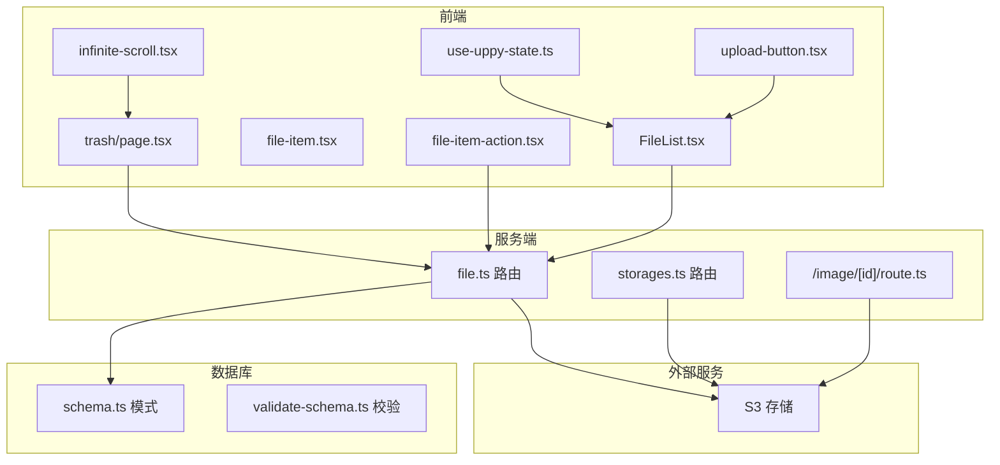
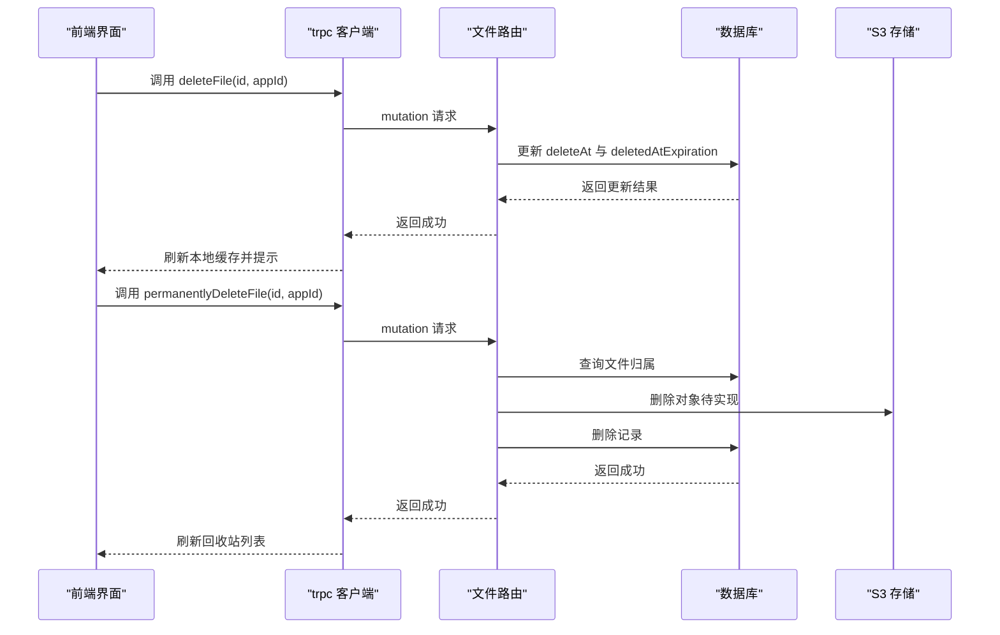
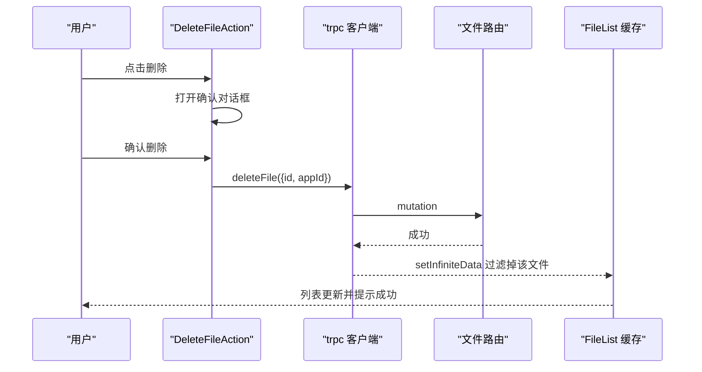
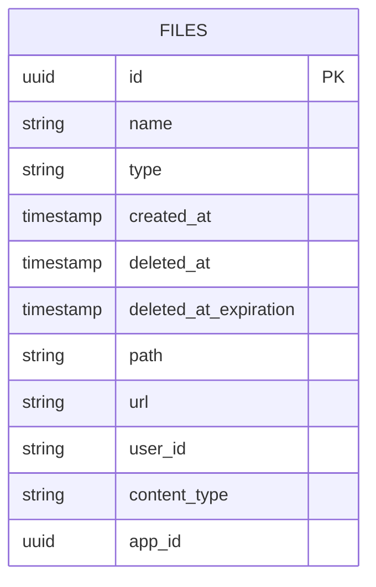
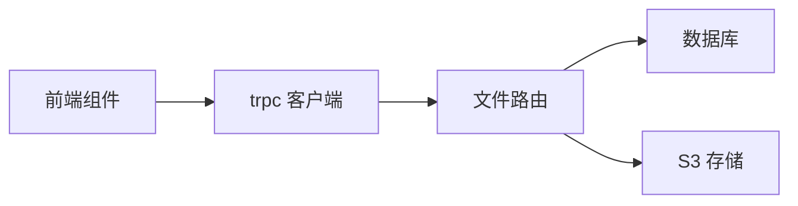

# 文件管理操作

<cite>
**本文引用的文件**
- [src/server/routes/file.ts](file://src/server/routes/file.ts)
- [src/components/feature/FileList.tsx](file://src/components/feature/FileList.tsx)
- [src/components/feature/file-item.tsx](file://src/components/feature/file-item.tsx)
- [src/components/feature/file-item-action.tsx](file://src/components/feature/file-item-action.tsx)
- [src/app/dashboard/apps/[appId]/trash/page.tsx](file://src/app/dashboard/apps/[appId]/trash/page.tsx)
- [src/server/db/schema.ts](file://src/server/db/schema.ts)
- [src/server/db/validate-schema.ts](file://src/server/db/validate-schema.ts)
- [src/utils/api.ts](file://src/utils/api.ts)
- [src/app/image/[id]/route.ts](file://src/app/image/[id]/route.ts)
- [src/components/feature/infinite-scroll.tsx](file://src/components/feature/infinite-scroll.tsx)
- [src/hooks/use-uppy-state.ts](file://src/hooks/use-uppy-state.ts)
- [src/components/feature/upload-button.tsx](file://src/components/feature/upload-button.tsx)
- [src/server/routes/storages.ts](file://src/server/routes/storages.ts)
- [src/components/feature/edit-storage-dialog.tsx](file://src/components/feature/edit-storage-dialog.tsx)
</cite>

## 目录

1. [简介](#简介)
2. [项目结构](#项目结构)
3. [核心组件](#核心组件)
4. [架构总览](#架构总览)
5. [详细组件分析](#详细组件分析)
6. [依赖关系分析](#依赖关系分析)
7. [性能考量](#性能考量)
8. [故障排查指南](#故障排查指南)
9. [结论](#结论)
10. [附录](#附录)

## 简介

本技术文档围绕文件管理操作进行全面说明，覆盖文件的增删改查（上传、列表、删除、恢复、永久删除）、软删除与过期清理机制、批量操作与状态同步、权限验证与安全检查、审计与用户反馈、以及前端交互与可扩展性建议。重点解析以下 API 的使用方式与参数校验：deleteFile、batchDeleteFiles、restoreFile、permanentlyDeleteFile，并结合前端界面展示与交互流程，帮助开发者快速理解与扩展功能。

## 项目结构

文件管理功能由服务端路由、数据库模式、前端组件与工具函数协同完成：

- 服务端路由：定义文件 CRUD、软删除、批量操作、回收站查询等接口
- 数据库模式：定义 files 表及索引，支持软删除字段与排序
- 前端组件：文件列表、文件项渲染、操作按钮、回收站页面、无限滚动
- 工具与集成：trpc 客户端、S3 存储签名上传、图像预览与缩放

图表来源

- [src/components/feature/FileList.tsx:1-366](file://src/components/feature/FileList.tsx#L1-L366)
- [src/components/feature/file-item.tsx:1-138](file://src/components/feature/file-item.tsx#L1-L138)
- [src/components/feature/file-item-action.tsx:1-112](file://src/components/feature/file-item-action.tsx#L1-L112)
- [src/app/dashboard/apps/[appId]/trash/page.tsx](file://src/app/dashboard/apps/[appId]/trash/page.tsx#L1-L580)
- [src/server/routes/file.ts:1-561](file://src/server/routes/file.ts#L1-L561)
- [src/server/routes/storages.ts:1-73](file://src/server/routes/storages.ts#L1-L73)
- [src/app/image/[id]/route.ts](file://src/app/image/[id]/route.ts#L1-L91)
- [src/server/db/schema.ts:120-142](file://src/server/db/schema.ts#L120-L142)
- [src/server/db/validate-schema.ts:1-18](file://src/server/db/validate-schema.ts#L1-L18)

章节来源

- [src/server/routes/file.ts:1-561](file://src/server/routes/file.ts#L1-L561)
- [src/server/db/schema.ts:120-142](file://src/server/db/schema.ts#L120-L142)

## 核心组件

- 文件路由（file.ts）：提供上传预签名 URL、保存文件、分页查询、软删除、批量软删除、恢复、批量恢复、回收站查询、永久删除、批量永久删除等接口
- 文件列表组件（FileList.tsx）：基于 trpc 的无限滚动查询，按日期分组展示文件，支持上传进度与 AI 标签识别
- 文件项组件（file-item.tsx）：远程文件项渲染与预览，支持图片缩略与放大查看
- 文件操作组件（file-item-action.tsx）：删除确认、复制链接、预览等交互
- 回收站页面（trash/page.tsx）：回收站无限滚动、批量选择、确认对话框、恢复/永久删除
- 数据库模式（schema.ts）：files 表含软删除字段与索引，支持 cursor 分页
- trpc 客户端（api.ts）：统一的客户端与纯客户端实例，用于调用后端接口
- 图像路由（/image/[id]/route.ts）：从 S3 读取图像并按参数缩放输出

章节来源

- [src/server/routes/file.ts:26-561](file://src/server/routes/file.ts#L26-L561)
- [src/components/feature/FileList.tsx:1-366](file://src/components/feature/FileList.tsx#L1-L366)
- [src/components/feature/file-item.tsx:1-138](file://src/components/feature/file-item.tsx#L1-L138)
- [src/components/feature/file-item-action.tsx:1-112](file://src/components/feature/file-item-action.tsx#L1-L112)
- [src/app/dashboard/apps/[appId]/trash/page.tsx](file://src/app/dashboard/apps/[appId]/trash/page.tsx#L1-L580)
- [src/server/db/schema.ts:120-142](file://src/server/db/schema.ts#L120-L142)
- [src/utils/api.ts:1-17](file://src/utils/api.ts#L1-L17)
- [src/app/image/[id]/route.ts](file://src/app/image/[id]/route.ts#L1-L91)

## 架构总览

文件管理采用“前端 trpc 调用 + 后端 drizzle ORM + S3 对象存储”的架构。上传通过预签名 URL 直传 S3；删除采用软删除并在数据库中标记删除时间与过期时间；回收站查询仅返回已删除且未过期的文件；永久删除预留 S3 清理逻辑。

图表来源

- [src/server/routes/file.ts:236-557](file://src/server/routes/file.ts#L236-L557)
- [src/utils/api.ts:1-17](file://src/utils/api.ts#L1-L17)

## 详细组件分析

### 文件路由与 API 解析

- 预签名上传 createPresignedUrl：生成 PUT 预签名 URL，校验应用与存储配置，限制有效期
- 保存文件 saveFile：写入数据库记录，设置用户与内容类型
- 列表查询 listFiles / infinityQueryFiles：按用户与应用过滤，支持搜索、排序、游标分页
- 软删除 deleteFile：设置 deleteAt 与 deletedAtExpiration（默认7天后过期）
- 批量软删除 batchDeleteFiles：同上，批量更新并返回计数
- 恢复 restoreFile：清除软删除标记
- 批量恢复 batchRestoreFiles：同上，批量更新
- 回收站查询 getDeletedFiles：查询已删除且未过期的文件，支持游标分页
- 永久删除 permanentlyDeleteFile：校验归属后删除 S3 对象（TODO）并从数据库移除
- 批量永久删除 batchPermanentlyDeleteFiles：同上，批量执行

参数验证与安全要点

- 所有受保护路由均校验会话与用户身份
- 删除/恢复/永久删除均强制校验用户 ID 与应用 ID，防止越权
- 软删除引入 deletedAtExpiration 字段，实现自动过期清理（需定时任务）

章节来源

- [src/server/routes/file.ts:26-561](file://src/server/routes/file.ts#L26-L561)
- [src/server/db/validate-schema.ts:1-18](file://src/server/db/validate-schema.ts#L1-L18)

### 前端交互与状态管理

- 文件列表 FileList：使用 trpc 的 useInfiniteQuery 获取分页数据，按日期分组，支持无限滚动与上传进度展示
- 文件项 file-item：根据内容类型渲染图片或占位图，支持预览弹窗
- 文件操作 file-item-action：删除按钮触发确认对话框，调用 deleteFile 并本地缓存更新
- 回收站 trash：支持批量选择、全选、分组展开、确认对话框、批量恢复/永久删除
- 无限滚动 infinite-scroll：监听底部哨兵，自动加载下一页

图表来源

- [src/components/feature/file-item-action.tsx:24-80](file://src/components/feature/file-item-action.tsx#L24-L80)
- [src/components/feature/FileList.tsx:106-124](file://src/components/feature/FileList.tsx#L106-L124)
- [src/server/routes/file.ts:236-262](file://src/server/routes/file.ts#L236-L262)

章节来源

- [src/components/feature/FileList.tsx:1-366](file://src/components/feature/FileList.tsx#L1-L366)
- [src/components/feature/file-item.tsx:1-138](file://src/components/feature/file-item.tsx#L1-L138)
- [src/components/feature/file-item-action.tsx:1-112](file://src/components/feature/file-item-action.tsx#L1-L112)
- [src/app/dashboard/apps/[appId]/trash/page.tsx](file://src/app/dashboard/apps/[appId]/trash/page.tsx#L1-L580)
- [src/components/feature/infinite-scroll.tsx:1-55](file://src/components/feature/infinite-scroll.tsx#L1-L55)

### 数据模型与索引

- files 表包含软删除字段 deleteAt 与 deletedAtExpiration，以及 cursor 索引以优化分页
- 通过 isNull(files.deleteAt) 过滤正常文件，确保默认查询不包含已删除项
- 回收站查询通过 deleteAt 非空与用户/应用过滤

图表来源

- [src/server/db/schema.ts:120-142](file://src/server/db/schema.ts#L120-L142)

章节来源

- [src/server/db/schema.ts:120-142](file://src/server/db/schema.ts#L120-L142)

### 权限验证、安全检查与审计

- 会话校验：所有受保护路由在 ctx 中读取 session 用户信息
- 资源归属校验：删除/恢复/永久删除均要求 files.userId 与 files.appId 匹配请求参数
- 应用存储校验：上传前校验应用存在且已配置存储，避免误用
- 审计建议：可在路由层增加操作日志记录（如用户、文件、时间、动作），便于审计追踪

章节来源

- [src/server/routes/file.ts:40-61](file://src/server/routes/file.ts#L40-L61)
- [src/server/routes/file.ts:236-342](file://src/server/routes/file.ts#L236-L342)

### 批量操作与状态同步

- 批量软删除与恢复：使用 inArray 条件批量更新，返回成功数量
- 前端状态同步：通过 trpc 的 setInfiniteData 在本地缓存中即时移除或更新项，提升交互体验
- 回收站批量操作：支持全选、分组批量选择，确认后批量调用对应 mutation

章节来源

- [src/server/routes/file.ts:264-342](file://src/server/routes/file.ts#L264-L342)
- [src/app/dashboard/apps/[appId]/trash/page.tsx](file://src/app/dashboard/apps/[appId]/trash/page.tsx#L185-L267)

### 文件状态管理、删除时间戳与过期清理

- 软删除：设置 deleteAt 与 deletedAtExpiration（默认7天后）
- 回收站查询：仅返回 deletedAt 非空且未过期的文件
- 过期清理：建议实现定时任务扫描 deletedAtExpiration 小于当前时间的记录，执行永久删除（S3 对象与数据库记录）

章节来源

- [src/server/routes/file.ts:244-247](file://src/server/routes/file.ts#L244-L247)
- [src/server/routes/file.ts:344-394](file://src/server/routes/file.ts#L344-L394)

### 图像访问与预览

- 图像路由：根据文件 ID 从数据库查询路径与存储配置，从 S3 读取对象，使用 sharp 按参数缩放输出
- 预览组件：支持点击预览弹窗，图片渲染时可按宽高参数调整尺寸

章节来源

- [src/app/image/[id]/route.ts](file://src/app/image/[id]/route.ts#L1-L91)
- [src/components/feature/file-item.tsx:30-72](file://src/components/feature/file-item.tsx#L30-L72)

## 依赖关系分析

- 前端依赖 trpc 客户端发起请求，路由层依赖 drizzle-orm 访问数据库，S3 SDK 用于对象存取
- 文件路由依赖 schema.ts 定义的数据结构与索引
- 回收站页面依赖文件路由的 getDeletedFiles 与批量操作接口

图表来源

- [src/utils/api.ts:1-17](file://src/utils/api.ts#L1-L17)
- [src/server/routes/file.ts:1-561](file://src/server/routes/file.ts#L1-L561)

章节来源

- [src/utils/api.ts:1-17](file://src/utils/api.ts#L1-L17)
- [src/server/routes/file.ts:1-561](file://src/server/routes/file.ts#L1-L561)

## 性能考量

- 分页与游标：使用 cursor 索引与游标分页减少大偏移查询成本
- 软删除过滤：默认查询通过 isNull 过滤已删除文件，降低查询复杂度
- 无限滚动：在列表与回收站页面使用 IntersectionObserver 触发分页加载
- 图像缩放：服务端按需缩放，避免前端过度渲染大图

章节来源

- [src/server/db/schema.ts:135-136](file://src/server/db/schema.ts#L135-L136)
- [src/components/feature/infinite-scroll.tsx:1-55](file://src/components/feature/infinite-scroll.tsx#L1-L55)
- [src/app/image/[id]/route.ts](file://src/app/image/[id]/route.ts#L73-L76)

## 故障排查指南

常见问题与定位建议

- 删除无效或越权：检查请求参数中的 appId 与当前用户是否匹配；确认文件确实存在且未被他人拥有
- 回收站为空：确认 deletedAt 非空且未过期；检查应用过滤条件
- 上传失败：检查应用是否配置存储；确认预签名 URL 有效期内；核对 S3 凭证与桶权限
- 图像无法显示：确认文件 content-type 为 image；检查 S3 对象是否存在；验证 sharp 处理链参数

章节来源

- [src/server/routes/file.ts:40-61](file://src/server/routes/file.ts#L40-L61)
- [src/server/routes/file.ts:344-394](file://src/server/routes/file.ts#L344-L394)
- [src/app/image/[id]/route.ts](file://src/app/image/[id]/route.ts#L17-L45)

## 结论

本文件管理模块通过软删除与过期清理实现了安全可控的删除策略，配合批量操作与前端缓存同步提升了用户体验。建议后续完善定时清理任务与审计日志，进一步增强系统可靠性与可追溯性。

## 附录

### API 使用与参数说明

- deleteFile
  - 输入：id（文件 ID）、appId（应用 ID）
  - 行为：设置 deleteAt 与 deletedAtExpiration（默认7天后）
  - 安全校验：必须匹配当前用户与应用
- batchDeleteFiles
  - 输入：ids（文件 ID 数组）、appId
  - 行为：批量软删除并返回计数
- restoreFile
  - 输入：id、appId
  - 行为：清除软删除标记
- batchRestoreFiles
  - 输入：ids、appId
  - 行为：批量恢复
- getDeletedFiles
  - 输入：cursor、limit、appId
  - 行为：查询已删除且未过期的文件，支持游标分页
- permanentlyDeleteFile
  - 输入：id、appId
  - 行为：校验归属后删除 S3 对象（TODO）与数据库记录
- batchPermanentlyDeleteFiles
  - 输入：ids、appId
  - 行为：批量永久删除

章节来源

- [src/server/routes/file.ts:236-557](file://src/server/routes/file.ts#L236-L557)

### 扩展与最佳实践

- 批量操作事务化：建议在数据库层使用事务包裹批量更新，失败时回滚并返回错误
- 审计日志：在路由层记录每次删除/恢复/永久删除的操作人、目标、时间与上下文
- 过期清理：实现定时任务扫描 deletedAtExpiration，自动执行永久删除
- S3 同步：完善 permanentlyDeleteFile 的 S3 删除逻辑，确保对象与记录一致
- 权限最小化：严格校验用户与应用 ID，避免跨用户访问
- 前端一致性：批量操作后统一通过 setInfiniteData 同步缓存，保证 UI 与数据一致
