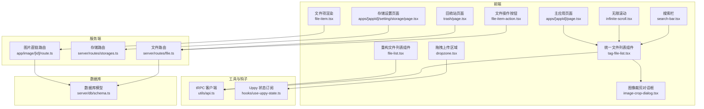
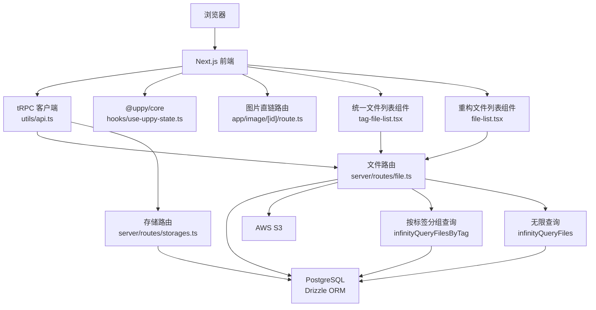
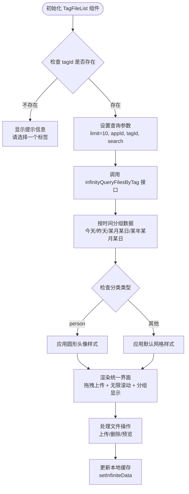
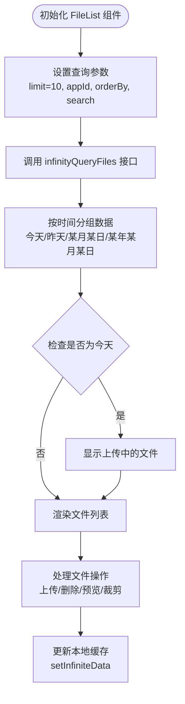
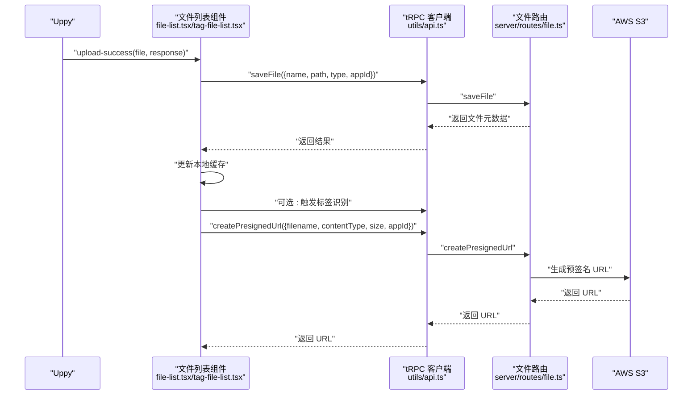
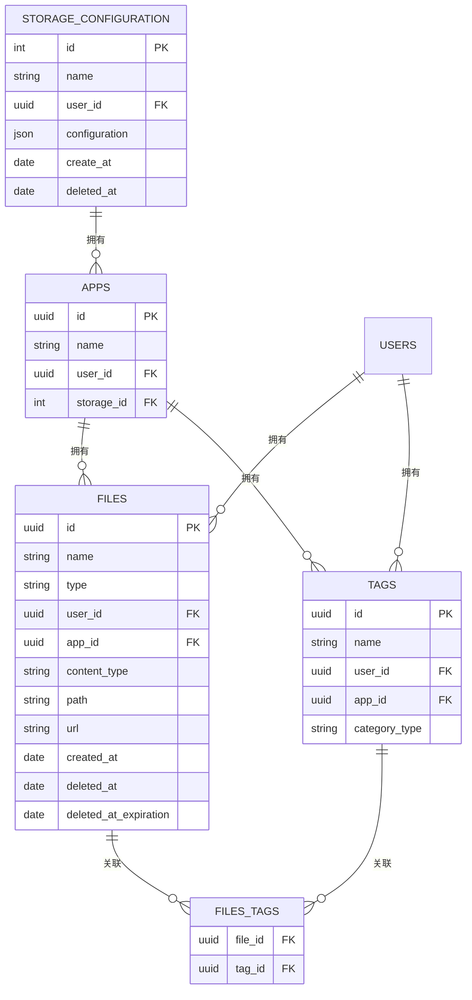
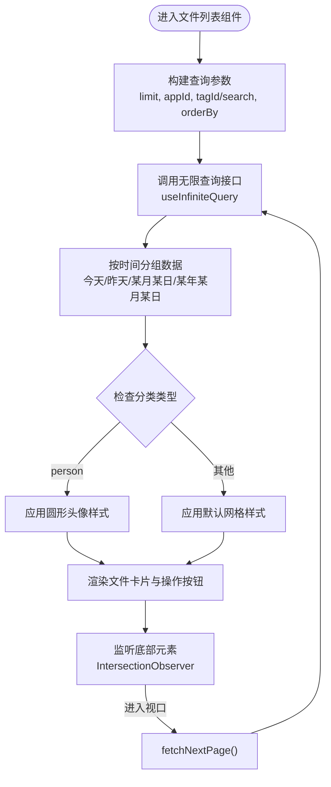
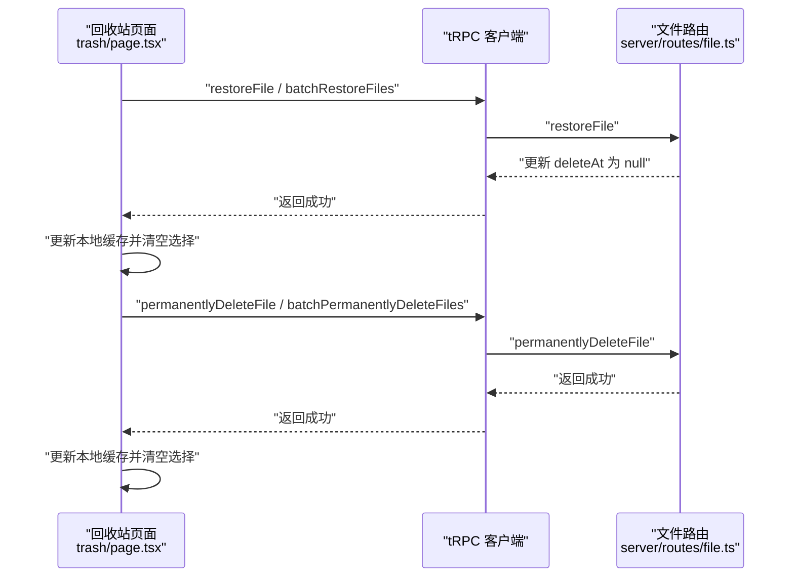
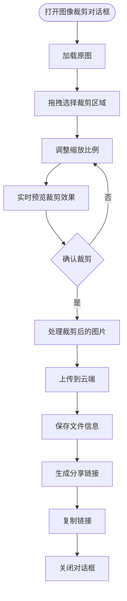
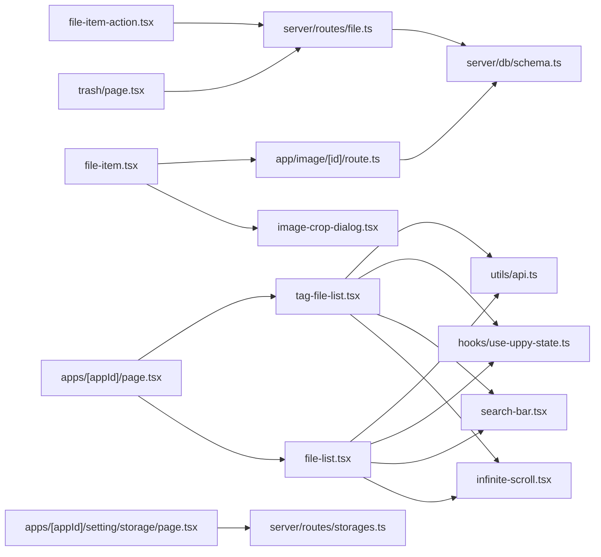

# 文件管理系统

<cite>
**本文引用的文件**
- [src/app/dashboard/apps/[appId]/tag-file-list.tsx](file://src/app/dashboard/apps/[appId]/tag-file-list.tsx)
- [src/app/dashboard/apps/[appId]/page.tsx](file://src/app/dashboard/apps/[appId]/page.tsx)
- [src/components/feature/file-list.tsx](file://src/components/feature/file-list.tsx)
- [src/components/feature/file-item-action.tsx](file://src/components/feature/file-item-action.tsx)
- [src/components/feature/file-item.tsx](file://src/components/feature/file-item.tsx)
- [src/components/feature/image-crop-dialog.tsx](file://src/components/feature/image-crop-dialog.tsx)
- [src/components/feature/dropzone.tsx](file://src/components/feature/dropzone.tsx)
- [src/components/feature/search-bar.tsx](file://src/components/feature/search-bar.tsx)
- [src/components/feature/infinite-scroll.tsx](file://src/components/feature/infinite-scroll.tsx)
- [src/components/ui/image-review/index.tsx](file://src/components/ui/image-review/index.tsx)
- [src/server/routes/file.ts](file://src/server/routes/file.ts)
- [src/server/routes/storages.ts](file://src/server/routes/storages.ts)
- [src/server/db/schema.ts](file://src/server/db/schema.ts)
- [src/app/image/[id]/route.ts](file://src/app/image/[id]/route.ts)
- [src/app/dashboard/apps/[appId]/setting/storage/page.tsx](file://src/app/dashboard/apps/[appId]/setting/storage/page.tsx)
- [src/app/dashboard/apps/[appId]/trash/page.tsx](file://src/app/dashboard/apps/[appId]/trash/page.tsx)
- [src/hooks/use-uppy-state.ts](file://src/hooks/use-uppy-state.ts)
- [src/utils/api.ts](file://src/utils/api.ts)
- [package.json](file://package.json)
</cite>

## 更新摘要
**变更内容**
- 文件列表组件重构：从 FileList.tsx 迁移到 file-list.tsx，实现更完善的文件管理功能
- 新增 TagFileList 组件：支持按标签分组的文件列表展示，替代原有的静态页面组件
- 文件操作增强：完整实现图像裁剪功能，支持在线图片编辑
- 统一文件管理界面：通过 Tab 系统实现动态分类管理，支持多种文件展示模式
- API 增强：新增按标签分组的无限查询接口，支持更灵活的数据检索

## 目录
1. [简介](#简介)
2. [项目结构](#项目结构)
3. [核心组件](#核心组件)
4. [架构总览](#架构总览)
5. [详细组件分析](#详细组件分析)
6. [依赖关系分析](#依赖关系分析)
7. [性能考量](#性能考量)
8. [故障排查指南](#故障排查指南)
9. [结论](#结论)
10. [附录](#附录)

## 简介
本文件管理系统基于 Next.js 与 tRPC 构建，提供完整的文件上传、存储、检索、搜索、分页与回收站管理能力。系统通过 AWS S3 进行对象存储，并使用预签名 URL 完成客户端直传；数据库采用 PostgreSQL（Drizzle ORM），文件与标签关联模型支持灵活的搜索与筛选。前端通过 Uppy 管理上传状态，结合 tRPC 的 React Query 客户端实现无限滚动加载、实时更新与批量操作。

**重大更新**：文件列表组件已重构为统一的 TagFileList 组件，支持动态分类类型和无限滚动分页功能，替代了原有的静态页面组件。系统现在通过 Tab 界面实现统一的文件管理，支持按标签分组的文件展示和多种文件操作功能。

## 项目结构
系统采用按功能模块划分的目录组织方式：
- 前端组件位于 src/components/feature 与 src/components/ui 下，分别负责业务组件与通用 UI 组件。
- 服务端路由位于 src/server/routes，包含文件、存储、应用等 API 路由。
- 数据库模型定义在 src/server/db/schema.ts，包含文件、标签、存储配置等表。
- 页面路由位于 src/app/dashboard 与 src/app/image，分别承载应用管理、回收站与图片直链访问。
- 工具与钩子位于 src/utils 与 src/hooks，提供 tRPC 客户端与 Uppy 状态订阅。

**图表来源**
- [src/app/dashboard/apps/[appId]/tag-file-list.tsx:1-327](file://src/app/dashboard/apps/[appId]/tag-file-list.tsx#L1-L327)
- [src/app/dashboard/apps/[appId]/page.tsx:1-240](file://src/app/dashboard/apps/[appId]/page.tsx#L1-L240)
- [src/components/feature/file-list.tsx:1-374](file://src/components/feature/file-list.tsx#L1-L374)
- [src/components/feature/dropzone.tsx:1-52](file://src/components/feature/dropzone.tsx#L1-L52)
- [src/components/feature/search-bar.tsx:1-199](file://src/components/feature/search-bar.tsx#L1-L199)
- [src/components/feature/infinite-scroll.tsx:1-55](file://src/components/feature/infinite-scroll.tsx#L1-L55)
- [src/components/feature/file-item-action.tsx:1-146](file://src/components/feature/file-item-action.tsx#L1-L146)
- [src/components/feature/file-item.tsx:1-138](file://src/components/feature/file-item.tsx#L1-L138)
- [src/components/feature/image-crop-dialog.tsx:1-281](file://src/components/feature/image-crop-dialog.tsx#L1-L281)
- [src/app/dashboard/apps/[appId]/trash/page.tsx](file://src/app/dashboard/apps/[appId]/trash/page.tsx#L1-L580)
- [src/app/dashboard/apps/[appId]/setting/storage/page.tsx](file://src/app/dashboard/apps/[appId]/setting/storage/page.tsx#L1-L103)
- [src/utils/api.ts:1-17](file://src/utils/api.ts#L1-L17)
- [src/hooks/use-uppy-state.ts:1-17](file://src/hooks/use-uppy-state.ts#L1-L17)
- [src/server/routes/file.ts:1-561](file://src/server/routes/file.ts#L1-L561)
- [src/server/routes/storages.ts:1-74](file://src/server/routes/storages.ts#L1-L74)
- [src/app/image/[id]/route.ts](file://src/app/image/[id]/route.ts#L1-L92)
- [src/server/db/schema.ts:1-270](file://src/server/db/schema.ts#L1-L270)

**章节来源**
- [src/app/dashboard/apps/[appId]/tag-file-list.tsx:1-327](file://src/app/dashboard/apps/[appId]/tag-file-list.tsx#L1-L327)
- [src/server/routes/file.ts:1-561](file://src/server/routes/file.ts#L1-L561)
- [src/server/db/schema.ts:1-270](file://src/server/db/schema.ts#L1-L270)

## 核心组件
- **统一文件列表组件（TagFileList）**：**新增** 支持按标签分组的文件列表展示，替代原有的静态页面组件，实现统一的文件管理界面。
- **重构文件列表组件（FileList）**：**更新** 从 FileList.tsx 迁移到 file-list.tsx，实现更完善的文件管理功能，支持无限滚动、分组展示、上传进度预览与文件操作。
- 拖拽上传区域：封装拖拽事件，将文件注入 Uppy 并触发上传流程。
- 搜索栏：支持关键词与日期范围筛选，并将过滤条件传递给查询。
- 无限滚动：基于 IntersectionObserver 的懒加载组件。
- 文件操作按钮：提供复制链接、删除、预览、裁剪等交互。
- 文件项渲染：根据内容类型渲染本地或远程图片，支持预览弹窗。
- 图像裁剪对话框：**新增** 完整的图像裁剪功能，支持在线图片编辑与预览。
- 图片预览组件：基于 rc-image 的增强预览功能，支持旋转、缩放、翻转等操作。
- 图片直链路由：根据文件 ID 获取 S3 对象并返回压缩后的 WebP。
- 存储设置页面：管理应用的存储配置，绑定到应用。
- 回收站页面：实现已删除文件的分组展示、恢复与永久删除。

**章节来源**
- [src/app/dashboard/apps/[appId]/tag-file-list.tsx:1-327](file://src/app/dashboard/apps/[appId]/tag-file-list.tsx#L1-L327)
- [src/components/feature/file-list.tsx:1-374](file://src/components/feature/file-list.tsx#L1-L374)
- [src/components/feature/dropzone.tsx:1-52](file://src/components/feature/dropzone.tsx#L1-L52)
- [src/components/feature/search-bar.tsx:1-199](file://src/components/feature/search-bar.tsx#L1-L199)
- [src/components/feature/infinite-scroll.tsx:1-55](file://src/components/feature/infinite-scroll.tsx#L1-L55)
- [src/components/feature/file-item-action.tsx:1-146](file://src/components/feature/file-item-action.tsx#L1-L146)
- [src/components/feature/file-item.tsx:1-138](file://src/components/feature/file-item.tsx#L1-L138)
- [src/components/feature/image-crop-dialog.tsx:1-281](file://src/components/feature/image-crop-dialog.tsx#L1-L281)
- [src/app/image/[id]/route.ts](file://src/app/image/[id]/route.ts#L1-L92)
- [src/app/dashboard/apps/[appId]/setting/storage/page.tsx](file://src/app/dashboard/apps/[appId]/setting/storage/page.tsx#L1-L103)
- [src/app/dashboard/apps/[appId]/trash/page.tsx](file://src/app/dashboard/apps/[appId]/trash/page.tsx#L1-L580)

## 架构总览
系统采用前后端分离的三层架构：
- 前端层：Next.js 应用，使用 tRPC React Query 客户端与 Uppy 上传器，**通过 Tab 系统实现统一的文件管理界面**。
- 服务端层：tRPC 路由暴露 CRUD、搜索、分页、回收站等接口，**新增按标签分组的无限查询接口**。
- 数据与存储层：PostgreSQL（Drizzle ORM）存储文件元数据与标签关系，AWS S3 存储实际对象，通过预签名 URL 完成直传。

**图表来源**
- [src/utils/api.ts:1-17](file://src/utils/api.ts#L1-L17)
- [src/server/routes/file.ts:1-561](file://src/server/routes/file.ts#L1-L561)
- [src/server/routes/storages.ts:1-74](file://src/server/routes/storages.ts#L1-L74)
- [src/hooks/use-uppy-state.ts:1-17](file://src/hooks/use-uppy-state.ts#L1-L17)
- [src/app/image/[id]/route.ts](file://src/app/image/[id]/route.ts#L1-L92)
- [src/server/db/schema.ts:1-270](file://src/server/db/schema.ts#L1-L270)
- [src/app/dashboard/apps/[appId]/tag-file-list.tsx:1-327](file://src/app/dashboard/apps/[appId]/tag-file-list.tsx#L1-L327)
- [src/components/feature/file-list.tsx:1-374](file://src/components/feature/file-list.tsx#L1-L374)

## 详细组件分析

### 统一文件列表组件（TagFileList）重构
**重大更新** 系统已将原有的静态页面组件合并为统一的 TagFileList 组件，实现动态分类管理和统一的文件管理界面。

- TagFileList 组件支持按标签分组的文件展示，通过 tagId 参数区分不同的文件集合。
- 实现统一的无限滚动分页功能，使用 tRPC 的 infinityQueryFilesByTag 接口获取数据。
- 支持按时间分组展示，提供可折叠的分组界面，提升大量文件的浏览体验。
- 集成拖拽上传功能，支持文件上传进度显示和自动刷新。
- 提供统一的文件操作按钮，包括复制链接、删除、预览等功能。
- **新增** 支持不同的展示样式变体（person 类型显示为圆形头像样式）。

**图表来源**
- [src/app/dashboard/apps/[appId]/tag-file-list.tsx:34-56](file://src/app/dashboard/apps/[appId]/tag-file-list.tsx#L34-L56)
- [src/app/dashboard/apps/[appId]/tag-file-list.tsx:275-310](file://src/app/dashboard/apps/[appId]/tag-file-list.tsx#L275-L310)

**章节来源**
- [src/app/dashboard/apps/[appId]/tag-file-list.tsx:1-327](file://src/app/dashboard/apps/[appId]/tag-file-list.tsx#L1-L327)
- [src/app/dashboard/apps/[appId]/page.tsx:219-229](file://src/app/dashboard/apps/[appId]/page.tsx#L219-L229)

### 重构文件列表组件（FileList）功能增强
**更新** 文件列表组件已从 FileList.tsx 迁移到 file-list.tsx，实现更完善的文件管理功能。

- **重构** 组件结构更加清晰，支持无限滚动、分组展示、上传进度预览与文件操作。
- 实现按时间分组的数据展示，支持今天、昨天、某月某日、某年某月某日的智能分组。
- 集成拖拽上传功能，支持文件上传进度显示和自动刷新。
- 提供统一的文件操作按钮，包括复制链接、删除、预览、裁剪等功能。
- **新增** 支持上传中的文件预览，实时显示上传进度。
- **增强** 缓存更新机制，确保删除操作后的数据一致性。

**图表来源**
- [src/components/feature/file-list.tsx:36-57](file://src/components/feature/file-list.tsx#L36-L57)
- [src/components/feature/file-list.tsx:224-335](file://src/components/feature/file-list.tsx#L224-L335)

**章节来源**
- [src/components/feature/file-list.tsx:1-374](file://src/components/feature/file-list.tsx#L1-L374)
- [src/app/dashboard/apps/[appId]/page.tsx:206-211](file://src/app/dashboard/apps/[appId]/page.tsx#L206-L211)

### 文件上传流程与预签名 URL 生成
- 客户端通过 Uppy 添加文件，监听上传事件。
- 调用 tRPC 接口生成预签名 URL，携带文件名、类型、大小与应用 ID。
- 使用预签名 URL 直接 PUT 到 S3，完成后调用保存接口写入数据库。
- 成功后刷新缓存并插入新记录到列表顶部，同时触发 AI 标签识别（图片文件）。

**图表来源**
- [src/components/feature/file-list.tsx:149-190](file://src/components/feature/file-list.tsx#L149-L190)
- [src/app/dashboard/apps/[appId]/tag-file-list.tsx:139-182](file://src/app/dashboard/apps/[appId]/tag-file-list.tsx#L139-L182)
- [src/server/routes/file.ts:27-90](file://src/server/routes/file.ts#L27-L90)
- [src/server/routes/file.ts:91-118](file://src/server/routes/file.ts#L91-L118)
- [src/utils/api.ts:1-17](file://src/utils/api.ts#L1-L17)

**章节来源**
- [src/components/feature/file-list.tsx:149-190](file://src/components/feature/file-list.tsx#L149-L190)
- [src/app/dashboard/apps/[appId]/tag-file-list.tsx:139-182](file://src/app/dashboard/apps/[appId]/tag-file-list.tsx#L139-L182)
- [src/server/routes/file.ts:27-118](file://src/server/routes/file.ts#L27-L118)
- [src/utils/api.ts:1-17](file://src/utils/api.ts#L1-L17)

### 文件存储架构与元数据管理
- 数据库模型包含 files、files_tags、tags、storageConfiguration 等表，支持文件与标签的多对多关系。
- 文件路由提供保存、分页查询、搜索、回收站查询、批量操作等接口。
- **新增按标签分组查询接口**：infinityQueryFilesByTag 支持按 tagId 进行文件查询和分页。
- **增强无限查询接口**：infinityQueryFiles 支持排序字段与方向的灵活配置。
- 存储路由提供存储配置的增删改查，支持应用绑定存储。

**图表来源**
- [src/server/db/schema.ts:120-270](file://src/server/db/schema.ts#L120-L270)
- [src/server/routes/file.ts:135-200](file://src/server/routes/file.ts#L135-L200)
- [src/server/routes/file.ts:396-444](file://src/server/routes/file.ts#L396-L444)
- [src/server/routes/storages.ts:1-74](file://src/server/routes/storages.ts#L1-L74)

**章节来源**
- [src/server/db/schema.ts:1-270](file://src/server/db/schema.ts#L1-L270)
- [src/server/routes/file.ts:135-200](file://src/server/routes/file.ts#L135-L200)
- [src/server/routes/file.ts:396-444](file://src/server/routes/file.ts#L396-L444)
- [src/server/routes/storages.ts:1-74](file://src/server/routes/storages.ts#L1-L74)

### 文件列表展示、无限滚动与搜索
- **统一的 TagFileList 组件**使用 tRPC 的无限查询，按时间分组展示，并支持自定义排序字段与方向。
- **重构的 FileList 组件**同样支持无限滚动与分组展示，提供更完善的文件管理功能。
- 通过 IntersectionObserver 实现底部哨兵触发下一页加载。
- 搜索栏支持关键词与日期范围筛选，将过滤条件合并到查询参数。
- **动态分类支持**：根据标签的 categoryType 决定显示样式（person 类型显示为圆形头像样式）。

**图表来源**
- [src/app/dashboard/apps/[appId]/tag-file-list.tsx:34-56](file://src/app/dashboard/apps/[appId]/tag-file-list.tsx#L34-L56)
- [src/components/feature/file-list.tsx:36-57](file://src/components/feature/file-list.tsx#L36-L57)
- [src/app/dashboard/apps/[appId]/tag-file-list.tsx:88-126](file://src/app/dashboard/apps/[appId]/tag-file-list.tsx#L88-L126)
- [src/components/feature/file-list.tsx:59-98](file://src/components/feature/file-list.tsx#L59-L98)

**章节来源**
- [src/app/dashboard/apps/[appId]/tag-file-list.tsx:34-56](file://src/app/dashboard/apps/[appId]/tag-file-list.tsx#L34-L56)
- [src/components/feature/infinite-scroll.tsx:1-55](file://src/components/feature/infinite-scroll.tsx#L1-L55)
- [src/components/feature/search-bar.tsx:1-199](file://src/components/feature/search-bar.tsx#L1-L199)
- [src/components/feature/file-list.tsx:59-98](file://src/components/feature/file-list.tsx#L59-L98)

### 文件删除、回收站管理与批量操作
- 删除文件时设置删除时间戳与过期时间（默认 7 天），不立即物理删除。
- 回收站页面按删除时间分组展示，支持单个与批量恢复、批量永久删除。
- 操作前弹出确认对话框，操作成功后更新本地缓存并清理选择集。

**图表来源**
- [src/app/dashboard/apps/[appId]/trash/page.tsx](file://src/app/dashboard/apps/[appId]/trash/page.tsx#L149-L267)
- [src/server/routes/file.ts:295-342](file://src/server/routes/file.ts#L295-L342)
- [src/server/routes/file.ts:501-557](file://src/server/routes/file.ts#L501-L557)

**章节来源**
- [src/app/dashboard/apps/[appId]/trash/page.tsx](file://src/app/dashboard/apps/[appId]/trash/page.tsx#L1-L580)
- [src/server/routes/file.ts:295-342](file://src/server/routes/file.ts#L295-L342)
- [src/server/routes/file.ts:501-557](file://src/server/routes/file.ts#L501-L557)

### 文件访问控制与安全考虑
- 所有文件相关接口均为受保护过程，需通过认证上下文校验。
- 删除、恢复、永久删除等操作均进行用户与应用维度的权限校验。
- 图片直链路由仅允许图片类型访问，并通过 S3 凭证读取对象，返回压缩后的 WebP。
- **统一文件列表组件**：支持动态分类管理，不同分类类型的文件显示不同的样式，提升用户体验。
- **文件操作增强**：图像裁剪功能提供在线图片编辑能力，支持预览与分享。

**章节来源**
- [src/server/routes/file.ts:27-61](file://src/server/routes/file.ts#L27-L61)
- [src/server/routes/file.ts:236-262](file://src/server/routes/file.ts#L236-L262)
- [src/server/routes/file.ts:264-293](file://src/server/routes/file.ts#L264-L293)
- [src/server/routes/file.ts:295-342](file://src/server/routes/file.ts#L295-L342)
- [src/server/routes/file.ts:501-557](file://src/server/routes/file.ts#L501-L557)
- [src/app/image/[id]/route.ts](file://src/app/image/[id]/route.ts#L8-L45)

### 文件操作增强：图像裁剪功能
**新增** 系统现已完整实现图像裁剪功能，提供在线图片编辑能力。

- **图像裁剪对话框**：提供完整的图片裁剪界面，支持拖拽选择区域、缩放控制。
- **实时预览**：裁剪过程中实时预览效果，支持缩放滑块调节。
- **云端处理**：裁剪后的图片直接上传到云端，生成新的文件记录。
- **分享链接**：裁剪成功后生成可分享的链接，支持一键复制。
- **无缝集成**：与文件列表组件无缝集成，支持在文件操作菜单中直接调用。

**图表来源**
- [src/components/feature/image-crop-dialog.tsx:112-168](file://src/components/feature/image-crop-dialog.tsx#L112-L168)
- [src/components/feature/file-item-action.tsx:118-142](file://src/components/feature/file-item-action.tsx#L118-L142)

**章节来源**
- [src/components/feature/image-crop-dialog.tsx:1-281](file://src/components/feature/image-crop-dialog.tsx#L1-L281)
- [src/components/feature/file-item-action.tsx:118-142](file://src/components/feature/file-item-action.tsx#L118-L142)

## 依赖关系分析
- 组件间依赖：**统一的 TagFileList 组件**依赖 tRPC 客户端、Uppy 状态、搜索栏与无限滚动；文件项渲染依赖图片预览组件；回收站页面依赖文件路由与 UI 组件。
- 服务端依赖：文件路由依赖 Drizzle ORM 与 AWS SDK；存储路由依赖 Drizzle ORM；图片直链路由依赖 S3 与 Sharp。
- 外部依赖：@uppy/core、@aws-sdk/*、sharp、date-fns、lucide-react、sonner、react-easy-crop 等。

**图表来源**
- [src/app/dashboard/apps/[appId]/tag-file-list.tsx:1-327](file://src/app/dashboard/apps/[appId]/tag-file-list.tsx#L1-L327)
- [src/app/dashboard/apps/[appId]/page.tsx:1-240](file://src/app/dashboard/apps/[appId]/page.tsx#L1-L240)
- [src/components/feature/file-list.tsx:1-374](file://src/components/feature/file-list.tsx#L1-L374)
- [src/components/feature/file-item-action.tsx:1-146](file://src/components/feature/file-item-action.tsx#L1-L146)
- [src/components/feature/file-item.tsx:1-138](file://src/components/feature/file-item.tsx#L1-L138)
- [src/components/feature/image-crop-dialog.tsx:1-281](file://src/components/feature/image-crop-dialog.tsx#L1-L281)
- [src/app/dashboard/apps/[appId]/trash/page.tsx](file://src/app/dashboard/apps/[appId]/trash/page.tsx#L1-L580)
- [src/app/dashboard/apps/[appId]/setting/storage/page.tsx](file://src/app/dashboard/apps/[appId]/setting/storage/page.tsx#L1-L103)
- [src/utils/api.ts:1-17](file://src/utils/api.ts#L1-L17)
- [src/hooks/use-uppy-state.ts:1-17](file://src/hooks/use-uppy-state.ts#L1-L17)
- [src/server/routes/file.ts:1-561](file://src/server/routes/file.ts#L1-L561)
- [src/server/routes/storages.ts:1-74](file://src/server/routes/storages.ts#L1-L74)
- [src/app/image/[id]/route.ts](file://src/app/image/[id]/route.ts#L1-L92)
- [src/server/db/schema.ts:1-270](file://src/server/db/schema.ts#L1-L270)

**章节来源**
- [src/app/dashboard/apps/[appId]/tag-file-list.tsx:1-327](file://src/app/dashboard/apps/[appId]/tag-file-list.tsx#L1-L327)
- [src/components/feature/file-list.tsx:1-374](file://src/components/feature/file-list.tsx#L1-L374)
- [src/server/routes/file.ts:1-561](file://src/server/routes/file.ts#L1-L561)
- [src/server/db/schema.ts:1-270](file://src/server/db/schema.ts#L1-L270)

## 性能考量
- 无限滚动与分页：使用游标分页与缓存局部更新，减少重复请求与重绘。
- 图片直链优化：服务端统一转换为 WebP 并设置长缓存头，降低带宽与延迟。
- 上传直传：预签名 URL 直传 S3，避免经由应用服务器中转，提升吞吐与稳定性。
- **统一文件列表组件优化**：通过动态分类管理减少组件重复，提升内存使用效率；按需启用查询，避免不必要的数据加载。
- **文件操作增强优化**：图像裁剪功能采用云端处理，避免客户端过度计算；支持预览与分享，提升用户体验。
- 查询优化：数据库索引覆盖游标查询字段，搜索使用 ILIKE 与 EXISTS 子查询，必要时可引入全文索引或物化视图。

## 故障排查指南
- 无法生成预签名 URL：检查应用是否配置存储、凭证是否正确、用户权限是否匹配。
- 上传成功但未显示：确认保存接口调用成功且本地缓存已更新；检查图片标签识别异常日志。
- 回收站为空：确认查询参数包含 appId 且存在已删除文件；检查删除时间与过期时间逻辑。
- 图片直链 400：确保文件内容类型为图片、路径解码正确、S3 凭证有效。
- 权限错误：检查 tRPC 受保护过程的用户与应用校验逻辑。
- **统一文件列表组件问题**：检查 tagId 参数是否正确传递；确认分类标签的 categoryType 配置；验证无限查询接口的查询条件。
- **分类显示异常**：检查标签的 categoryType 字段值；确认 person 类型的圆形头像样式应用逻辑。
- **文件操作增强问题**：检查图像裁剪对话框的权限配置；确认云端处理服务正常运行；验证分享链接生成逻辑。
- **重构文件列表组件问题**：检查无限滚动组件的配置；确认分组展示逻辑；验证上传进度显示功能。

**章节来源**
- [src/server/routes/file.ts:27-90](file://src/server/routes/file.ts#L27-L90)
- [src/components/feature/file-list.tsx:149-190](file://src/components/feature/file-list.tsx#L149-L190)
- [src/app/dashboard/apps/[appId]/tag-file-list.tsx:139-182](file://src/app/dashboard/apps/[appId]/tag-file-list.tsx#L139-L182)
- [src/app/dashboard/apps/[appId]/trash/page.tsx](file://src/app/dashboard/apps/[appId]/trash/page.tsx#L50-L64)
- [src/app/image/[id]/route.ts](file://src/app/image/[id]/route.ts#L15-L45)
- [src/components/feature/image-crop-dialog.tsx:112-168](file://src/components/feature/image-crop-dialog.tsx#L112-L168)

## 结论
本系统通过清晰的分层设计与完善的权限控制，实现了从上传、存储、检索到回收站管理的完整闭环。**重大重构**将原有的静态页面组件合并为统一的 TagFileList 组件，支持动态分类类型和无限滚动分页功能，显著提升了系统的可维护性和用户体验。**文件列表组件重构**进一步增强了文件管理功能，支持更完善的文件操作与展示。**文件操作增强**通过图像裁剪功能，为用户提供了更丰富的图片编辑能力。统一的文件管理界面减少了代码重复，提高了开发效率。预签名 URL 与直传机制显著提升了上传性能，而 tRPC 与 Drizzle 的组合提供了可靠的接口与数据一致性保障。未来可在搜索性能、标签体系与定时清理任务方面进一步优化。

## 附录

### 统一文件列表组件使用示例（步骤说明）
- 在主应用页面中，通过动态渲染的方式为每个分类标签创建对应的 Tab 内容。
- 为每个分类标签传入相应的 tagId 和 variant 参数（person 类型显示为圆形头像样式）。
- TagFileList 组件会自动处理无限滚动、分组显示、文件操作等所有功能。
- 通过搜索栏输入关键词与选择日期范围进行筛选，搜索条件会自动应用到所有分类的查询中。

**章节来源**
- [src/app/dashboard/apps/[appId]/page.tsx:219-229](file://src/app/dashboard/apps/[appId]/page.tsx#L219-L229)
- [src/app/dashboard/apps/[appId]/tag-file-list.tsx:22-29](file://src/app/dashboard/apps/[appId]/tag-file-list.tsx#L22-L29)

### 重构文件列表组件使用示例（步骤说明）
- 在页面中引入重构的 FileList 组件，并传入 Uppy 实例、应用 ID、排序字段与搜索过滤器。
- 组件会自动处理无限滚动、分组展示、文件操作等所有功能。
- 支持上传中的文件预览，实时显示上传进度。
- 通过搜索栏输入关键词与选择日期范围进行筛选。

**章节来源**
- [src/app/dashboard/apps/[appId]/page.tsx:206-211](file://src/app/dashboard/apps/[appId]/page.tsx#L206-L211)
- [src/components/feature/file-list.tsx:26-31](file://src/components/feature/file-list.tsx#L26-L31)

### 文件操作增强功能使用示例（步骤说明）
- 在文件操作菜单中选择"裁剪图片"选项。
- 在裁剪对话框中拖拽选择裁剪区域，调整缩放比例。
- 点击"裁剪并上传"按钮，系统会自动处理并上传裁剪后的图片。
- 裁剪成功后生成分享链接，支持一键复制与分享。
- 裁剪后的图片会出现在文件列表中，支持正常的文件操作。

**章节来源**
- [src/components/feature/file-item-action.tsx:118-142](file://src/components/feature/file-item-action.tsx#L118-L142)
- [src/components/feature/image-crop-dialog.tsx:112-168](file://src/components/feature/image-crop-dialog.tsx#L112-L168)

### 最佳实践与扩展开发指南
- 上传：优先使用预签名 URL 直传；对大文件启用断点续传与并发分片。
- 搜索：为高频查询建立复合索引；考虑引入全文检索或向量检索增强标签匹配。
- 回收站：定期执行过期清理任务；提供导出与审计日志。
- 安全：严格限制存储凭证权限；对直链访问增加防盗链与鉴权策略。
- **统一文件列表组件**：合理设计分类标签体系，确保 categoryType 的正确使用；优化无限滚动性能，避免一次性加载过多数据。
- **文件操作增强**：图像裁剪功能应考虑性能优化，避免大图片的过度处理；提供更好的错误处理与用户反馈。
- 扩展：新增文件类型时扩展内容类型判断与直链路由；引入队列异步处理标签识别与缩略图生成；考虑添加批量文件操作功能。
- **重构组件**：保持组件的单一职责，避免过度复杂的逻辑；提供更好的错误边界与加载状态处理。