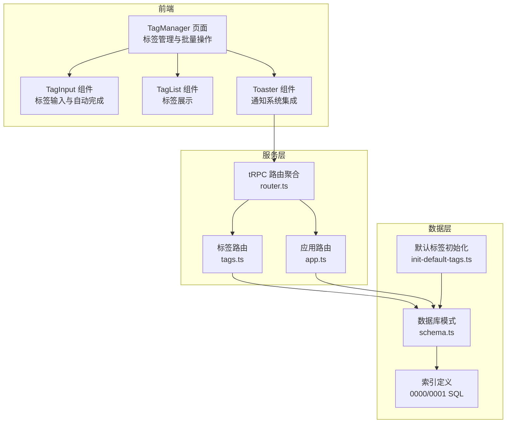
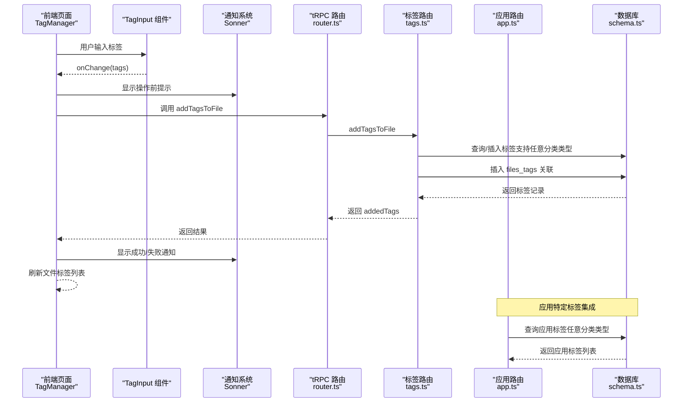
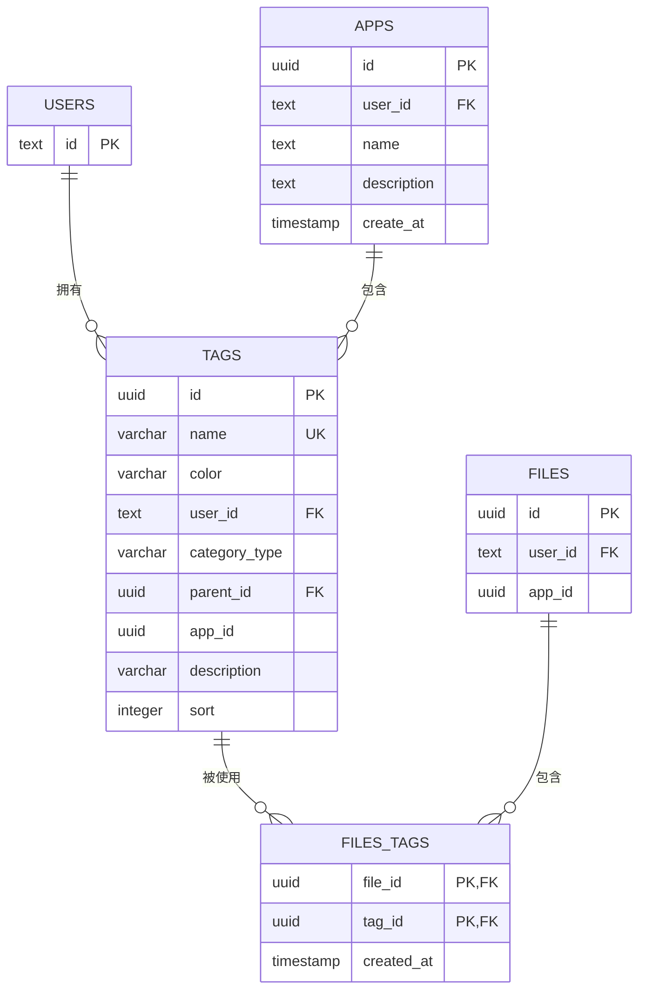
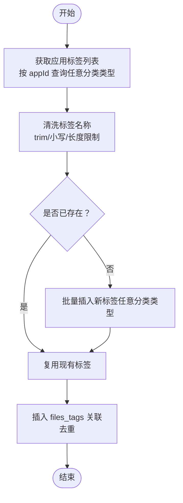
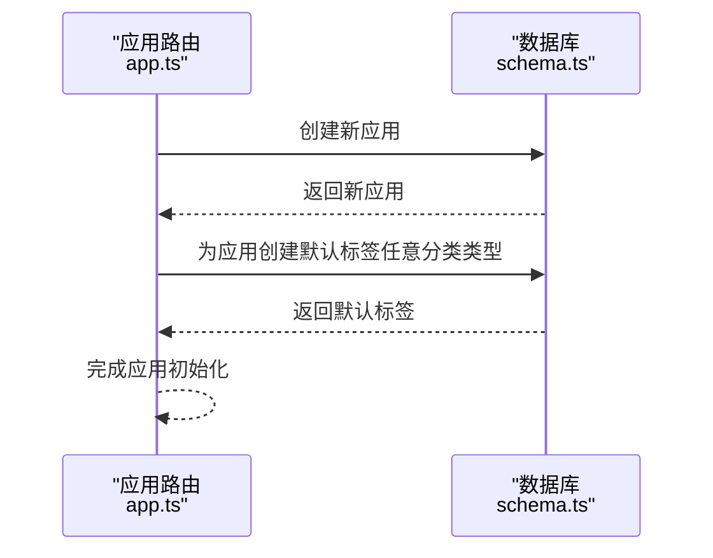
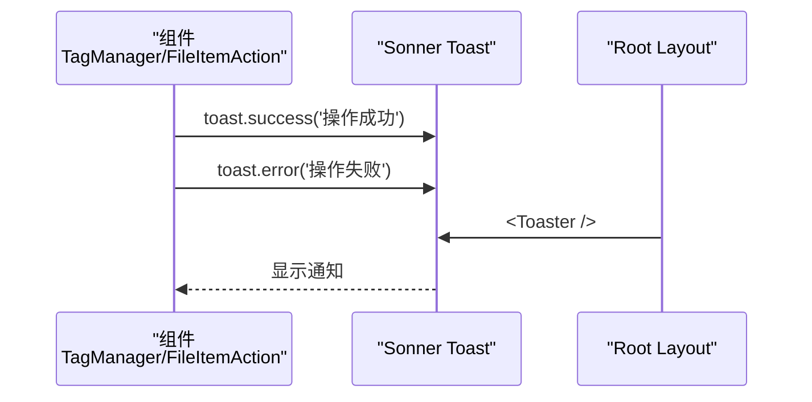
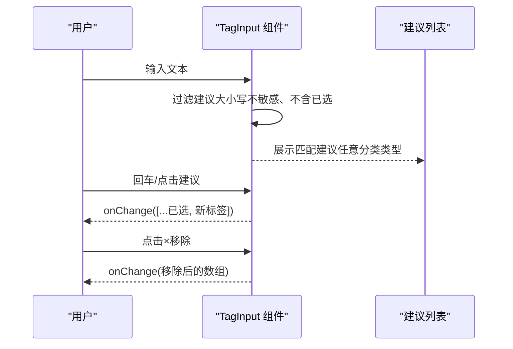
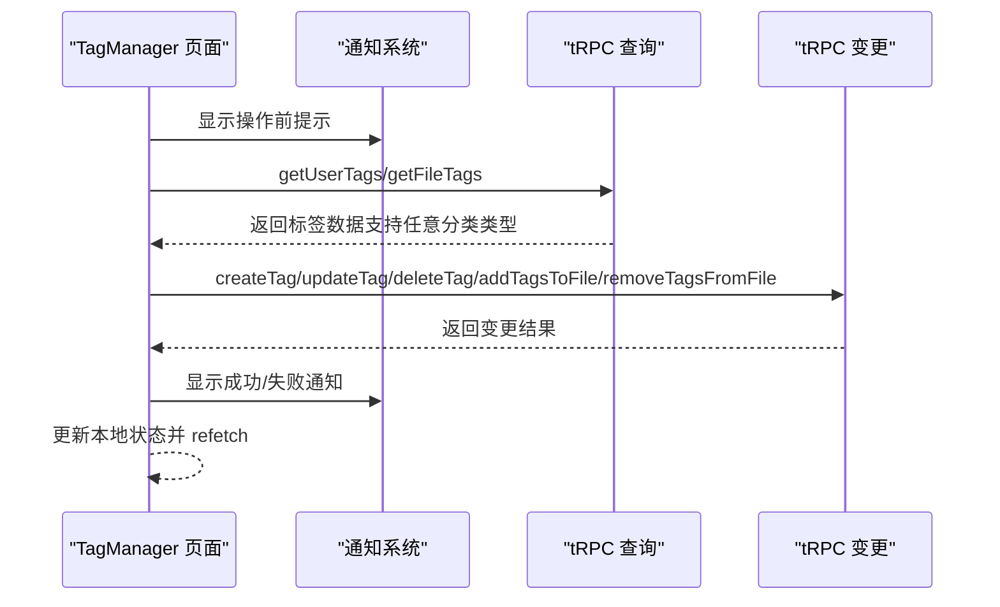
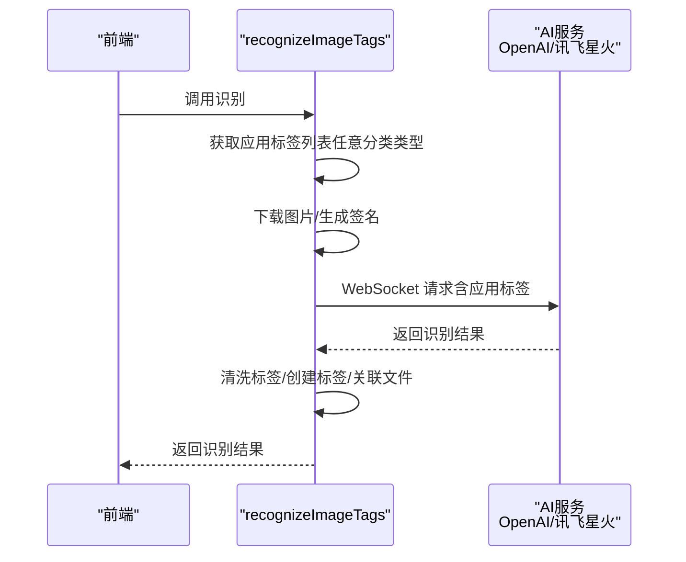
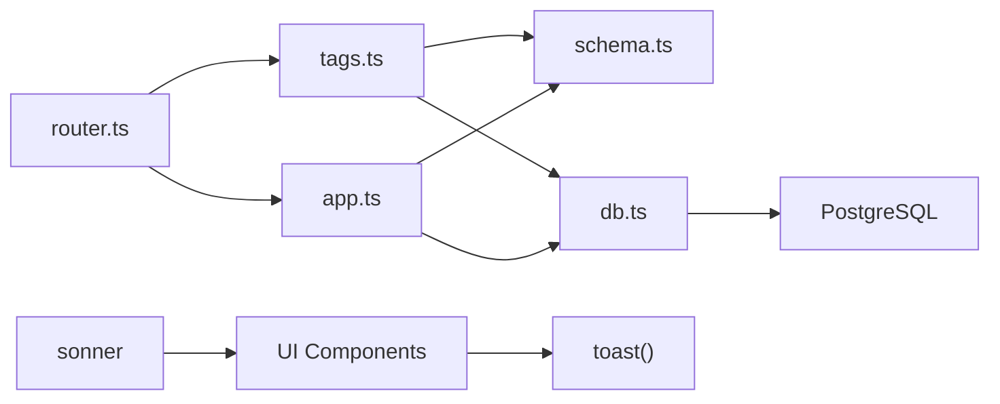

# 标签管理系统

<cite>
**本文引用的文件**
- [schema.ts](file://src/server/db/schema.ts)
- [tags.ts](file://src/server/routes/tags.ts)
- [app.ts](file://src/server/routes/app.ts)
- [tag-input.tsx](file://src/components/ui/tag-input.tsx)
- [tag.tsx](file://src/components/ui/tag.tsx)
- [page.tsx](file://src/app/dashboard/apps/[appId]/setting/tag-manager/page.tsx)
- [sonner.tsx](file://src/components/ui/sonner.tsx)
- [layout.tsx](file://src/app/layout.tsx)
- [file-item-action.tsx](file://src/components/feature/file-item-action.tsx)
- [image-crop-dialog.tsx](file://src/components/feature/image-crop-dialog.tsx)
- [db.ts](file://src/server/db/db.ts)
- [router.ts](file://src/server/trpc-middlewares/router.ts)
- [init-default-tags.ts](file://scripts/init-default-tags.ts)
- [0000_skinny_carlie_cooper.sql](file://drizzle/0000_skinny_carlie_cooper.sql)
- [0001_lonely_big_bertha.sql](file://drizzle/0001_lonely_big_bertha.sql)
- [package.json](file://package.json)
</cite>

## 更新摘要
**变更内容**
- 集成了完整的通知系统（Sonner），增强了用户体验反馈机制
- 优化了数据库查询逻辑，确保标签查询正确性和应用作用域隔离
- 改进了标签管理界面的交互体验，提供实时的操作反馈
- 在多个组件中实现了统一的通知系统集成，包括标签管理、文件操作、图片裁剪等功能

## 目录
1. [简介](#简介)
2. [项目结构](#项目结构)
3. [核心组件](#核心组件)
4. [架构总览](#架构总览)
5. [详细组件分析](#详细组件分析)
6. [依赖分析](#依赖分析)
7. [性能考虑](#性能考虑)
8. [故障排除指南](#故障排除指南)
9. [结论](#结论)
10. [附录](#附录)

## 简介
本技术文档面向"标签管理系统"，系统围绕"标签数据模型、标签关联机制、标签搜索与智能识别、标签输入与自动完成、标签管理界面、标签统计与使用分析、批量操作与清理"等主题展开。文档从代码级视角解析标签的创建、更新、删除、与文件的多对多关联、AI智能识别、以及前端交互组件的实现方式，并提供性能优化策略、最佳实践与故障排除建议。

**更新** 本次更新重点集成了完整的通知系统（Sonner），为用户提供实时的操作反馈和状态提示。同时优化了数据库查询逻辑，确保标签查询的正确性和应用作用域的严格隔离。**重要更新** CategoryType 类型现已扩展为灵活的字符串类型，支持任意分类名称，移除了原有的 ('person' | 'location' | 'event') 硬编码限制。**新增** 应用作用域标签支持，通过 appId 字段实现应用级别的标签隔离和管理。

## 项目结构
标签系统由三层组成：
- 数据层：PostgreSQL 表结构与索引，通过 Drizzle ORM 映射
- 服务层：基于 tRPC 的路由模块，提供标签 CRUD、AI 识别、批量关联等能力
- 前端层：React 组件，提供标签输入、自动完成、标签展示与管理界面，集成通知系统

**图表来源**
- [router.ts:9-16](file://src/server/trpc-middlewares/router.ts#L9-L16)
- [tags.ts:46-531](file://src/server/routes/tags.ts#L46-L531)
- [app.ts:17-48](file://src/server/routes/app.ts#L17-L48)
- [schema.ts:202-270](file://src/server/db/schema.ts#L202-L270)
- [init-default-tags.ts:14-68](file://scripts/init-default-tags.ts#L14-L68)
- [sonner.tsx:13-40](file://src/components/ui/sonner.tsx#L13-L40)

**章节来源**
- [router.ts:1-20](file://src/server/trpc-middlewares/router.ts#L1-L20)
- [tags.ts:46-531](file://src/server/routes/tags.ts#L46-L531)
- [app.ts:17-48](file://src/server/routes/app.ts#L17-L48)
- [schema.ts:202-270](file://src/server/db/schema.ts#L202-L270)
- [init-default-tags.ts:14-68](file://scripts/init-default-tags.ts#L14-L68)
- [sonner.tsx:13-40](file://src/components/ui/sonner.tsx#L13-L40)

## 核心组件
- 标签数据模型与索引
  - 标签表 tags：包含 id、name、color、userId、categoryType、parentId、appId、description、sort 等字段；定义了 user_idx、name_idx、category_idx、parent_idx 索引
  - 文件-标签关联表 files_tags：复合主键 (file_id, tag_id)，并为 file_id、tag_id 建立索引
- 标签路由与业务逻辑
  - 用户标签列表、按分类分组标签、创建/更新/删除标签
  - 为文件创建或获取标签、添加标签到文件、移除文件标签、清理未使用标签
  - **新增** AI 图片标签识别（基于讯飞星火 API），支持应用特定标签集成和智能分类
- **新增** 应用路由与默认标签管理
  - 应用创建时自动生成默认标签（人物、地点、事务）
  - 支持应用级别的标签管理和初始化
- **新增** 通知系统集成（Sonner）
  - 全局 Toaster 组件，支持主题适配和自定义图标
  - 在标签管理、文件操作、图片裁剪等组件中集成实时反馈
- 前端标签组件
  - TagInput：支持自动完成、最大标签数限制、回车添加、回退删除、点击建议添加
  - TagList：展示标签列表，支持可选的移除回调
- 初始化脚本
  - 为每个应用初始化默认标签（人物、地点、事件）

**章节来源**
- [schema.ts:202-270](file://src/server/db/schema.ts#L202-L270)
- [tags.ts:48-413](file://src/server/routes/tags.ts#L48-L413)
- [app.ts:17-48](file://src/server/routes/app.ts#L17-L48)
- [sonner.tsx:13-40](file://src/components/ui/sonner.tsx#L13-L40)
- [tag-input.tsx:14-157](file://src/components/ui/tag-input.tsx#L14-L157)
- [tag.tsx:20-203](file://src/components/ui/tag.tsx#L20-L203)
- [init-default-tags.ts:8-68](file://scripts/init-default-tags.ts#L8-L68)

## 架构总览
标签系统采用 tRPC 作为前后端通信桥梁，服务端路由集中于 tagsRouter 和 appsRouter，数据库通过 Drizzle ORM 访问。AI 识别模块封装在服务端，前端仅负责触发与展示结果。**更新** 新增应用特定标签集成，AI识别时会传入当前应用的所有标签，提供更精准的分类。**重要更新** CategoryType 现在支持任意字符串，不再受硬编码限制。**新增** 应用作用域标签支持，通过 appId 字段实现应用级别的标签隔离。**新增** 通知系统集成，为用户提供实时的操作反馈和状态提示。

**图表来源**
- [page.tsx:233-245](file://src/app/dashboard/apps/[appId]/setting/tag-manager/page.tsx#L233-L245)
- [tag-input.tsx:14-157](file://src/components/ui/tag-input.tsx#L14-L157)
- [layout.tsx:41](file://src/app/layout.tsx#L41)
- [router.ts:9-16](file://src/server/trpc-middlewares/router.ts#L9-L16)
- [tags.ts:291-353](file://src/server/routes/tags.ts#L291-L353)
- [app.ts:33-45](file://src/server/routes/app.ts#L33-L45)
- [schema.ts:242-258](file://src/server/db/schema.ts#L242-L258)

## 详细组件分析

### 数据模型与索引设计
- 标签表 tags
  - 字段：id、name（唯一）、color、userId、categoryType（灵活字符串类型，默认 general）、parentId、appId、description、sort
  - 索引：tags_user_idx、tags_name_idx、tags_category_idx、tags_parent_idx
- 文件-标签关联表 files_tags
  - 复合主键：(file_id, tag_id)
  - 索引：files_tags_file_idx、files_tags_tag_idx
- 关系映射
  - tags.user、tags.files、tags.parent/children
  - files_tags.file、files_tags.tag

**图表来源**
- [schema.ts:202-270](file://src/server/db/schema.ts#L202-L270)
- [0000_skinny_carlie_cooper.sql:83-90](file://drizzle/0000_skinny_carlie_cooper.sql#L83-L90)
- [0001_lonely_big_bertha.sql:1-8](file://drizzle/0001_lonely_big_bertha.sql#L1-L8)

**章节来源**
- [schema.ts:202-270](file://src/server/db/schema.ts#L202-L270)
- [0000_skinny_carlie_cooper.sql:83-90](file://drizzle/0000_skinny_carlie_cooper.sql#L83-L90)
- [0001_lonely_big_bertha.sql:1-8](file://drizzle/0001_lonely_big_bertha.sql#L1-L8)

### 标签路由与业务流程
- 用户标签列表：按使用次数降序、名称升序返回，支持应用作用域过滤
- 按分类分组标签：返回所有分类类型（不限于 person/location/event），并统计关联文件数
- 创建/更新/删除标签：校验用户归属、名称唯一性、冲突检测
- 为文件创建或获取标签：去重、批量插入、随机颜色生成
- 添加标签到文件：事务内完成标签创建与关联，避免重复
- 移除文件标签：支持按 tagIds 或全部移除
- 清理未使用标签：删除无任何关联的标签
- **新增** AI 图片标签识别：下载图片、生成签名、WebSocket 调用讯飞星火 API，解析响应并入库
  - **智能分类**：获取当前应用的所有标签，动态生成分类提示
  - **应用特定集成**：传入 appId 和现有标签列表，提供更精准的识别结果

**图表来源**
- [tags.ts:448-461](file://src/server/routes/tags.ts#L448-L461)
- [tags.ts:246-353](file://src/server/routes/tags.ts#L246-L353)

**章节来源**
- [tags.ts:48-413](file://src/server/routes/tags.ts#L48-L413)
- [tags.ts:246-353](file://src/server/routes/tags.ts#L246-L353)
- [tags.ts:416-531](file://src/server/routes/tags.ts#L416-L531)

### 应用路由与默认标签管理
- **新增** 应用创建时自动生成默认标签：人物、地点、事务
- 支持应用级别的标签管理和初始化
- 为新应用创建分类标签，提供基础的标签体系

**图表来源**
- [app.ts:33-45](file://src/server/routes/app.ts#L33-L45)

**章节来源**
- [app.ts:17-48](file://src/server/routes/app.ts#L17-L48)

### 通知系统集成（Sonner）
- **新增** Toaster 组件：全局通知容器，支持主题适配和自定义图标
- **新增** 主题集成：使用 next-themes 获取系统主题，自动适配明暗模式
- **新增** 自定义图标：success、info、warning、error、loading 状态的专用图标
- **新增** 样式定制：通过 CSS 变量适配设计系统主题
- **集成范围**：标签管理、文件操作、图片裁剪等多个组件使用 toast 进行反馈

**图表来源**
- [sonner.tsx:13-40](file://src/components/ui/sonner.tsx#L13-L40)
- [layout.tsx:41](file://src/app/layout.tsx#L41)
- [page.tsx:93-115](file://src/app/dashboard/apps/[appId]/setting/tag-manager/page.tsx#L93-L115)

**章节来源**
- [sonner.tsx:13-40](file://src/components/ui/sonner.tsx#L13-L40)
- [layout.tsx:41](file://src/app/layout.tsx#L41)
- [page.tsx:93-115](file://src/app/dashboard/apps/[appId]/setting/tag-manager/page.tsx#L93-L115)

### 标签输入组件与自动完成
- TagInput（推荐用于页面）：支持最多 N 个标签、最大长度限制、自动完成、点击建议添加、点击外部关闭建议、回车添加、回退删除最后一个
- TagInput（通用版本）：与推荐版本类似，但更简洁，适合通用场景
- TagList：展示标签列表，支持可选移除回调

**图表来源**
- [tag-input.tsx:28-99](file://src/components/ui/tag-input.tsx#L28-L99)
- [tag.tsx:97-203](file://src/components/ui/tag.tsx#L97-L203)

**章节来源**
- [tag-input.tsx:14-157](file://src/components/ui/tag-input.tsx#L14-L157)
- [tag.tsx:20-203](file://src/components/ui/tag.tsx#L20-L203)

### 标签管理界面
- 页面职责：展示用户标签列表、创建/编辑/删除标签、为当前文件添加/移除标签、显示文件标签数量
- 与 tRPC 集成：查询用户标签、查询文件标签、创建/更新/删除标签、添加/移除标签到文件
- **更新** 交互细节：确认删除、异步刷新、错误提示、**新增** 实时通知反馈
- **更新** 通知系统：使用 toast 提供创建、更新、删除标签的成功和失败通知

**图表来源**
- [page.tsx:48-111](file://src/app/dashboard/apps/[appId]/setting/tag-manager/page.tsx#L48-L111)
- [page.tsx:113-231](file://src/app/dashboard/apps/[appId]/setting/tag-manager/page.tsx#L113-L231)
- [page.tsx:93-115](file://src/app/dashboard/apps/[appId]/setting/tag-manager/page.tsx#L93-L115)

**章节来源**
- [page.tsx:30-465](file://src/app/dashboard/apps/[appId]/setting/tag-manager/page.tsx#L30-L465)

### AI 智能标签识别
- **更新** 触发条件：提供 fileId 或 imageUrl，若未提供 imageUrl 则从文件记录获取
- **更新** 识别流程：下载图片 -> 生成签名 -> WebSocket 请求 -> 解析响应 -> 清洗标签 -> 创建/获取标签 -> 关联文件
- **新增** 应用特定标签集成：获取当前应用的所有标签，动态生成分类提示
- **新增** 智能分类增强：根据现有标签动态生成提示，提高识别准确性
- **新增** 多AI服务支持：可选择不同的AI服务提供商（OpenAI、Google Vision、Azure Computer Vision）
- 失败处理：捕获异常、抛出 TRPC 错误、记录日志

**图表来源**
- [tags.ts:416-531](file://src/server/routes/tags.ts#L416-L531)
- [tags.ts:544-728](file://src/server/routes/tags.ts#L544-L728)

**章节来源**
- [tags.ts:416-531](file://src/server/routes/tags.ts#L416-L531)
- [tags.ts:544-728](file://src/server/routes/tags.ts#L544-L728)

## 依赖分析
- tRPC 路由聚合：router.ts 将 tags 路由和 apps 路由挂载到 appRouter
- 数据库连接：db.ts 使用 DATABASE_URL 连接 PostgreSQL，Drizzle ORM 映射 schema.ts
- **新增** 通知系统：sonner 2.0.7 版本，提供现代化的通知体验
- 包依赖：@trpc/*、drizzle-orm、postgres、ws、uuid、**新增** sonner 等

**图表来源**
- [router.ts:9-16](file://src/server/trpc-middlewares/router.ts#L9-L16)
- [tags.ts:1-10](file://src/server/routes/tags.ts#L1-L10)
- [app.ts:1-8](file://src/server/routes/app.ts#L1-L8)
- [db.ts:1-9](file://src/server/db/db.ts#L1-L9)
- [schema.ts:1-16](file://src/server/db/schema.ts#L1-L16)
- [package.json:62](file://package.json#L62)

**章节来源**
- [router.ts:1-20](file://src/server/trpc-middlewares/router.ts#L1-L20)
- [db.ts:1-9](file://src/server/db/db.ts#L1-L9)
- [package.json:14-66](file://package.json#L14-L66)

## 性能考虑
- 索引优化
  - tags：user_idx、name_idx、category_idx、parent_idx
  - files_tags：file_idx、tag_idx
  - files：cursor_idx（id, created_at）
- 查询优化
  - 使用原生 SQL 聚合统计标签使用次数，避免多次往返
  - inArray 批量查询标签名称，减少查询次数
  - onConflictDoNothing 避免重复关联
  - **更新** CategoryType 查询优化：支持任意字符串类型，无需硬编码限制
  - **新增** 应用作用域查询优化：通过 appId 过滤标签，避免跨应用数据污染
  - **新增** 通知系统性能：Sonner 使用轻量级实现，避免不必要的重新渲染
- 事务与幂等
  - addTagsToFile 使用事务保证标签创建与关联的一致性
  - cleanupUnusedTags 使用子查询删除无关联标签
- **新增** AI识别优化
  - 应用标签预加载：在AI识别前获取应用标签列表，避免重复查询
  - 智能提示缓存：利用现有标签生成动态提示，提高识别效率
  - 多AI服务降级：支持多种AI服务提供商，提高可用性
- 前端优化
  - TagInput 自动完成使用防抖式过滤，减少渲染压力
  - TagManager 使用异步更新与 refetch，避免同步 setState
  - **新增** 通知系统优化：统一的通知容器，避免重复实例化

**章节来源**
- [schema.ts:218-224](file://src/server/db/schema.ts#L218-L224)
- [tags.ts:52-74](file://src/server/routes/tags.ts#L52-L74)
- [tags.ts:304-350](file://src/server/routes/tags.ts#L304-L350)
- [tags.ts:401-413](file://src/server/routes/tags.ts#L401-L413)
- [tag-input.tsx:28-44](file://src/components/ui/tag-input.tsx#L28-L44)
- [sonner.tsx:13-40](file://src/components/ui/sonner.tsx#L13-L40)

## 故障排除指南
- 标签名称冲突
  - 现象：更新/创建标签时报冲突
  - 处理：确保名称唯一，或先删除旧标签再创建
- 权限不足
  - 现象：找不到文件或标签
  - 处理：确认当前用户与文件/标签的 userId 匹配
- **新增** 通知系统问题
  - 现象：toast 不显示或显示异常
  - 处理：检查 Toaster 组件是否正确渲染在根布局中，确认 sonner 版本兼容性
  - **新增** 检查主题适配：确认 next-themes 正常工作，检查 CSS 变量是否正确应用
- **新增** AI 识别失败
  - 现象：识别为空或报错
  - 处理：检查环境变量（XFYUN_*、OPENAI_*）、网络连通性、WebSocket 超时设置
  - **新增** 检查应用标签：确认应用是否有标签，AI识别需要至少一个标签才能生成有效提示
  - **新增** 多AI服务切换：如果OpenAI失败，系统会自动尝试其他AI服务提供商
- 未使用标签清理无效
  - 现象：cleanupUnusedTags 返回删除计数为 0
  - 处理：确认标签确实无任何关联，或检查软删除状态
- **新增** 应用标签初始化问题
  - 现象：新应用没有默认标签
  - 处理：运行初始化脚本或检查应用创建流程
- **新增** CategoryType 类型问题
  - 现象：分类类型不符合预期
  - 处理：确认 CategoryType 为字符串类型，支持任意分类名称，不再受硬编码限制
- **新增** 应用作用域标签问题
  - 现象：标签在不同应用间可见或不可见
  - 处理：确认 appId 字段正确设置，查询时包含 appId 条件
- **新增** 通知样式问题
  - 现象：通知样式不正确或主题不匹配
  - 处理：检查 CSS 变量定义，确认设计系统主题变量正确应用

**章节来源**
- [tags.ts:135-140](file://src/server/routes/tags.ts#L135-L140)
- [tags.ts:222-232](file://src/server/routes/tags.ts#L222-L232)
- [tags.ts:524-529](file://src/server/routes/tags.ts#L524-L529)
- [tags.ts:401-413](file://src/server/routes/tags.ts#L401-L413)
- [sonner.tsx:27-34](file://src/components/ui/sonner.tsx#L27-L34)

## 结论
标签管理系统通过清晰的数据模型、完善的 tRPC 路由与前端组件，实现了标签的创建、管理、与文件的多对多关联，并提供了 AI 智能识别与统计分析能力。**更新** 本次重大优化显著增强了AI图像标签识别系统，通过应用特定标签集成、智能分类和动态提示生成，大幅提升了标签识别的准确性和智能化水平。**重要更新** CategoryType 类型扩展为灵活字符串类型，移除了原有的 ('person' | 'location' | 'event') 硬编码限制，现在支持任意分类名称，为系统提供了更大的灵活性和扩展性。**新增** 应用作用域标签支持，通过 appId 字段实现应用级别的标签隔离，确保不同应用的标签数据相互独立。**新增** 通知系统集成（Sonner），为用户提供实时的操作反馈和状态提示，显著提升了用户体验。通过合理的索引与查询优化，系统在大数据量下仍具备良好性能。建议在生产环境中结合监控与缓存策略进一步提升稳定性与用户体验。

## 附录
- 默认标签初始化
  - 为每个应用初始化默认标签（人物、地点、事务），避免首次使用无分类标签的情况
  - 支持手动初始化脚本，可为现有应用添加缺失的默认标签
- **新增** 应用特定标签集成
  - AI识别时自动获取应用标签列表，提供更精准的分类
  - 支持动态提示生成，根据现有标签调整识别策略
- **新增** CategoryType 类型扩展
  - CategoryType 现在为灵活字符串类型，支持任意分类名称
  - 移除了硬编码的 ('person' | 'location' | 'event') 限制
  - SQL 查询逻辑已相应优化，支持动态分类类型
- **新增** 应用作用域标签支持
  - 新增 appId 字段，实现应用级别的标签隔离
  - 所有标签查询和操作都支持 appId 过滤
  - 应用创建时自动初始化默认标签
- **新增** 通知系统集成
  - Sonner 2.0.7 版本，提供现代化的通知体验
  - 全局 Toaster 组件，支持主题适配和自定义图标
  - 在标签管理、文件操作、图片裁剪等组件中集成实时反馈
- 环境变量
  - XFYUN_APP_ID、XFYUN_API_KEY、XFYUN_API_SECRET：用于讯飞星火 AI 识别
  - OPENAI_API_KEY：用于 OpenAI Vision API（可选）
  - DATABASE_URL：PostgreSQL 连接串

**章节来源**
- [init-default-tags.ts:8-68](file://scripts/init-default-tags.ts#L8-L68)
- [tags.ts:560-569](file://src/server/routes/tags.ts#L560-L569)
- [app.ts:33-45](file://src/server/routes/app.ts#L33-L45)
- [schema.ts:210-212](file://src/server/db/schema.ts#L210-L212)
- [tags.ts:11-12](file://src/server/routes/tags.ts#L11-L12)
- [sonner.tsx:13-40](file://src/components/ui/sonner.tsx#L13-L40)
- [package.json:62](file://package.json#L62)