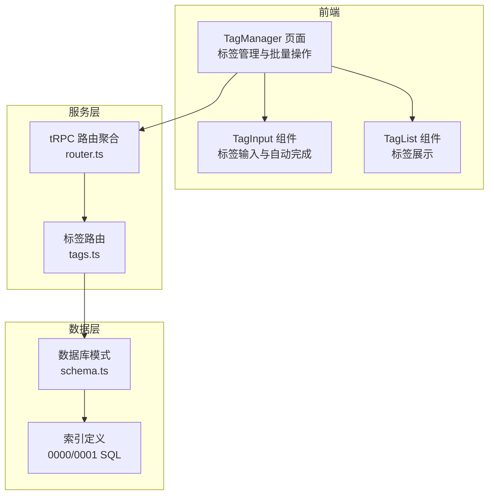
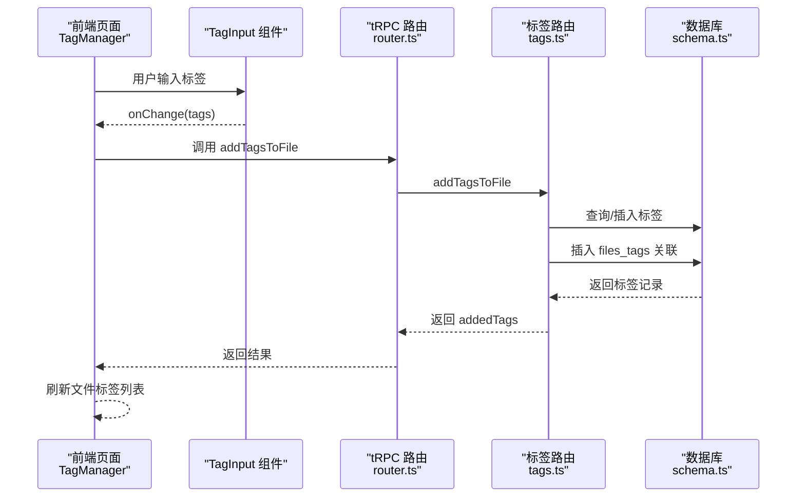
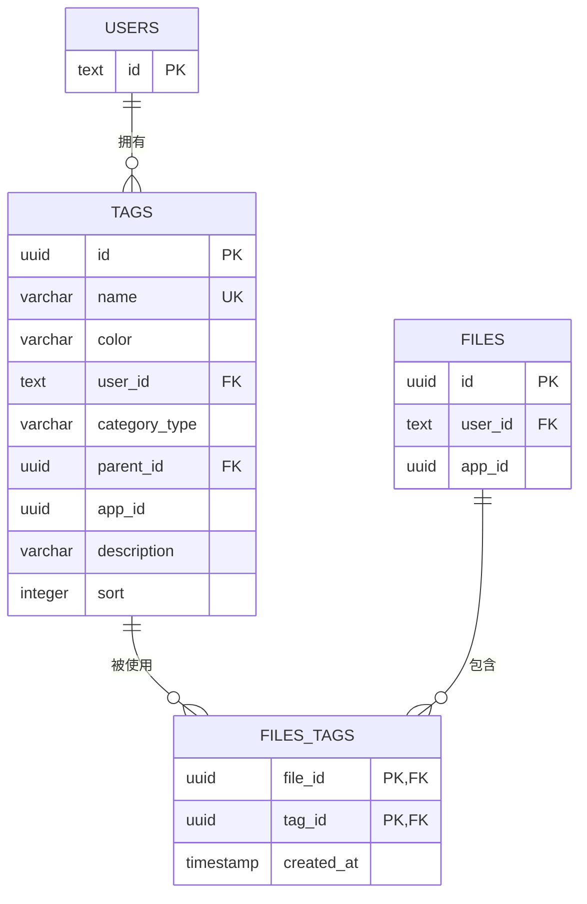
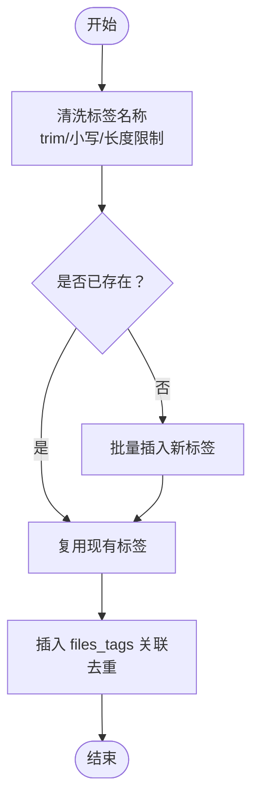
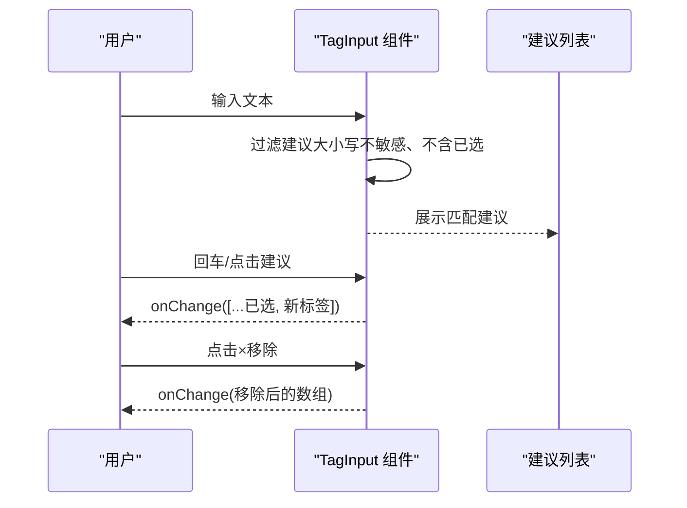
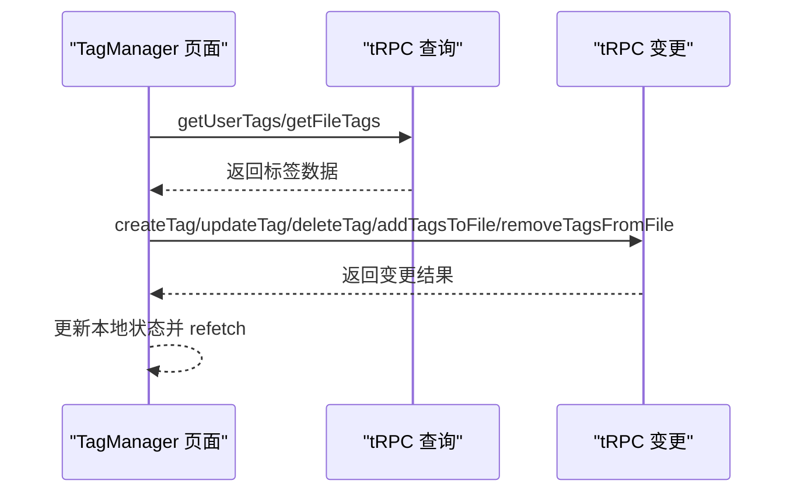
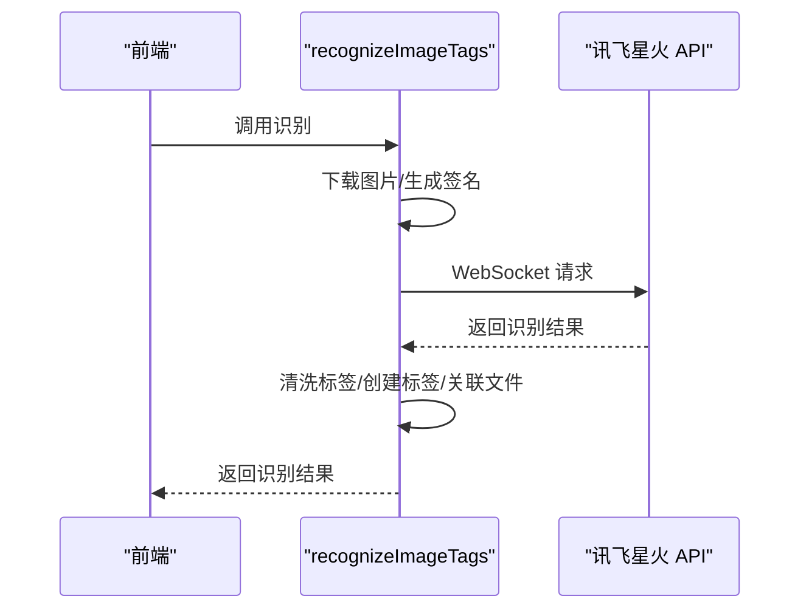
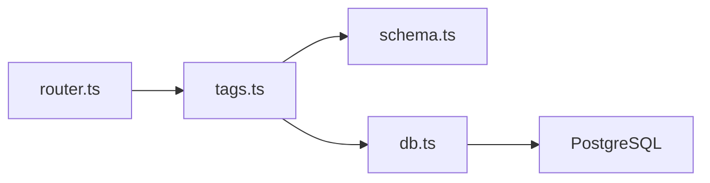

# 标签管理系统

<cite>
**本文引用的文件**
- [schema.ts](file://src/server/db/schema.ts)
- [tags.ts](file://src/server/routes/tags.ts)
- [tag-input.tsx](file://src/components/ui/tag-input.tsx)
- [tag.tsx](file://src/components/ui/tag.tsx)
- [page.tsx](file://src/app/dashboard/apps/[appId]/setting/tag-manager/page.tsx)
- [db.ts](file://src/server/db/db.ts)
- [router.ts](file://src/server/trpc-middlewares/router.ts)
- [init-default-tags.ts](file://scripts/init-default-tags.ts)
- [0000_skinny_carlie_cooper.sql](file://drizzle/0000_skinny_carlie_cooper.sql)
- [0001_lonely_big_bertha.sql](file://drizzle/0001_lonely_big_bertha.sql)
- [package.json](file://package.json)
</cite>

## 目录
1. [简介](#简介)
2. [项目结构](#项目结构)
3. [核心组件](#核心组件)
4. [架构总览](#架构总览)
5. [详细组件分析](#详细组件分析)
6. [依赖分析](#依赖分析)
7. [性能考虑](#性能考虑)
8. [故障排除指南](#故障排除指南)
9. [结论](#结论)
10. [附录](#附录)

## 简介
本技术文档面向“标签管理系统”，系统围绕“标签数据模型、标签关联机制、标签搜索与智能识别、标签输入与自动完成、标签管理界面、标签统计与使用分析、批量操作与清理”等主题展开。文档从代码级视角解析标签的创建、更新、删除、与文件的多对多关联、AI智能识别、以及前端交互组件的实现方式，并提供性能优化策略、最佳实践与故障排除建议。

## 项目结构
标签系统由三层组成：
- 数据层：PostgreSQL 表结构与索引，通过 Drizzle ORM 映射
- 服务层：基于 tRPC 的路由模块，提供标签 CRUD、AI 识别、批量关联等能力
- 前端层：React 组件，提供标签输入、自动完成、标签展示与管理界面

**图表来源**
- [router.ts:9-16](file://src/server/trpc-middlewares/router.ts#L9-L16)
- [tags.ts:46-531](file://src/server/routes/tags.ts#L46-L531)
- [schema.ts:202-270](file://src/server/db/schema.ts#L202-L270)
- [0000_skinny_carlie_cooper.sql:83-90](file://drizzle/0000_skinny_carlie_cooper.sql#L83-L90)
- [0001_lonely_big_bertha.sql:1-8](file://drizzle/0001_lonely_big_bertha.sql#L1-L8)

**章节来源**
- [router.ts:1-20](file://src/server/trpc-middlewares/router.ts#L1-L20)
- [tags.ts:46-531](file://src/server/routes/tags.ts#L46-L531)
- [schema.ts:202-270](file://src/server/db/schema.ts#L202-L270)
- [0000_skinny_carlie_cooper.sql:1-116](file://drizzle/0000_skinny_carlie_cooper.sql#L1-L116)
- [0001_lonely_big_bertha.sql:1-8](file://drizzle/0001_lonely_big_bertha.sql#L1-L8)

## 核心组件
- 标签数据模型与索引
  - 标签表 tags：包含 id、name、color、userId、categoryType、parentId、appId、description、sort 等字段；定义了 user_idx、name_idx、category_idx、parent_idx 索引
  - 文件-标签关联表 files_tags：复合主键 (file_id, tag_id)，并为 file_id、tag_id 建立索引
- 标签路由与业务逻辑
  - 用户标签列表、按分类分组标签、创建/更新/删除标签
  - 为文件创建或获取标签、添加标签到文件、移除文件标签、清理未使用标签
  - AI 图片标签识别（基于讯飞星火 API）
- 前端标签组件
  - TagInput：支持自动完成、最大标签数限制、回车添加、回退删除、点击建议添加
  - TagList：展示标签列表，支持可选的移除回调
- 初始化脚本
  - 为每个应用初始化默认标签（人物、地点、事件）

**章节来源**
- [schema.ts:202-270](file://src/server/db/schema.ts#L202-L270)
- [tags.ts:48-413](file://src/server/routes/tags.ts#L48-L413)
- [tag-input.tsx:14-157](file://src/components/ui/tag-input.tsx#L14-L157)
- [tag.tsx:20-203](file://src/components/ui/tag.tsx#L20-L203)
- [init-default-tags.ts:8-68](file://scripts/init-default-tags.ts#L8-L68)

## 架构总览
标签系统采用 tRPC 作为前后端通信桥梁，服务端路由集中于 tagsRouter，数据库通过 Drizzle ORM 访问。AI 识别模块封装在服务端，前端仅负责触发与展示结果。

**图表来源**
- [page.tsx:233-245](file://src/app/dashboard/apps/[appId]/setting/tag-manager/page.tsx#L233-L245)
- [tag-input.tsx:14-157](file://src/components/ui/tag-input.tsx#L14-L157)
- [router.ts:9-16](file://src/server/trpc-middlewares/router.ts#L9-L16)
- [tags.ts:291-353](file://src/server/routes/tags.ts#L291-L353)
- [schema.ts:242-258](file://src/server/db/schema.ts#L242-L258)

## 详细组件分析

### 数据模型与索引设计
- 标签表 tags
  - 字段：id、name（唯一）、color、userId、categoryType（默认 general）、parentId、appId、description、sort
  - 索引：tags_user_idx、tags_name_idx、tags_category_idx、tags_parent_idx
- 文件-标签关联表 files_tags
  - 复合主键：(file_id, tag_id)
  - 索引：files_tags_file_idx、files_tags_tag_idx
- 关系映射
  - tags.user、tags.files、tags.parent/children
  - files_tags.file、files_tags.tag

**图表来源**
- [schema.ts:202-270](file://src/server/db/schema.ts#L202-L270)
- [0000_skinny_carlie_cooper.sql:83-90](file://drizzle/0000_skinny_carlie_cooper.sql#L83-L90)
- [0001_lonely_big_bertha.sql:1-8](file://drizzle/0001_lonely_big_bertha.sql#L1-L8)

**章节来源**
- [schema.ts:202-270](file://src/server/db/schema.ts#L202-L270)
- [0000_skinny_carlie_cooper.sql:83-90](file://drizzle/0000_skinny_carlie_cooper.sql#L83-L90)
- [0001_lonely_big_bertha.sql:1-8](file://drizzle/0001_lonely_big_bertha.sql#L1-L8)

### 标签路由与业务流程
- 用户标签列表：按使用次数降序、名称升序返回
- 按分类分组标签：仅返回顶级分类（person/location/event），并统计关联文件数
- 创建/更新/删除标签：校验用户归属、名称唯一性、冲突检测
- 为文件创建或获取标签：去重、批量插入、随机颜色生成
- 添加标签到文件：事务内完成标签创建与关联，避免重复
- 移除文件标签：支持按 tagIds 或全部移除
- 清理未使用标签：删除无任何关联的标签
- AI 图片标签识别：下载图片、生成签名、WebSocket 调用讯飞星火 API，解析响应并入库

**图表来源**
- [tags.ts:246-353](file://src/server/routes/tags.ts#L246-L353)

**章节来源**
- [tags.ts:48-413](file://src/server/routes/tags.ts#L48-L413)
- [tags.ts:246-353](file://src/server/routes/tags.ts#L246-L353)
- [tags.ts:416-531](file://src/server/routes/tags.ts#L416-L531)

### 标签输入组件与自动完成
- TagInput（推荐用于页面）：支持最多 N 个标签、最大长度限制、自动完成、点击建议添加、点击外部关闭建议、回车添加、回退删除最后一个
- TagInput（通用版本）：与推荐版本类似，但更简洁，适合通用场景
- TagList：展示标签列表，支持可选移除回调

**图表来源**
- [tag-input.tsx:28-99](file://src/components/ui/tag-input.tsx#L28-L99)
- [tag.tsx:97-203](file://src/components/ui/tag.tsx#L97-L203)

**章节来源**
- [tag-input.tsx:14-157](file://src/components/ui/tag-input.tsx#L14-L157)
- [tag.tsx:20-203](file://src/components/ui/tag.tsx#L20-L203)

### 标签管理界面
- 页面职责：展示用户标签列表、创建/编辑/删除标签、为当前文件添加/移除标签、显示文件标签数量
- 与 tRPC 集成：查询用户标签、查询文件标签、创建/更新/删除标签、添加/移除标签到文件
- 交互细节：确认删除、异步刷新、错误提示

**图表来源**
- [page.tsx:48-111](file://src/app/dashboard/apps/[appId]/setting/tag-manager/page.tsx#L48-L111)
- [page.tsx:113-231](file://src/app/dashboard/apps/[appId]/setting/tag-manager/page.tsx#L113-L231)

**章节来源**
- [page.tsx:30-465](file://src/app/dashboard/apps/[appId]/setting/tag-manager/page.tsx#L30-L465)

### AI 智能标签识别
- 触发条件：提供 fileId 或 imageUrl，若未提供 imageUrl 则从文件记录获取
- 识别流程：下载图片 -> 生成签名 -> WebSocket 请求 -> 解析响应 -> 清洗标签 -> 创建/获取标签 -> 关联文件
- 失败处理：捕获异常、抛出 TRPC 错误、记录日志

**图表来源**
- [tags.ts:416-531](file://src/server/routes/tags.ts#L416-L531)
- [tags.ts:534-735](file://src/server/routes/tags.ts#L534-L735)

**章节来源**
- [tags.ts:416-531](file://src/server/routes/tags.ts#L416-L531)
- [tags.ts:534-735](file://src/server/routes/tags.ts#L534-L735)

## 依赖分析
- tRPC 路由聚合：router.ts 将 tags 路由挂载到 appRouter
- 数据库连接：db.ts 使用 DATABASE_URL 连接 PostgreSQL，Drizzle ORM 映射 schema.ts
- 包依赖：@trpc/*、drizzle-orm、postgres、ws、uuid 等

**图表来源**
- [router.ts:9-16](file://src/server/trpc-middlewares/router.ts#L9-L16)
- [tags.ts:1-10](file://src/server/routes/tags.ts#L1-L10)
- [db.ts:1-9](file://src/server/db/db.ts#L1-L9)
- [schema.ts:1-16](file://src/server/db/schema.ts#L1-L16)

**章节来源**
- [router.ts:1-20](file://src/server/trpc-middlewares/router.ts#L1-L20)
- [db.ts:1-9](file://src/server/db/db.ts#L1-L9)
- [package.json:14-66](file://package.json#L14-L66)

## 性能考虑
- 索引优化
  - tags：user_idx、name_idx、category_idx、parent_idx
  - files_tags：file_idx、tag_idx
  - files：cursor_idx（id, created_at）
- 查询优化
  - 使用原生 SQL 聚合统计标签使用次数，避免多次往返
  - inArray 批量查询标签名称，减少查询次数
  - onConflictDoNothing 避免重复关联
- 事务与幂等
  - addTagsToFile 使用事务保证标签创建与关联的一致性
  - cleanupUnusedTags 使用子查询删除无关联标签
- 前端优化
  - TagInput 自动完成使用防抖式过滤，减少渲染压力
  - TagManager 使用异步更新与 refetch，避免同步 setState

**章节来源**
- [schema.ts:218-224](file://src/server/db/schema.ts#L218-L224)
- [tags.ts:52-74](file://src/server/routes/tags.ts#L52-L74)
- [tags.ts:304-350](file://src/server/routes/tags.ts#L304-L350)
- [tags.ts:401-413](file://src/server/routes/tags.ts#L401-L413)
- [tag-input.tsx:28-44](file://src/components/ui/tag-input.tsx#L28-L44)

## 故障排除指南
- 标签名称冲突
  - 现象：更新/创建标签时报冲突
  - 处理：确保名称唯一，或先删除旧标签再创建
- 权限不足
  - 现象：找不到文件或标签
  - 处理：确认当前用户与文件/标签的 userId 匹配
- AI 识别失败
  - 现象：识别为空或报错
  - 处理：检查环境变量（XFYUN_*）、网络连通性、WebSocket 超时设置
- 未使用标签清理无效
  - 现象：cleanupUnusedTags 返回删除计数为 0
  - 处理：确认标签确实无任何关联，或检查软删除状态

**章节来源**
- [tags.ts:135-140](file://src/server/routes/tags.ts#L135-L140)
- [tags.ts:222-232](file://src/server/routes/tags.ts#L222-L232)
- [tags.ts:524-529](file://src/server/routes/tags.ts#L524-L529)
- [tags.ts:401-413](file://src/server/routes/tags.ts#L401-L413)

## 结论
标签管理系统通过清晰的数据模型、完善的 tRPC 路由与前端组件，实现了标签的创建、管理、与文件的多对多关联，并提供了 AI 智能识别与统计分析能力。通过合理的索引与查询优化，系统在大数据量下仍具备良好性能。建议在生产环境中结合监控与缓存策略进一步提升稳定性与用户体验。

## 附录
- 默认标签初始化
  - 为每个应用初始化默认标签（人物、地点、事务），避免首次使用无分类标签的情况
- 环境变量
  - XFYUN_APP_ID、XFYUN_API_KEY、XFYUN_API_SECRET：用于 AI 识别
  - DATABASE_URL：PostgreSQL 连接串

**章节来源**
- [init-default-tags.ts:8-68](file://scripts/init-default-tags.ts#L8-L68)
- [tags.ts:560-569](file://src/server/routes/tags.ts#L560-L569)