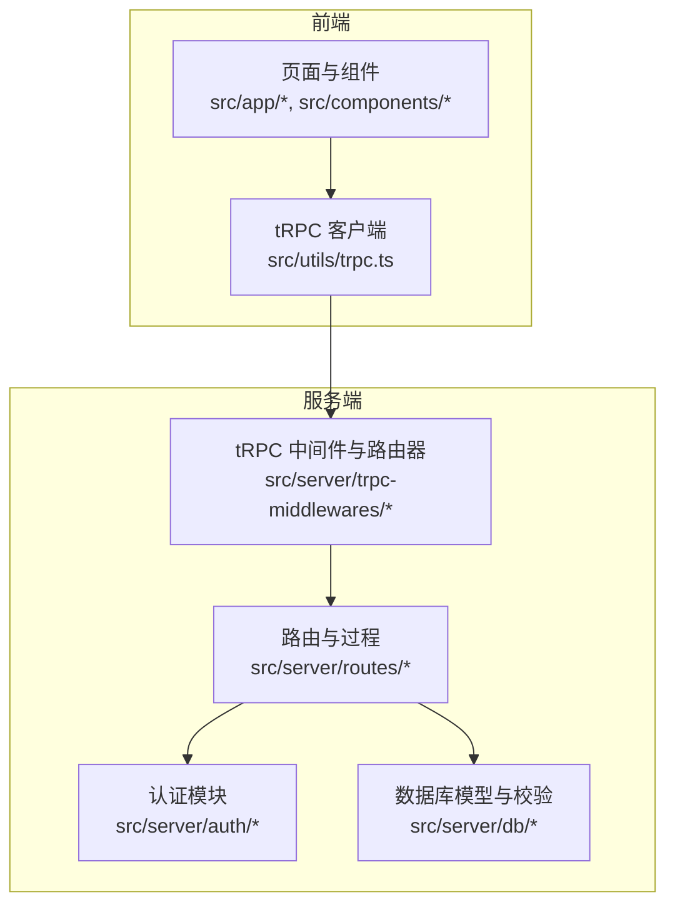
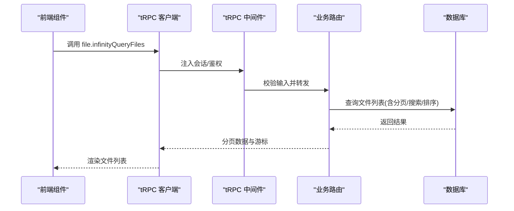
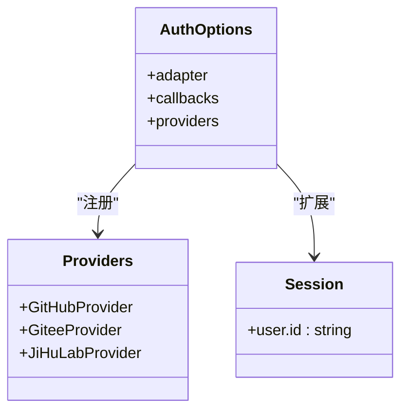
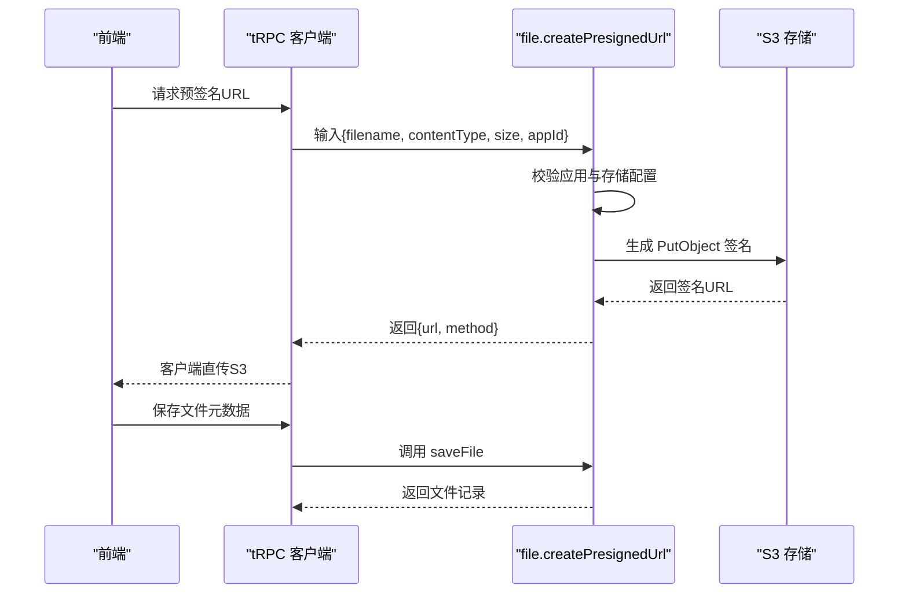
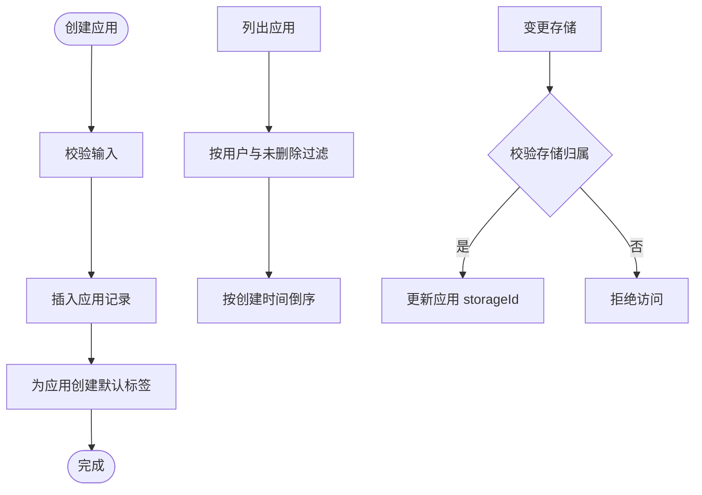
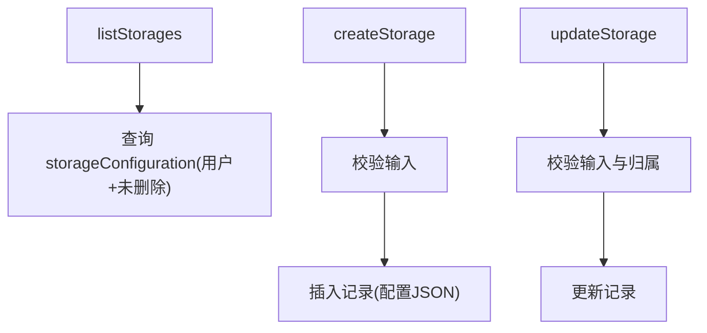
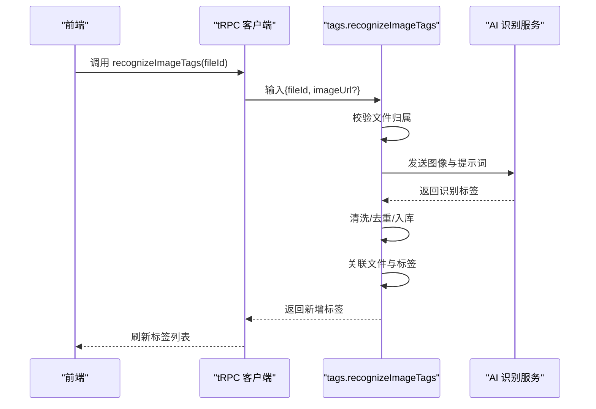
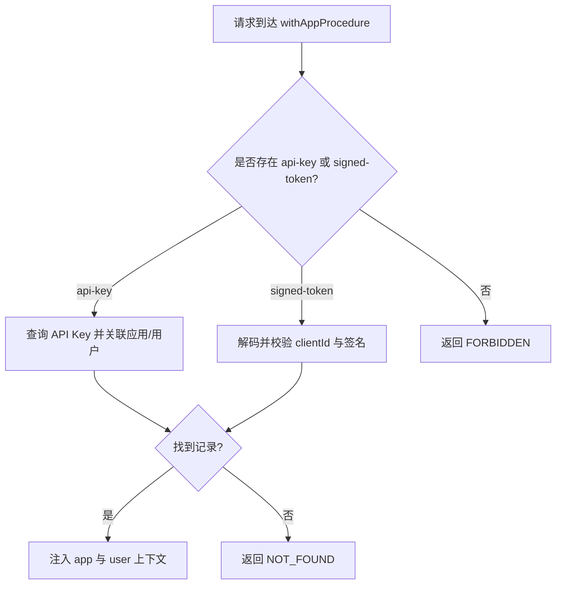
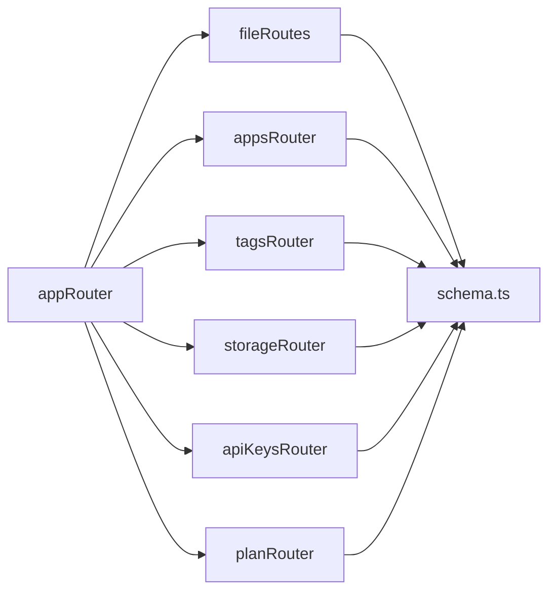

# 核心功能模块

<cite>
**本文引用的文件**
- [src/lib/auth.ts](file://src/lib/auth.ts)
- [src/server/auth/index.ts](file://src/server/auth/index.ts)
- [src/server/db/schema.ts](file://src/server/db/schema.ts)
- [src/server/routes/app.ts](file://src/server/routes/app.ts)
- [src/server/routes/file.ts](file://src/server/routes/file.ts)
- [src/server/routes/storages.ts](file://src/server/routes/storages.ts)
- [src/server/routes/tags.ts](file://src/server/routes/tags.ts)
- [src/server/routes/api-keys.ts](file://src/server/routes/api-keys.ts)
- [src/server/routes/user.ts](file://src/server/routes/user.ts)
- [src/server/db/validate-schema.ts](file://src/server/db/validate-schema.ts)
- [src/server/trpc-middlewares/router.ts](file://src/server/trpc-middlewares/router.ts)
- [src/server/trpc-middlewares/trpc.ts](file://src/server/trpc-middlewares/trpc.ts)
- [src/utils/trpc.ts](file://src/utils/trpc.ts)
- [src/components/feature/FileList.tsx](file://src/components/feature/FileList.tsx)
- [src/components/feature/file-item.tsx](file://src/components/feature/file-item.tsx)
</cite>

## 目录

1. [简介](#简介)
2. [项目结构](#项目结构)
3. [核心组件](#核心组件)
4. [架构总览](#架构总览)
5. [详细组件分析](#详细组件分析)
6. [依赖分析](#依赖分析)
7. [性能考虑](#性能考虑)
8. [故障排查指南](#故障排查指南)
9. [结论](#结论)
10. [附录](#附录)

## 简介

本文件面向 Image SaaS 项目的“核心功能模块”，系统性梳理并解释以下六大模块的设计与实现：

- 用户认证系统：支持多源 OAuth 登录、会话管理与 SKIP_LOGIN 快速调试模式
- 文件管理系统：上传预签名、文件列表、分页检索、软删除与回收站、标签关联
- 应用管理系统：应用创建、列表、绑定存储
- 存储配置系统：S3 兼容存储配置的增删改查
- 标签管理系统：标签 CRUD、按分类聚合、AI 图片标签识别
- API 管理系统：基于 API Key 与签名 Token 的应用级鉴权

文档同时提供接口说明、参数定义、业务流程图、类图与序列图，帮助初学者快速上手，也为资深开发者提供深入的技术细节与最佳实践。

## 项目结构

项目采用前后端同构的 Next.js 结构，核心逻辑集中在服务端的 server 目录，通过 tRPC 提供统一 API；前端通过自动生成的客户端调用这些过程。

**图表来源**

- [src/server/trpc-middlewares/router.ts:1-20](file://src/server/trpc-middlewares/router.ts#L1-L20)
- [src/server/trpc-middlewares/trpc.ts:1-130](file://src/server/trpc-middlewares/trpc.ts#L1-L130)
- [src/utils/trpc.ts:1-7](file://src/utils/trpc.ts#L1-L7)

**章节来源**

- [src/server/trpc-middlewares/router.ts:1-20](file://src/server/trpc-middlewares/router.ts#L1-L20)
- [src/server/trpc-middlewares/trpc.ts:1-130](file://src/server/trpc-middlewares/trpc.ts#L1-L130)
- [src/utils/trpc.ts:1-7](file://src/utils/trpc.ts#L1-L7)

## 核心组件

- 认证与会话：基于 NextAuth 的 Drizzle 适配器，支持 GitHub、Gitee、JiHuLab 多 OAuth 提供商；在 SKIP_LOGIN 模式下自动注入管理员会话
- 数据模型：用户、应用、文件、存储配置、API Key、标签及多对多关联表
- tRPC 路由：文件、应用、标签、存储、API Key、计划等模块过程
- 前端集成：FileList 组件通过 tRPC 客户端拉取无限滚动文件列表，上传完成后自动触发 AI 标签识别

**章节来源**

- [src/server/auth/index.ts:1-163](file://src/server/auth/index.ts#L1-L163)
- [src/server/db/schema.ts:1-270](file://src/server/db/schema.ts#L1-L270)
- [src/server/trpc-middlewares/router.ts:1-20](file://src/server/trpc-middlewares/router.ts#L1-L20)
- [src/components/feature/FileList.tsx:1-366](file://src/components/feature/FileList.tsx#L1-L366)

## 架构总览

整体采用“前端 tRPC 客户端 → tRPC 中间件 → 业务路由 → 数据库”的链路。中间件负责会话注入与 API Key/签名 Token 鉴权，路由层实现具体业务逻辑并对输入进行严格校验。

**图表来源**

- [src/server/trpc-middlewares/trpc.ts:30-45](file://src/server/trpc-middlewares/trpc.ts#L30-L45)
- [src/server/routes/file.ts:135-234](file://src/server/routes/file.ts#L135-L234)
- [src/utils/trpc.ts:1-7](file://src/utils/trpc.ts#L1-L7)

**章节来源**

- [src/server/trpc-middlewares/trpc.ts:1-130](file://src/server/trpc-middlewares/trpc.ts#L1-L130)
- [src/server/routes/file.ts:1-561](file://src/server/routes/file.ts#L1-L561)
- [src/utils/trpc.ts:1-7](file://src/utils/trpc.ts#L1-L7)

## 详细组件分析

### 用户认证系统

- 支持提供商：GitHub、Gitee、JiHuLab；Gitee/JiHuLab 通过自定义 Provider 实现
- 会话扩展：在 NextAuth Session 中注入用户 ID
- SKIP_LOGIN 模式：当环境变量启用时，自动创建/返回管理员用户，便于本地开发
- 服务器端会话：封装 getServerSession，兼容 SKIP_LOGIN 与标准 NextAuth

**图表来源**

- [src/server/auth/index.ts:111-138](file://src/server/auth/index.ts#L111-L138)
- [src/server/auth/index.ts:103-109](file://src/server/auth/index.ts#L103-L109)

**章节来源**

- [src/lib/auth.ts:1-3](file://src/lib/auth.ts#L1-L3)
- [src/server/auth/index.ts:1-163](file://src/server/auth/index.ts#L1-L163)

### 文件管理系统

- 上传流程：创建预签名 URL → 客户端直传 S3 → 服务端保存元数据
- 列表与检索：支持按创建时间/删除时间排序、游标分页、关键词与日期范围搜索
- 生命周期：软删除（带过期时间）→ 回收站查询 → 批量恢复/永久删除
- 标签关联：文件与标签多对多，支持按标签筛选文件

**图表来源**

- [src/server/routes/file.ts:27-90](file://src/server/routes/file.ts#L27-L90)
- [src/server/routes/file.ts:91-118](file://src/server/routes/file.ts#L91-L118)

**章节来源**

- [src/server/routes/file.ts:1-561](file://src/server/routes/file.ts#L1-L561)
- [src/server/db/schema.ts:120-142](file://src/server/db/schema.ts#L120-L142)

### 应用管理系统

- 创建应用：生成唯一 ID，绑定当前用户
- 列表应用：按创建时间倒序，排除软删除
- 绑定存储：校验存储归属用户后更新应用 storageId

**图表来源**

- [src/server/routes/app.ts:18-48](file://src/server/routes/app.ts#L18-L48)
- [src/server/routes/app.ts:49-58](file://src/server/routes/app.ts#L49-L58)
- [src/server/routes/app.ts:59-87](file://src/server/routes/app.ts#L59-L87)

**章节来源**

- [src/server/routes/app.ts:1-88](file://src/server/routes/app.ts#L1-L88)
- [src/server/db/validate-schema.ts:13-15](file://src/server/db/validate-schema.ts#L13-L15)

### 存储配置系统

- 列表：仅返回当前用户未删除的存储配置
- 新增：校验长度与必填字段，写入 JSON 配置
- 更新：校验归属与未删除，原子更新

**图表来源**

- [src/server/routes/storages.ts:8-13](file://src/server/routes/storages.ts#L8-L13)
- [src/server/routes/storages.ts:15-39](file://src/server/routes/storages.ts#L15-L39)
- [src/server/routes/storages.ts:41-73](file://src/server/routes/storages.ts#L41-L73)

**章节来源**

- [src/server/routes/storages.ts:1-74](file://src/server/routes/storages.ts#L1-L74)
- [src/server/db/schema.ts:164-183](file://src/server/db/schema.ts#L164-L183)

### 标签管理系统

- 标签 CRUD：创建前去重，更新时避免名称冲突
- 分类聚合：按 person/location/event 顶级分类统计文件数
- AI 识别：通过 WebSocket 调用第三方视觉服务，清洗输出后入库并关联文件
- 批处理：为文件批量添加/移除标签，清理未使用标签

**图表来源**

- [src/server/routes/tags.ts:416-531](file://src/server/routes/tags.ts#L416-L531)
- [src/server/routes/tags.ts:559-708](file://src/server/routes/tags.ts#L559-L708)

**章节来源**

- [src/server/routes/tags.ts:1-735](file://src/server/routes/tags.ts#L1-L735)

### API 管理系统

- 列表 API Key：按应用查询未删除的密钥
- 创建 API Key：生成 key 与 clientId，绑定应用
- 应用级鉴权：中间件支持两种路径
  - Header: api-key → 直接匹配
  - Header: signed-token → 解析 JWT，校验 clientId 并验证签名

**图表来源**

- [src/server/trpc-middlewares/trpc.ts:47-127](file://src/server/trpc-middlewares/trpc.ts#L47-L127)

**章节来源**

- [src/server/routes/api-keys.ts:1-38](file://src/server/routes/api-keys.ts#L1-L38)
- [src/server/trpc-middlewares/trpc.ts:1-130](file://src/server/trpc-middlewares/trpc.ts#L1-L130)

## 依赖分析

- tRPC 路由聚合：appRouter 将 file、apps、tags、storages、apiKeys、plan 路由组合
- 中间件链：protectedProcedure → withSessionMiddleware → 会话校验；withAppProcedure → API Key/签名鉴权
- 数据模型：用户、应用、文件、标签、存储配置、API Key 通过 relations 建立关联

**图表来源**

- [src/server/trpc-middlewares/router.ts:9-16](file://src/server/trpc-middlewares/router.ts#L9-L16)
- [src/server/db/schema.ts:1-270](file://src/server/db/schema.ts#L1-L270)

**章节来源**

- [src/server/trpc-middlewares/router.ts:1-20](file://src/server/trpc-middlewares/router.ts#L1-L20)
- [src/server/db/schema.ts:1-270](file://src/server/db/schema.ts#L1-L270)

## 性能考虑

- 分页与游标：文件列表与按标签查询均使用游标分页，避免大偏移导致的性能问题
- 索引优化：文件表按 (id, createdAt) 建索引；标签表按用户、名称、分类、父节点建立索引
- SQL 原生查询：标签统计与分类聚合使用原生 SQL，减少 ORM 层开销
- 上传直连：预签名 URL 使上传直接走 S3，降低服务端带宽压力
- 批处理：批量删除/恢复与批量永久删除减少多次往返

[本节为通用性能建议，不直接分析特定文件]

## 故障排查指南

- 会话无效：确认受保护过程已通过 withSessionMiddleware；检查 SKIP_LOGIN 环境变量与 getServerSession 返回值
- API Key 鉴权失败：核对 api-key 是否未删除；signed-token 是否包含 clientId 且签名有效
- 文件上传失败：检查应用是否绑定存储、存储配置是否正确；S3 凭据是否可用
- 标签识别异常：确认 AI 服务凭证配置；WebSocket 连接是否超时；返回内容是否为空
- 权限不足：多数路由对 appId 与 userId 进行双重校验，确保当前会话用户与目标资源一致

**章节来源**

- [src/server/trpc-middlewares/trpc.ts:30-45](file://src/server/trpc-middlewares/trpc.ts#L30-L45)
- [src/server/trpc-middlewares/trpc.ts:47-127](file://src/server/trpc-middlewares/trpc.ts#L47-L127)
- [src/server/routes/file.ts:40-61](file://src/server/routes/file.ts#L40-L61)
- [src/server/routes/tags.ts:534-556](file://src/server/routes/tags.ts#L534-L556)

## 结论

本项目围绕 tRPC 构建统一 API 层，结合 NextAuth 与 Drizzle 实现安全可靠的认证与数据模型。文件管理采用“预签名直传 + 元数据落库”的高并发策略；标签系统支持人工与 AI 协同；API 管理提供灵活的应用级鉴权。通过清晰的模块边界与中间件链路，系统具备良好的可维护性与扩展性。

[本节为总结性内容，不直接分析特定文件]

## 附录

### 接口与参数说明（按模块）

- 认证与会话
  - getServerSession：返回当前会话；SKIP_LOGIN 模式下返回默认管理员
  - authOptions：配置 DrizzleAdapter、OAuth 提供商与回调

- 文件管理（file）
  - createPresignedUrl：输入 { filename, contentType, size, appId }，输出 { url, method }
  - saveFile：输入 { name, path, type, appId }，输出文件记录
  - infinityQueryFiles：输入 { appId, limit, orderBy, search? }，输出 items 与 nextCursor
  - deleteFile/batchDeleteFiles：软删除，带过期时间
  - restoreFile/batchRestoreFiles：恢复软删除
  - getDeletedFiles：回收站查询
  - infinityQueryFilesByTag：按标签筛选文件
  - permanentlyDeleteFile/batchPermanentlyDeleteFiles：永久删除（注释提示需补充 S3 删除）

- 应用管理（apps）
  - createApp：输入 { name, description }，输出新建应用
  - listApps：输出应用列表
  - changeStorage：输入 { appId, storageId }，更新应用绑定存储

- 存储配置（storages）
  - listStorages：输出存储配置列表
  - createStorage：输入 { name, bucket, region, accessKeyId, secretAccessKey, apiEndPoint? }
  - updateStorage：输入 { id, name, bucket, region, accessKeyId, secretAccessKey, apiEndPoint? }

- 标签管理（tags）
  - getUserTags：输入 { appId }，输出标签与使用计数
  - getTagsByCategory：输入 { appId }，输出分类标签与计数
  - createTag：输入 { name, color }
  - updateTag：输入 { tagId, name?, color? }
  - deleteTag：输入 { tagId }
  - createOrGetTags：输入 { tagNames[] }，输出标签集合
  - addTagsToFile：输入 { fileId, tagNames[] }
  - getFileTags：输入 { fileId }
  - removeTagsFromFile：输入 { fileId, tagIds? }
  - cleanupUnusedTags：清理未使用标签
  - recognizeImageTags：输入 { fileId, imageUrl? }，输出识别结果与新增标签

- API 管理（apiKeys）
  - listApiKeys：输入 { appId }
  - createApiKey：输入 { name, appId }

- 计划查询（plan）
  - getPlan：输出用户计划信息

**章节来源**

- [src/server/routes/file.ts:27-558](file://src/server/routes/file.ts#L27-L558)
- [src/server/routes/app.ts:18-87](file://src/server/routes/app.ts#L18-L87)
- [src/server/routes/storages.ts:8-73](file://src/server/routes/storages.ts#L8-L73)
- [src/server/routes/tags.ts:48-531](file://src/server/routes/tags.ts#L48-L531)
- [src/server/routes/api-keys.ts:8-37](file://src/server/routes/api-keys.ts#L8-L37)
- [src/server/routes/user.ts:6-24](file://src/server/routes/user.ts#L6-L24)

### 最佳实践

- 上传：始终先调用 createPresignedUrl，再直传 S3，最后调用 saveFile 保存元数据
- 标签：优先使用 createOrGetTags 与 addTagsToFile，避免重复创建
- 鉴权：内部路由使用 protectedProcedure，对外 API 使用 withAppProcedure
- 搜索：文件列表支持关键词与日期范围，建议前端做防抖与缓存
- AI 识别：识别成功后刷新标签分类视图，提升用户体验

[本节为通用最佳实践，不直接分析特定文件]
