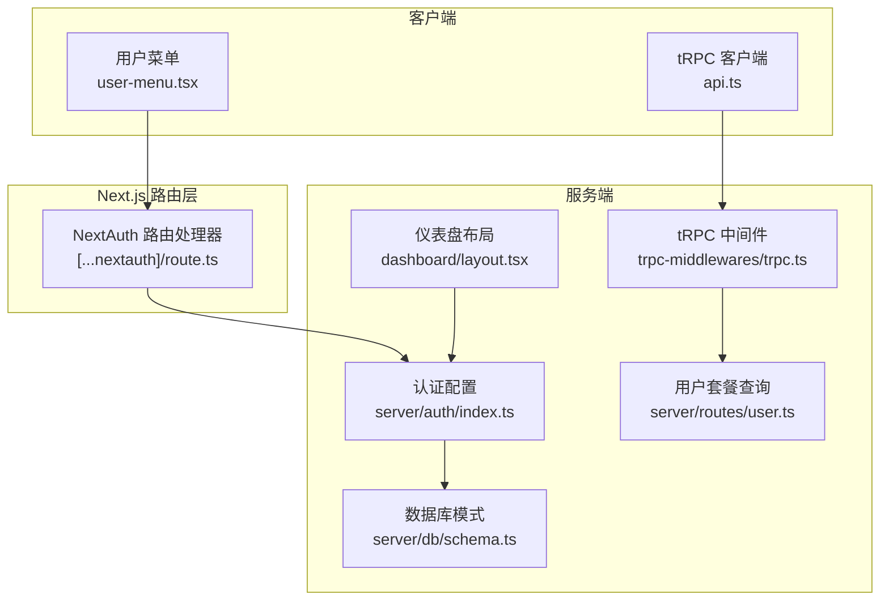
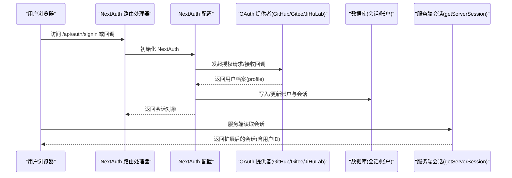
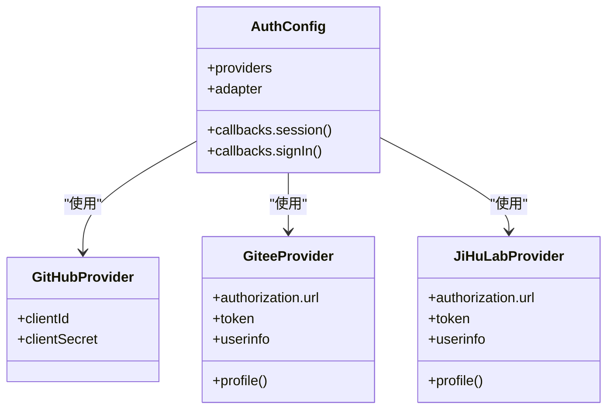
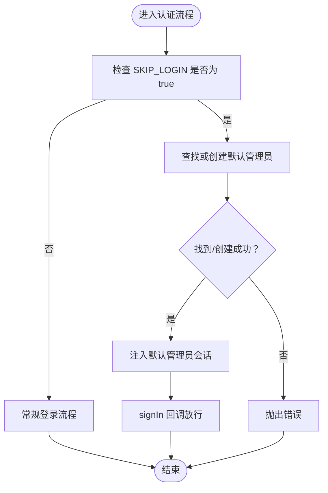
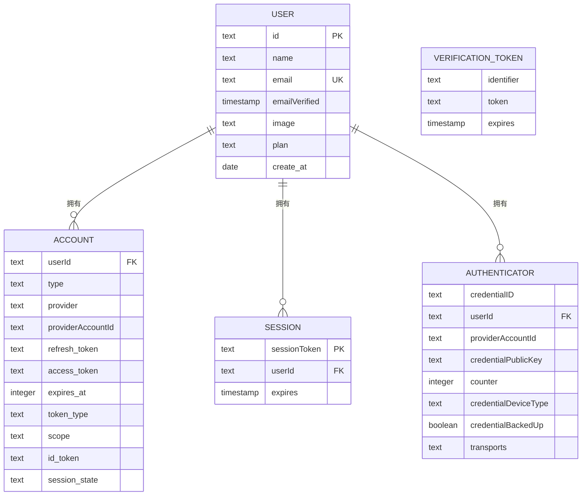
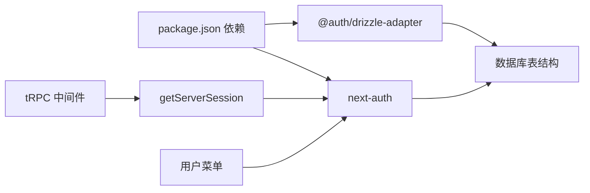

# 用户认证系统

<cite>
**本文引用的文件**
- [src/app/api/auth/[...nextauth]/route.ts](file://src/app/api/auth/[...nextauth]/route.ts)
- [src/lib/auth.ts](file://src/lib/auth.ts)
- [src/server/auth/index.ts](file://src/server/auth/index.ts)
- [src/server/db/schema.ts](file://src/server/db/schema.ts)
- [src/components/feature/user-menu.tsx](file://src/components/feature/user-menu.tsx)
- [src/app/dashboard/layout.tsx](file://src/app/dashboard/layout.tsx)
- [src/server/trpc-middlewares/trpc.ts](file://src/server/trpc-middlewares/trpc.ts)
- [src/server/routes/user.ts](file://src/server/routes/user.ts)
- [src/utils/api.ts](file://src/utils/api.ts)
- [package.json](file://package.json)
- [docker-compose.yml](file://docker-compose.yml)
</cite>

## 目录

1. [简介](#简介)
2. [项目结构](#项目结构)
3. [核心组件](#核心组件)
4. [架构总览](#架构总览)
5. [详细组件分析](#详细组件分析)
6. [依赖关系分析](#依赖关系分析)
7. [性能考量](#性能考量)
8. [故障排除指南](#故障排除指南)
9. [结论](#结论)
10. [附录](#附录)

## 简介

本文件面向开发者，系统性阐述基于 NextAuth.js 的多平台 OAuth 认证实现，覆盖 GitHub、Gitee、JiHuLab 等第三方登录提供商的配置与集成；解释认证流程、会话管理、用户注册与登录机制；详解 SKIP_LOGIN 模式的实现原理与使用场景；说明认证回调函数、用户数据模型扩展及自定义认证提供者的添加方法；并提供完整的配置示例、环境变量设置与安全注意事项，以及最佳实践与故障排除建议。

## 项目结构

认证系统围绕 Next.js 路由处理器、NextAuth 配置、Drizzle 数据适配器与数据库模式展开，同时通过 tRPC 中间件在服务端注入会话上下文，前端通过用户菜单组件展示与退出登录。

**图表来源**

- [src/app/api/auth/[...nextauth]/route.ts:1-7](file://src/app/api/auth/[...nextauth]/route.ts#L1-L7)
- [src/server/auth/index.ts:1-163](file://src/server/auth/index.ts#L1-L163)
- [src/server/db/schema.ts:1-270](file://src/server/db/schema.ts#L1-L270)
- [src/app/dashboard/layout.tsx:1-49](file://src/app/dashboard/layout.tsx#L1-L49)
- [src/server/trpc-middlewares/trpc.ts:1-130](file://src/server/trpc-middlewares/trpc.ts#L1-L130)
- [src/server/routes/user.ts:1-26](file://src/server/routes/user.ts#L1-L26)
- [src/components/feature/user-menu.tsx:1-65](file://src/components/feature/user-menu.tsx#L1-L65)
- [src/utils/api.ts:1-17](file://src/utils/api.ts#L1-L17)

**章节来源**

- [src/app/api/auth/[...nextauth]/route.ts:1-7](file://src/app/api/auth/[...nextauth]/route.ts#L1-L7)
- [src/lib/auth.ts:1-3](file://src/lib/auth.ts#L1-L3)
- [src/server/auth/index.ts:1-163](file://src/server/auth/index.ts#L1-L163)
- [src/server/db/schema.ts:1-270](file://src/server/db/schema.ts#L1-L270)
- [src/app/dashboard/layout.tsx:1-49](file://src/app/dashboard/layout.tsx#L1-L49)
- [src/server/trpc-middlewares/trpc.ts:1-130](file://src/server/trpc-middlewares/trpc.ts#L1-L130)
- [src/server/routes/user.ts:1-26](file://src/server/routes/user.ts#L1-L26)
- [src/components/feature/user-menu.tsx:1-65](file://src/components/feature/user-menu.tsx#L1-L65)
- [src/utils/api.ts:1-17](file://src/utils/api.ts#L1-L17)
- [package.json:14-66](file://package.json#L14-L66)
- [docker-compose.yml:11-24](file://docker-compose.yml#L11-L24)

## 核心组件

- NextAuth 路由处理器：统一暴露 GET/POST，转发到 NextAuth 实例，处理 OAuth 回调与会话请求。
- 认证配置与提供者：GitHub、Gitee、JiHuLab 三类 OAuth 提供者，配合 DrizzleAdapter 进行会话与账户持久化。
- 会话扩展：在 Session 类型中注入用户 ID 字段，确保服务端路由与 tRPC 可读取。
- SKIP_LOGIN 模式：开发/演示阶段自动创建默认管理员并注入会话，绕过真实登录。
- tRPC 中间件：在服务端为受保护过程注入会话上下文，缺失会话时抛出权限错误。
- 前端用户菜单：展示用户信息并触发退出登录。

**章节来源**

- [src/app/api/auth/[...nextauth]/route.ts:1-7](file://src/app/api/auth/[...nextauth]/route.ts#L1-L7)
- [src/server/auth/index.ts:11-138](file://src/server/auth/index.ts#L11-L138)
- [src/server/auth/index.ts:103-129](file://src/server/auth/index.ts#L103-L129)
- [src/server/auth/index.ts:140-163](file://src/server/auth/index.ts#L140-L163)
- [src/server/trpc-middlewares/trpc.ts:11-45](file://src/server/trpc-middlewares/trpc.ts#L11-L45)
- [src/components/feature/user-menu.tsx:24-26](file://src/components/feature/user-menu.tsx#L24-L26)

## 架构总览

认证系统采用“路由层 -> NextAuth -> 数据适配器 -> 数据库”的链路，结合 tRPC 中间件在服务端注入会话上下文，前端通过用户菜单组件进行交互。

**图表来源**

- [src/app/api/auth/[...nextauth]/route.ts:1-7](file://src/app/api/auth/[...nextauth]/route.ts#L1-L7)
- [src/server/auth/index.ts:111-138](file://src/server/auth/index.ts#L111-L138)
- [src/server/db/schema.ts:47-79](file://src/server/db/schema.ts#L47-L79)

## 详细组件分析

### NextAuth 路由处理器

- 将 NextAuth 实例挂载到 /api/auth/[...nextauth]，统一处理登录、回调、会话等请求。
- 导出 GET/POST，便于 Next.js App Router 下的路由约定。

**章节来源**

- [src/app/api/auth/[...nextauth]/route.ts:1-7](file://src/app/api/auth/[...nextauth]/route.ts#L1-L7)

### 认证配置与提供者

- 提供者列表包含 GitHub、Gitee、JiHuLab，均通过 DrizzleAdapter 与数据库对接。
- Gitee/JiHuLab 为自定义提供者，显式声明授权、令牌与用户信息端点，并在 profile 回调中标准化字段。
- 会话回调将用户 ID 注入到 session.user，使后续服务端逻辑可直接读取。

**图表来源**

- [src/server/auth/index.ts:111-138](file://src/server/auth/index.ts#L111-L138)
- [src/server/auth/index.ts:11-38](file://src/server/auth/index.ts#L11-L38)
- [src/server/auth/index.ts:40-63](file://src/server/auth/index.ts#L40-L63)

**章节来源**

- [src/server/auth/index.ts:11-63](file://src/server/auth/index.ts#L11-L63)
- [src/server/auth/index.ts:111-138](file://src/server/auth/index.ts#L111-L138)

### 会话扩展与类型增强

- 通过模块增强为 Session 添加 user.id 字段，确保在服务端与 tRPC 中可用。
- 会话回调将 NextAuth 内部 user.id 同步到 session.user.id。

**章节来源**

- [src/server/auth/index.ts:103-129](file://src/server/auth/index.ts#L103-L129)

### SKIP_LOGIN 模式

- 当环境变量 SKIP_LOGIN 为 true 时：
  - 自动查找或创建默认管理员用户（邮箱、名称、计划等），并注入会话。
  - 在 signIn 回调中直接放行登录。
  - 仪表盘布局在该模式下不强制重定向至登录页。
- 适用于开发与演示环境，避免真实第三方登录的复杂性。

**图表来源**

- [src/server/auth/index.ts:65-101](file://src/server/auth/index.ts#L65-L101)
- [src/server/auth/index.ts:122-128](file://src/server/auth/index.ts#L122-L128)
- [src/app/dashboard/layout.tsx:18-21](file://src/app/dashboard/layout.tsx#L18-L21)

**章节来源**

- [src/server/auth/index.ts:65-101](file://src/server/auth/index.ts#L65-L101)
- [src/server/auth/index.ts:122-128](file://src/server/auth/index.ts#L122-L128)
- [src/app/dashboard/layout.tsx:18-21](file://src/app/dashboard/layout.tsx#L18-L21)

### 会话管理与服务端读取

- 通过自定义 getServerSession 包装 nextAuthGetServerSession，在 SKIP_LOGIN 模式下返回默认管理员会话。
- 仪表盘布局与 tRPC 中间件均依赖此函数获取会话，缺失会话时 tRPC 抛出权限错误。

**章节来源**

- [src/server/auth/index.ts:140-163](file://src/server/auth/index.ts#L140-L163)
- [src/app/dashboard/layout.tsx:16](file://src/app/dashboard/layout.tsx#L16)
- [src/server/trpc-middlewares/trpc.ts:11-45](file://src/server/trpc-middlewares/trpc.ts#L11-L45)

### 用户数据模型与关系

- users 表包含 id、name、email、emailVerified、image、plan、createAt 等字段。
- accounts、sessions、verificationTokens、authenticators 等表遵循 NextAuth 规范，与 users 建立外键关系。
- relations 映射用于关联文件、应用、标签等业务实体。

**图表来源**

- [src/server/db/schema.ts:28-38](file://src/server/db/schema.ts#L28-L38)
- [src/server/db/schema.ts:47-79](file://src/server/db/schema.ts#L47-L79)
- [src/server/db/schema.ts:97-118](file://src/server/db/schema.ts#L97-L118)

**章节来源**

- [src/server/db/schema.ts:28-38](file://src/server/db/schema.ts#L28-L38)
- [src/server/db/schema.ts:47-79](file://src/server/db/schema.ts#L47-L79)
- [src/server/db/schema.ts:97-118](file://src/server/db/schema.ts#L97-L118)

### tRPC 中间件与受保护过程

- withSessionMiddleware 从 getServerSession 注入 ctx.session。
- protectedProcedure 在缺少会话时抛出 FORBIDDEN 错误。
- 用户套餐查询通过受保护过程访问数据库，返回当前用户计划信息。

**章节来源**

- [src/server/trpc-middlewares/trpc.ts:11-45](file://src/server/trpc-middlewares/trpc.ts#L11-L45)
- [src/server/routes/user.ts:5-24](file://src/server/routes/user.ts#L5-L24)

### 前端用户菜单与退出登录

- 用户菜单展示用户名、邮箱、套餐信息，并提供退出登录入口。
- 退出登录通过跳转到 /api/auth/signout 触发 NextAuth 的登出流程。

**章节来源**

- [src/components/feature/user-menu.tsx:24-26](file://src/components/feature/user-menu.tsx#L24-L26)
- [src/components/feature/user-menu.tsx:46-50](file://src/components/feature/user-menu.tsx#L46-L50)

## 依赖关系分析

- NextAuth 依赖 DrizzleAdapter 与数据库表结构保持一致。
- tRPC 中间件依赖 getServerSession 提供会话上下文。
- 前端组件依赖 NextAuth 路由处理器与 tRPC 客户端。

**图表来源**

- [package.json:14-66](file://package.json#L14-L66)
- [src/server/trpc-middlewares/trpc.ts:11-19](file://src/server/trpc-middlewares/trpc.ts#L11-L19)
- [src/server/auth/index.ts:140-163](file://src/server/auth/index.ts#L140-L163)

**章节来源**

- [package.json:14-66](file://package.json#L14-L66)
- [src/server/trpc-middlewares/trpc.ts:11-19](file://src/server/trpc-middlewares/trpc.ts#L11-L19)
- [src/server/auth/index.ts:140-163](file://src/server/auth/index.ts#L140-L163)

## 性能考量

- 使用 DrizzleAdapter 与数据库直连，减少 ORM 层开销。
- SKIP_LOGIN 模式仅在开发/演示环境启用，避免生产环境不必要的数据库写入。
- tRPC 中间件在每次受保护请求中读取会话，建议在上游缓存或合理设计会话生命周期以降低查询压力。

[本节为通用指导，无需特定文件来源]

## 故障排除指南

- 环境变量未配置
  - 确认 NEXTAUTH_SECRET、NEXTAUTH_URL、GITHUB_ID/SECRET、GITEE_ID/SECRET、JIHULAB_ID/SECRET 已在运行环境中设置。
  - 参考容器编排文件中的环境变量示例。
- OAuth 回调失败
  - 检查 NEXTAUTH_URL 是否与 OAuth 提供商回调地址一致。
  - 确认回调路径 /api/auth/callback/{provider} 可达且未被中间件拦截。
- 会话为空
  - 在 SKIP_LOGIN 模式下，确认环境变量已正确设置；否则仪表盘布局会重定向至登录页。
  - 检查 getServerSession 是否在服务端正确调用。
- tRPC 权限错误
  - 受保护过程缺少会话时会抛出 FORBIDDEN，请在调用前确保已登录或启用 SKIP_LOGIN。
- 用户菜单不显示计划
  - 确认用户存在 plan 字段且 tRPC 查询正常返回。

**章节来源**

- [docker-compose.yml:11-24](file://docker-compose.yml#L11-L24)
- [src/app/dashboard/layout.tsx:18-21](file://src/app/dashboard/layout.tsx#L18-L21)
- [src/server/trpc-middlewares/trpc.ts:33-45](file://src/server/trpc-middlewares/trpc.ts#L33-L45)
- [src/server/routes/user.ts:8-24](file://src/server/routes/user.ts#L8-L24)

## 结论

本认证系统以 NextAuth 为核心，结合 DrizzleAdapter 与多平台 OAuth 提供者，实现了稳定、可扩展的用户认证与会话管理。SKIP_LOGIN 模式显著提升了开发与演示效率。通过 tRPC 中间件与服务端会话注入，系统在服务端具备一致的会话上下文。建议在生产环境严格配置环境变量与安全参数，并对会话与数据库访问进行监控与优化。

[本节为总结，无需特定文件来源]

## 附录

### 配置示例与环境变量

- NextAuth 基础
  - NEXTAUTH_URL：NextAuth 外部可访问的根 URL（如 http://localhost:3000）。
  - NEXTAUTH_SECRET：用于加密 NextAuth 会话的密钥。
- GitHub OAuth
  - GITHUB_ID、GITHUB_SECRET：GitHub OAuth 应用的客户端 ID 与密钥。
- Gitee OAuth
  - GITEE_ID、GITEE_SECRET：Gitee OAuth 应用的客户端 ID 与密钥。
- JiHuLab OAuth
  - JIHULAB_ID、JIHULAB_SECRET：JiHuLab OAuth 应用的客户端 ID 与密钥。
- SKIP_LOGIN
  - SKIP_LOGIN=true：启用开发模式，自动创建默认管理员并注入会话。

**章节来源**

- [docker-compose.yml:11-24](file://docker-compose.yml#L11-L24)
- [src/server/auth/index.ts:131-136](file://src/server/auth/index.ts#L131-L136)
- [src/server/auth/index.ts:35-38](file://src/server/auth/index.ts#L35-L38)
- [src/server/auth/index.ts:60-63](file://src/server/auth/index.ts#L60-L63)
- [src/server/auth/index.ts:141-157](file://src/server/auth/index.ts#L141-L157)

### 安全考虑

- NEXTAUTH_SECRET 必须保密且长度足够，定期轮换。
- 回调地址需与实际部署域名一致，防止 CSRF 与开放重定向风险。
- 在生产环境禁用 SKIP_LOGIN，避免绕过认证。
- 对数据库连接使用最小权限原则，限制 NextAuth 相关表的写入范围。

[本节为通用指导，无需特定文件来源]

### 自定义认证提供者添加步骤

- 定义提供者对象，包含授权端点、令牌端点、用户信息端点与 profile 解析函数。
- 在 providers 数组中注册新提供者。
- 如需样式定制，可在提供者中配置 logo、背景色与文字颜色。
- 在 SKIP_LOGIN 模式下，如需自动登录，可在 signIn 回调中放行。

**章节来源**

- [src/server/auth/index.ts:11-38](file://src/server/auth/index.ts#L11-L38)
- [src/server/auth/index.ts:40-63](file://src/server/auth/index.ts#L40-L63)
- [src/server/auth/index.ts:130-137](file://src/server/auth/index.ts#L130-L137)
- [src/server/auth/index.ts:122-128](file://src/server/auth/index.ts#L122-L128)
