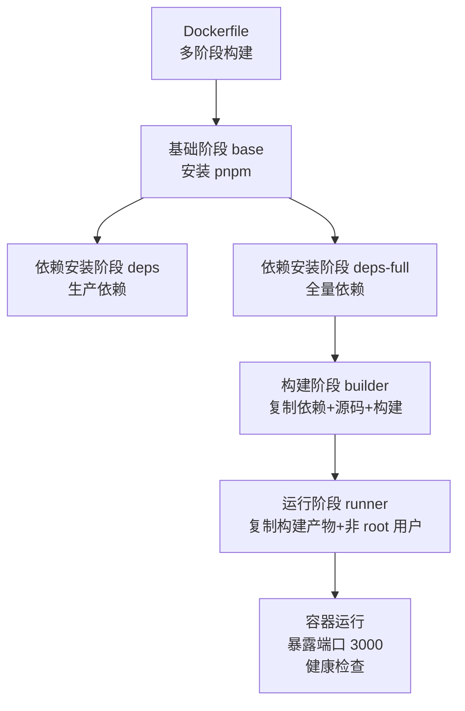
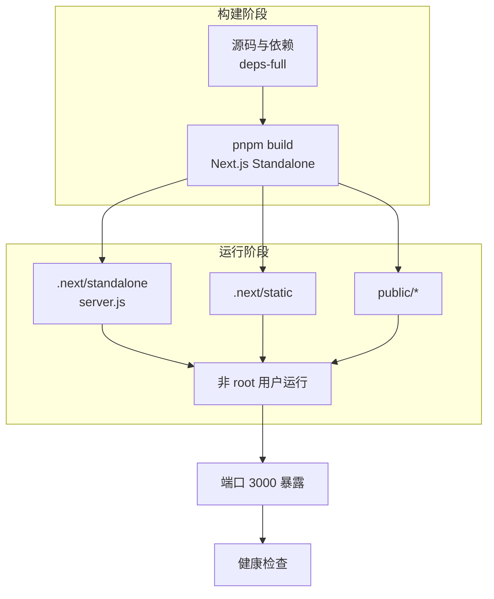
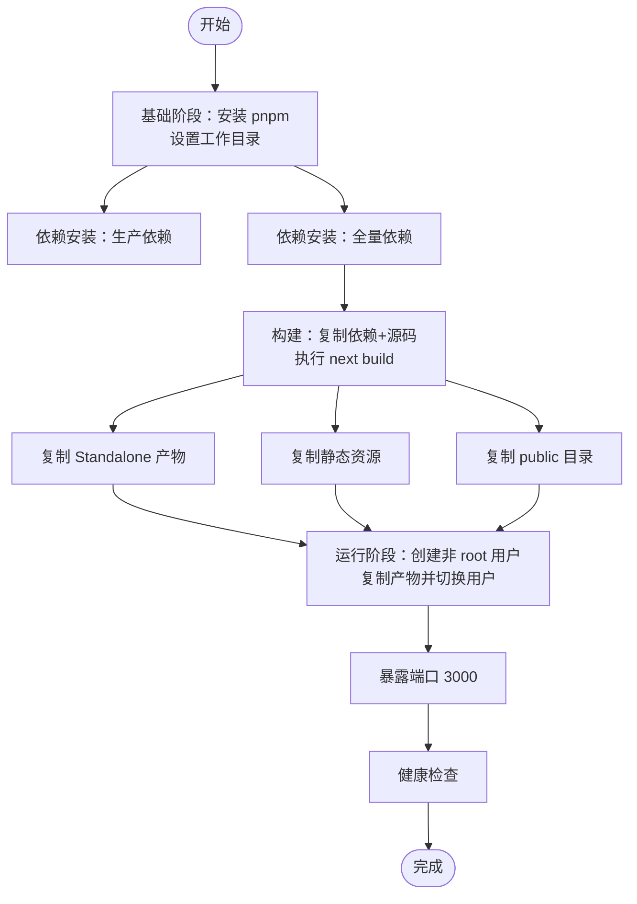
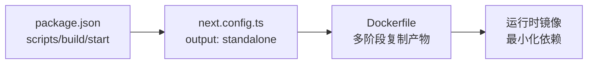

# Docker 配置

<cite>
**本文引用的文件**
- [Dockerfile](file://Dockerfile)
- [.dockerignore](file://.dockerignore)
- [docker-compose.yml](file://docker-compose.yml)
- [README.Docker.md](file://README.Docker.md)
- [start.sh](file://start.sh)
- [package.json](file://package.json)
- [next.config.ts](file://next.config.ts)
- [src/server/auth/index.ts](file://src/server/auth/index.ts)
- [drizzle.config.ts](file://drizzle.config.ts)
</cite>

## 目录
1. [简介](#简介)
2. [项目结构与 Docker 相关文件](#项目结构与-docker-相关文件)
3. [核心组件与阶段划分](#核心组件与阶段划分)
4. [架构总览](#架构总览)
5. [详细组件分析](#详细组件分析)
6. [依赖关系分析](#依赖关系分析)
7. [性能与体积优化](#性能与体积优化)
8. [安全与合规最佳实践](#安全与合规最佳实践)
9. [故障排除指南](#故障排除指南)
10. [结论](#结论)

## 简介
本文件系统性梳理 Image SaaS 项目的 Docker 配置与多阶段构建设计，覆盖基础镜像选择、依赖安装优化、构建产物复制策略、运行时配置（非 root 用户、环境变量、端口暴露、启动命令）、容器安全最佳实践（最小化攻击面、健康检查、只读文件系统建议），并提供优化建议与故障排除清单，帮助团队在开发与生产环境中稳定、高效地交付应用。

## 项目结构与 Docker 相关文件
- Dockerfile：定义多阶段构建流程，包含基础阶段、依赖安装阶段（生产/全量）、构建阶段与运行阶段。
- .dockerignore：排除不必要的构建上下文文件，减少镜像体积与构建时间。
- docker-compose.yml：定义服务、环境变量注入、健康检查、重启策略等运行参数。
- README.Docker.md：部署与运维指南，包含常见问题、监控与扩展建议。
- start.sh：辅助脚本（在特定场景下加载 .env 并启动 Next.js），但当前 Dockerfile 使用 Next.js Standalone 模式直接运行 server.js，该脚本通常不被调用。
- package.json：定义构建脚本与依赖，影响构建阶段的执行。
- next.config.ts：启用 Standalone 输出模式，配合 Docker 多阶段构建显著减小最终镜像。
- src/server/auth/index.ts：NextAuth 配置，依赖环境变量（如 OAuth 凭据、NextAuth 秘钥）。
- drizzle.config.ts：Drizzle CLI 配置，用于数据库迁移与 schema 管理。

图表来源
- [Dockerfile:1-76](file://Dockerfile#L1-L76)
- [next.config.ts:8-9](file://next.config.ts#L8-L9)

章节来源
- [Dockerfile:1-76](file://Dockerfile#L1-L76)
- [.dockerignore:1-87](file://.dockerignore#L1-L87)
- [docker-compose.yml:1-72](file://docker-compose.yml#L1-L72)
- [README.Docker.md:1-230](file://README.Docker.md#L1-L230)
- [package.json:5-12](file://package.json#L5-L12)
- [next.config.ts:8-9](file://next.config.ts#L8-L9)

## 核心组件与阶段划分
- 基础阶段（base）
  - 选择 Node.js 20 Alpine 作为基础镜像，兼顾体积与稳定性。
  - 启用 Corepack 并激活 pnpm，确保包管理器一致性。
  - 设置工作目录并复制包清单文件，为后续依赖安装做准备。
- 依赖安装阶段（deps）
  - 使用冻结锁文件安装生产依赖，保证可重复构建与最小依赖集。
- 依赖安装阶段（deps-full）
  - 安装全量依赖（含开发依赖），满足构建阶段的工具链需求。
- 构建阶段（builder）
  - 复制全量依赖与源码，设置生产环境变量，执行构建。
  - Next.js 使用 Standalone 输出模式，便于后续仅复制必要产物。
- 运行阶段（runner）
  - 仅复制构建产物（standalone 与 static），创建非 root 用户并切换。
  - 设置生产环境变量、暴露端口、指定启动命令为 node server.js。

章节来源
- [Dockerfile:16-23](file://Dockerfile#L16-L23)
- [Dockerfile:28-41](file://Dockerfile#L28-L41)
- [Dockerfile:46-75](file://Dockerfile#L46-L75)
- [next.config.ts:8-9](file://next.config.ts#L8-L9)

## 架构总览
下图展示从源码到最终运行容器的关键路径与职责边界，体现“构建与运行分离”的多阶段设计。

图表来源
- [Dockerfile:30-66](file://Dockerfile#L30-L66)
- [Dockerfile:71-75](file://Dockerfile#L71-L75)
- [next.config.ts:8-9](file://next.config.ts#L8-L9)

## 详细组件分析

### 多阶段构建流程与职责
- 基础阶段
  - 作用：统一 Node 与 pnpm 环境，避免宿主机差异。
  - 关键点：使用 alpine 降低体积；冻结锁文件安装生产依赖。
- 依赖安装阶段（deps）
  - 作用：最小化运行时依赖集合，缩短构建时间。
  - 关键点：仅安装生产依赖，减少镜像层与潜在漏洞面。
- 依赖安装阶段（deps-full）
  - 作用：提供构建所需的完整依赖（TypeScript、构建工具等）。
  - 关键点：与基础阶段共享缓存层，提升增量构建效率。
- 构建阶段（builder）
  - 作用：执行 next build，生成 Standalone 产物。
  - 关键点：Next.js Standalone 输出模式，仅复制必要文件，显著减小镜像体积。
- 运行阶段（runner）
  - 作用：最小化运行时镜像，仅包含运行所需文件与非 root 用户。
  - 关键点：复制 standalone 与 static，暴露端口并设置启动命令。

图表来源
- [Dockerfile:16-75](file://Dockerfile#L16-L75)
- [next.config.ts:8-9](file://next.config.ts#L8-L9)

章节来源
- [Dockerfile:16-75](file://Dockerfile#L16-L75)
- [next.config.ts:8-9](file://next.config.ts#L8-L9)

### 运行时配置与启动流程
- 环境变量
  - NODE_ENV=production：确保运行在生产模式。
  - NEXT_TELEMETRY_DISABLED=1：禁用 Telemetry，减少网络请求与隐私风险。
  - PORT=3000、HOSTNAME=0.0.0.0：绑定到 0.0.0.0，便于容器网络访问。
- 非 root 用户
  - 创建系统组与用户，使用非 root 用户运行，降低权限风险。
- 端口暴露与启动命令
  - EXPOSE 3000，CMD 使用 node server.js 启动 Next.js Standalone 服务器。
- 启动脚本 start.sh
  - 当前 Dockerfile 使用 Standalone 模式，无需该脚本；若需兼容传统启动方式，可参考其加载 .env 与启动命令的方式。

章节来源
- [Dockerfile:36-54](file://Dockerfile#L36-L54)
- [Dockerfile:56-69](file://Dockerfile#L56-L69)
- [Dockerfile:71-75](file://Dockerfile#L71-L75)
- [start.sh:1-8](file://start.sh#L1-L8)

### 健康检查与容器生命周期
- docker-compose.yml 中配置了健康检查，通过 HTTP 请求探测 /api/health，间隔、超时与重试策略合理。
- 重启策略采用 unless-stopped，确保容器异常退出后自动恢复。
- 建议在生产环境结合反向代理与负载均衡，进一步提升可用性与安全性。

章节来源
- [docker-compose.yml:37-46](file://docker-compose.yml#L37-L46)

### 环境变量与外部集成
- 数据库：DATABASE_URL 由外部注入，支持 Neon 等云数据库。
- NextAuth：NEXTAUTH_URL、NEXTAUTH_SECRET 以及 OAuth 提供商（GitHub、Google 等）凭据。
- 对象存储：AWS_REGION、AWS_ACCESS_KEY_ID、AWS_SECRET_ACCESS_KEY、AWS_S3_BUCKET。
- AI 能力：OPENROUTER_API_KEY。
- Node 环境：NODE_ENV=production。

章节来源
- [docker-compose.yml:11-35](file://docker-compose.yml#L11-L35)

## 依赖关系分析
- 构建与运行解耦
  - 构建阶段仅使用 deps-full 的依赖，运行阶段仅复制 Standalone 产物，避免将开发依赖带入运行时。
- Next.js Standalone
  - next.config.ts 启用 output: 'standalone'，使运行阶段只需复制 .next/standalone 与 .next/static，显著减少镜像体积。
- 包管理与缓存
  - 使用 pnpm 并冻结锁文件，提升构建一致性与速度；.dockerignore 排除 node_modules、测试与构建输出，避免污染构建上下文。

图表来源
- [package.json:5-12](file://package.json#L5-L12)
- [next.config.ts:8-9](file://next.config.ts#L8-L9)
- [Dockerfile:30-66](file://Dockerfile#L30-L66)

章节来源
- [package.json:5-12](file://package.json#L5-L12)
- [next.config.ts:8-9](file://next.config.ts#L8-L9)
- [.dockerignore:1-87](file://.dockerignore#L1-L87)
- [Dockerfile:30-66](file://Dockerfile#L30-L66)

## 性能与体积优化
- 多阶段构建
  - 将构建与运行分离，仅在最终镜像中保留运行所需文件，显著降低镜像体积与攻击面。
- 基础镜像与包管理
  - 使用 Node.js 20 Alpine 与 pnpm，结合冻结锁文件，提升构建速度与一致性。
- Next.js Standalone
  - 仅复制 .next/standalone 与 .next/static，避免复制 node_modules 与源码。
- 构建上下文优化
  - .dockerignore 排除大量无关文件，减少传输与构建时间。

章节来源
- [Dockerfile:16-75](file://Dockerfile#L16-L75)
- [next.config.ts:8-9](file://next.config.ts#L8-L9)
- [.dockerignore:1-87](file://.dockerignore#L1-L87)

## 安全与合规最佳实践
- 非 root 用户运行
  - 创建系统组与用户，使用 USER 切换，降低权限风险。
- 最小化攻击面
  - 仅复制运行所需文件；移除开发依赖与源码；禁用 Telemetry。
- 健康检查与可观测性
  - docker-compose 中配置健康检查；建议结合日志驱动与资源限制。
- 环境变量管理
  - 通过 docker-compose 的 environment 注入敏感配置；建议在生产环境使用 Docker secrets 或外部密钥管理服务。
- 反向代理与 TLS
  - 建议在生产环境使用 Nginx/Caddy 作为反向代理，并启用 HTTPS。

章节来源
- [Dockerfile:56-69](file://Dockerfile#L56-L69)
- [Dockerfile:50-54](file://Dockerfile#L50-L54)
- [docker-compose.yml:37-46](file://docker-compose.yml#L37-L46)
- [README.Docker.md:74-141](file://README.Docker.md#L74-L141)

## 故障排除指南
- 镜像构建失败
  - 检查 Node.js 版本与 pnpm 兼容性；确保网络连通；确认磁盘空间充足。
- 容器启动失败
  - 核对环境变量是否正确注入；查看容器日志；验证数据库可达性。
- 性能问题
  - 使用 CDN 加速静态资源；优化数据库查询与索引；考虑引入缓存层。
- 健康检查失败
  - 确认 /api/health 路由可用；检查容器内端口映射与防火墙规则。
- 迁移与初始化
  - 首次部署时执行数据库迁移；可在容器内运行迁移命令或在本地完成后再启动容器。

章节来源
- [README.Docker.md:142-191](file://README.Docker.md#L142-L191)
- [docker-compose.yml:37-46](file://docker-compose.yml#L37-L46)

## 结论
Image SaaS 的 Docker 配置采用成熟的多阶段构建策略，结合 Next.js Standalone 输出模式与最小化运行时镜像，有效降低了镜像体积与安全风险。通过合理的环境变量注入、健康检查与重启策略，配合生产环境的反向代理与 TLS，可满足从开发到生产的多样化部署需求。建议持续关注依赖更新与镜像扫描，保持镜像安全与合规。