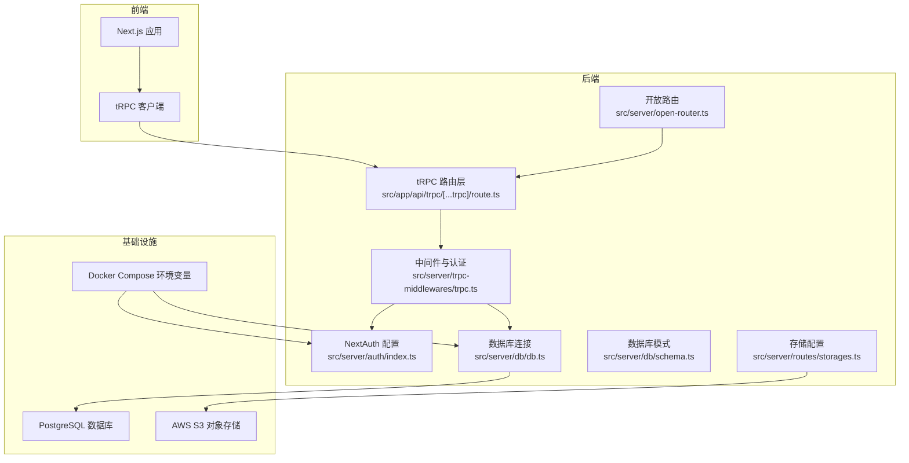
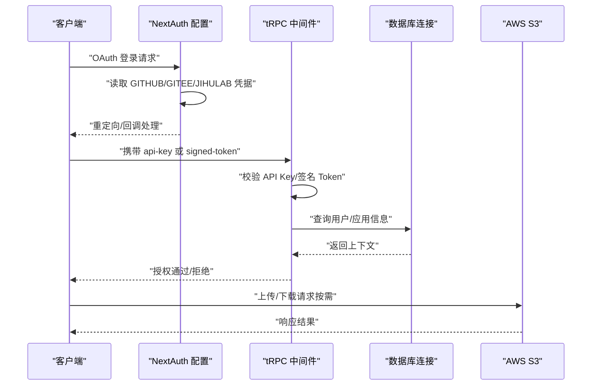
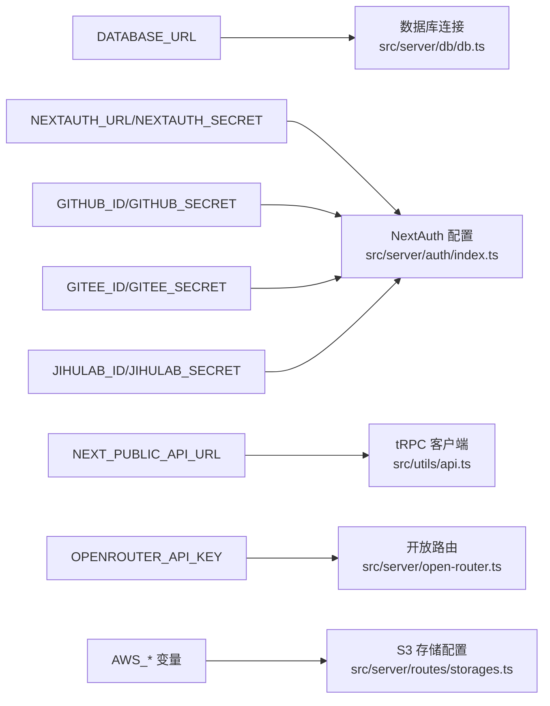

# 环境变量配置

<cite>
**本文档引用的文件**
- [src/server/auth/index.ts](file://src/server/auth/index.ts)
- [src/server/db/db.ts](file://src/server/db/db.ts)
- [drizzle.config.ts](file://drizzle.config.ts)
- [docker-compose.yml](file://docker-compose.yml)
- [Dockerfile](file://Dockerfile)
- [src/server/trpc-middlewares/trpc.ts](file://src/server/trpc-middlewares/trpc.ts)
- [src/server/routes/storages.ts](file://src/server/routes/storages.ts)
- [src/server/db/schema.ts](file://src/server/db/schema.ts)
- [src/app/api/trpc/[...trpc]/route.ts](file://src/app/api/trpc/[...trpc]/route.ts)
- [src/server/open-router.ts](file://src/server/open-router.ts)
- [src/utils/api.ts](file://src/utils/api.ts)
- [src/utils/open-api.ts](file://src/utils/open-api.ts)
- [src/lib/auth.ts](file://src/lib/auth.ts)
- [src/server/routes/tags.ts](file://src/server/routes/tags.ts)
</cite>

## 目录

1. [简介](#简介)
2. [项目结构](#项目结构)
3. [核心组件](#核心组件)
4. [架构总览](#架构总览)
5. [详细组件分析](#详细组件分析)
6. [依赖关系分析](#依赖关系分析)
7. [性能考量](#性能考量)
8. [故障排查指南](#故障排查指南)
9. [结论](#结论)
10. [附录](#附录)

## 简介

本文件为 Image SaaS 项目的环境变量配置完整文档，涵盖数据库连接、AWS S3 存储、NextAuth 认证与 tRPC API 的配置要点。文档详细说明各环境变量的作用、格式要求与安全注意事项，并提供开发、测试、生产三类环境的配置示例与最佳实践。同时，文档阐述了环境变量的优先级与覆盖规则、配置验证与错误处理机制，以及敏感信息的安全存储与管理策略（如密钥轮换与访问控制），并给出配置模板与初始化脚本思路，帮助快速搭建新环境。

## 项目结构

Image SaaS 采用 Next.js 16 与 tRPC 架构，后端使用 Drizzle ORM 连接 PostgreSQL 数据库；认证基于 NextAuth，支持 GitHub、Gitee、JiHuLab 等 OAuth 提供商；前端通过 tRPC 客户端调用后端接口；AWS S3 作为对象存储（可按需配置）。环境变量主要分布在认证、数据库、tRPC 中间件、存储配置与 Docker Compose 中。

**图表来源**

- [src/app/api/trpc/[...trpc]/route.ts](file://src/app/api/trpc/[...trpc]/route.ts#L1-L14)
- [src/server/trpc-middlewares/trpc.ts:1-129](file://src/server/trpc-middlewares/trpc.ts#L1-L129)
- [src/server/auth/index.ts:1-163](file://src/server/auth/index.ts#L1-L163)
- [src/server/db/db.ts:1-9](file://src/server/db/db.ts#L1-L9)
- [src/server/routes/storages.ts:1-73](file://src/server/routes/storages.ts#L1-L73)
- [src/server/open-router.ts:1-10](file://src/server/open-router.ts#L1-L10)
- [docker-compose.yml:1-72](file://docker-compose.yml#L1-L72)

**章节来源**

- [src/app/api/trpc/[...trpc]/route.ts](file://src/app/api/trpc/[...trpc]/route.ts#L1-L14)
- [src/server/trpc-middlewares/trpc.ts:1-129](file://src/server/trpc-middlewares/trpc.ts#L1-L129)
- [src/server/auth/index.ts:1-163](file://src/server/auth/index.ts#L1-L163)
- [src/server/db/db.ts:1-9](file://src/server/db/db.ts#L1-L9)
- [src/server/routes/storages.ts:1-73](file://src/server/routes/storages.ts#L1-L73)
- [src/server/open-router.ts:1-10](file://src/server/open-router.ts#L1-L10)
- [docker-compose.yml:1-72](file://docker-compose.yml#L1-L72)

## 核心组件

本节梳理与环境变量直接相关的后端组件及其职责：

- NextAuth 认证：负责 GitHub/Gitee/JiHuLab 等 OAuth 登录、会话管理与 SKIP_LOGIN 模式。
- tRPC 中间件：负责会话校验、API Key 与签名 Token 校验、日志记录等。
- 数据库连接：通过 DATABASE_URL 连接 PostgreSQL。
- 存储配置：用户可配置 S3 存储参数（桶、区域、凭据等）。
- 开放路由：面向公开访问的路由集合（如文件开放访问）。

**章节来源**

- [src/server/auth/index.ts:1-163](file://src/server/auth/index.ts#L1-L163)
- [src/server/trpc-middlewares/trpc.ts:1-129](file://src/server/trpc-middlewares/trpc.ts#L1-L129)
- [src/server/db/db.ts:1-9](file://src/server/db/db.ts#L1-L9)
- [src/server/routes/storages.ts:1-73](file://src/server/routes/storages.ts#L1-L73)
- [src/server/open-router.ts:1-10](file://src/server/open-router.ts#L1-L10)

## 架构总览

下图展示环境变量在系统中的流向与依赖关系：

**图表来源**

- [src/server/auth/index.ts:1-163](file://src/server/auth/index.ts#L1-L163)
- [src/server/trpc-middlewares/trpc.ts:1-129](file://src/server/trpc-middlewares/trpc.ts#L1-L129)
- [src/server/db/db.ts:1-9](file://src/server/db/db.ts#L1-L9)
- [src/server/routes/storages.ts:1-73](file://src/server/routes/storages.ts#L1-L73)

## 详细组件分析

### 数据库连接配置

- 关键变量
  - DATABASE_URL：PostgreSQL 连接字符串，驱动从环境变量读取并建立连接。
- 格式要求
  - 标准 PostgreSQL 连接字符串，包含主机、端口、数据库名、用户名与密码等必要信息。
- 安全考虑
  - 生产环境必须使用加密传输与最小权限账号；避免在镜像中硬编码。
  - 使用只读账号用于查询，写入操作使用受限账号。
- 验证与错误处理
  - 连接失败将导致应用启动失败或运行时异常；建议在启动脚本中进行连接测试。
- 配置示例
  - 开发：本地或云数据库地址，便于调试。
  - 测试：独立测试数据库实例，隔离数据。
  - 生产：云数据库（如 Neon、RDS）高可用地址，启用 SSL。

**章节来源**

- [src/server/db/db.ts:1-9](file://src/server/db/db.ts#L1-L9)
- [drizzle.config.ts:1-14](file://drizzle.config.ts#L1-L14)

### NextAuth 认证配置

- 关键变量
  - NEXTAUTH_URL：NextAuth 回调地址，用于生成回调链接。
  - NEXTAUTH_SECRET：NextAuth 会话签名密钥，必须足够随机且保密。
  - GITHUB_ID / GITHUB_SECRET：GitHub OAuth 应用凭据。
  - GITEE_ID / GITEE_SECRET：Gitee OAuth 应用凭据。
  - JIHULAB_ID / JIHULAB_SECRET：JiHuLab OAuth 应用凭据。
  - SKIP_LOGIN：启用后自动创建管理员会话，仅限开发或演示环境。
- 格式要求
  - NEXTAUTH_URL 为完整可访问的 URL，末尾不带斜杠。
  - NEXTAUTH_SECRET 长度建议至少 32 字符，使用强随机字符集。
  - OAuth ID/Secret 来自对应平台的应用注册页面。
- 安全考虑
  - NEXTAUTH_SECRET 必须妥善保管，定期轮换；不同环境使用不同密钥。
  - SKIP_LOGIN 仅在开发或演示环境启用，严禁用于生产。
  - OAuth 回调域名需与 NEXTAUTH_URL 一致，防止 CSRF。
- 验证与错误处理
  - 缺少任一凭据会导致认证提供商初始化失败；应尽早捕获并在日志中提示。
- 配置示例
  - 开发：NEXTAUTH_URL=http://localhost:3000，SKIP_LOGIN=true（可选）。
  - 测试：NEXTAUTH_URL=https://test.example.com，SKIP_LOGIN=false。
  - 生产：NEXTAUTH_URL=https://app.example.com，SKIP_LOGIN=false。

**章节来源**

- [src/server/auth/index.ts:1-163](file://src/server/auth/index.ts#L1-L163)
- [docker-compose.yml:1-72](file://docker-compose.yml#L1-L72)

### tRPC API 配置

- 关键变量
  - NEXT_PUBLIC_API_URL：前端 tRPC 客户端使用的 API 基础地址。
  - OPENROUTER_API_KEY：开放路由（如文件公开访问）所需的第三方 API 密钥（示例）。
- 格式要求
  - NEXT_PUBLIC_API_URL 为可公开访问的 API 域名，末尾不带斜杠。
  - OPENROUTER_API_KEY 为标准 API Key 格式。
- 安全考虑
  - OPENROUTER_API_KEY 属于敏感信息，仅在后端使用，避免泄露到前端。
- 验证与错误处理
  - 缺失时可能导致开放路由功能不可用；应在启动时进行校验。
- 配置示例
  - 开发：NEXT_PUBLIC_API_URL=http://localhost:3000
  - 测试/生产：NEXT_PUBLIC_API_URL=https://api.example.com

**章节来源**

- [src/utils/api.ts:1-20](file://src/utils/api.ts#L1-L20)
- [src/utils/open-api.ts:1-20](file://src/utils/open-api.ts#L1-L20)
- [src/server/open-router.ts:1-10](file://src/server/open-router.ts#L1-L10)

### AWS S3 存储配置

- 关键变量
  - AWS_REGION：S3 区域。
  - AWS_ACCESS_KEY_ID / AWS_SECRET_ACCESS_KEY：S3 访问凭据。
  - AWS_S3_BUCKET：S3 存储桶名称。
- 格式要求
  - AWS_REGION 为标准区域标识（如 ap-northeast-1）。
  - 凭据来自 AWS IAM 用户或角色，具备最小权限。
  - AWS_S3_BUCKET 为已存在的存储桶名称。
- 安全考虑
  - 凭据必须通过安全渠道注入，避免明文存储；生产环境建议使用 IAM 角色或 KMS 加密。
  - 存储桶策略与桶策略需限制访问范围，启用版本控制与删除保护。
- 验证与错误处理
  - 初始化时进行桶存在性与权限检查；失败时记录详细错误并阻断流程。
- 配置示例
  - 开发：本地 MinIO 或测试桶。
  - 生产：专用 S3 桶，启用访问日志与审计。

**章节来源**

- [docker-compose.yml:1-72](file://docker-compose.yml#L1-L72)
- [src/server/routes/storages.ts:1-73](file://src/server/routes/storages.ts#L1-L73)
- [src/server/db/schema.ts:154-173](file://src/server/db/schema.ts#L154-L173)

### tRPC 中间件与 API Key/签名 Token 校验

- 关键变量
  - api-key：HTTP 请求头，用于基于 API Key 的认证。
  - signed-token：HTTP 请求头，携带 JWT，后端解码并校验签名。
- 格式要求
  - api-key 为后端生成的唯一 Key。
  - signed-token 为使用 API Key 私钥签名的 JWT，包含 clientId。
- 安全考虑
  - API Key 与签名密钥必须严格保密；定期轮换；限制 IP/来源白名单。
  - JWT 签名算法与密钥长度需符合安全要求；及时吊销失效密钥。
- 验证与错误处理
  - 缺失或无效的 api-key/singed-token 将触发 FORBIDDEN/NOT_FOUND/BAD_REQUEST 错误。
- 配置示例
  - 开发：使用测试 API Key 与短期有效 Token。
  - 生产：长周期 API Key 与高强度签名算法。

**章节来源**

- [src/server/trpc-middlewares/trpc.ts:1-129](file://src/server/trpc-middlewares/trpc.ts#L1-L129)

### Docker 环境变量注入

- 关键点
  - Docker Compose 将环境变量注入容器，覆盖默认值（如 NEXTAUTH_URL 的回退）。
  - 生产环境建议通过外部密钥管理服务（如 AWS Secrets Manager、HashiCorp Vault）注入。
- 安全考虑
  - 避免将 .env 提交至版本库；使用只读挂载与最小权限。
- 配置示例
  - 使用 env_file 指向 .env 文件；或通过 CI/CD 注入。

**章节来源**

- [docker-compose.yml:1-72](file://docker-compose.yml#L1-L72)
- [Dockerfile:1-76](file://Dockerfile#L1-L76)

## 依赖关系分析

下图展示环境变量在组件间的依赖关系与传递路径：

**图表来源**

- [src/server/db/db.ts:1-9](file://src/server/db/db.ts#L1-L9)
- [src/server/auth/index.ts:1-163](file://src/server/auth/index.ts#L1-L163)
- [src/utils/api.ts:1-20](file://src/utils/api.ts#L1-L20)
- [src/server/open-router.ts:1-10](file://src/server/open-router.ts#L1-L10)
- [src/server/routes/storages.ts:1-73](file://src/server/routes/storages.ts#L1-L73)
- [docker-compose.yml:1-72](file://docker-compose.yml#L1-L72)

**章节来源**

- [src/server/db/db.ts:1-9](file://src/server/db/db.ts#L1-L9)
- [src/server/auth/index.ts:1-163](file://src/server/auth/index.ts#L1-L163)
- [src/utils/api.ts:1-20](file://src/utils/api.ts#L1-L20)
- [src/server/open-router.ts:1-10](file://src/server/open-router.ts#L1-L10)
- [src/server/routes/storages.ts:1-73](file://src/server/routes/storages.ts#L1-L73)
- [docker-compose.yml:1-72](file://docker-compose.yml#L1-L72)

## 性能考量

- 环境变量解析开销极低，但频繁读取可能影响冷启动；建议在应用启动时一次性读取并缓存关键配置。
- 数据库连接池大小与超时时间需结合环境压力调整；生产环境建议开启连接复用与健康检查。
- tRPC 中间件的日志记录在高并发场景下会产生额外 IO，建议按环境级别调整日志等级。

## 故障排查指南

- 数据库连接失败
  - 检查 DATABASE_URL 是否正确、网络连通性与 SSL 配置。
  - 参考：[src/server/db/db.ts:1-9](file://src/server/db/db.ts#L1-L9)
- NextAuth 回调异常
  - 核对 NEXTAUTH_URL 与 NEXTAUTH_SECRET，确认 OAuth 应用回调地址一致。
  - 参考：[src/server/auth/index.ts:1-163](file://src/server/auth/index.ts#L1-L163)
- API Key/签名 Token 无效
  - 确认 api-key 或 signed-token 是否正确传入，签名是否匹配。
  - 参考：[src/server/trpc-middlewares/trpc.ts:1-129](file://src/server/trpc-middlewares/trpc.ts#L1-L129)
- S3 访问失败
  - 校验 AWS_REGION、AWS_ACCESS_KEY_ID、AWS_SECRET_ACCESS_KEY、AWS_S3_BUCKET。
  - 参考：[docker-compose.yml:1-72](file://docker-compose.yml#L1-L72)

**章节来源**

- [src/server/db/db.ts:1-9](file://src/server/db/db.ts#L1-L9)
- [src/server/auth/index.ts:1-163](file://src/server/auth/index.ts#L1-L163)
- [src/server/trpc-middlewares/trpc.ts:1-129](file://src/server/trpc-middlewares/trpc.ts#L1-L129)
- [docker-compose.yml:1-72](file://docker-compose.yml#L1-L72)

## 结论

本文件系统性梳理了 Image SaaS 项目所需的关键环境变量，明确了其作用、格式、安全与验证策略，并提供了多环境配置示例与最佳实践。建议在生产环境中严格遵循最小权限原则与密钥轮换策略，配合外部密钥管理服务与严格的访问控制，确保系统安全与稳定。

## 附录

### 环境变量优先级与覆盖规则

- Docker Compose 优先级：命令行注入 > env_file > 环境变量默认值。
- Next.js/Node 环境：容器内环境变量覆盖默认值；开发与生产环境变量隔离。
- 推荐做法：使用 .env.development/.env.test/.env.production 分离配置，CI/CD 注入覆盖。

**章节来源**

- [docker-compose.yml:1-72](file://docker-compose.yml#L1-L72)
- [Dockerfile:1-76](file://Dockerfile#L1-L76)

### 配置模板与初始化脚本思路

- 配置模板（示例）
  - 开发：DATABASE*URL、NEXTAUTH_URL、NEXTAUTH_SECRET、GITHUB*_、AWS\__、NEXT_PUBLIC_API_URL
  - 测试：独立 DATABASE_URL 与测试桶，禁用 SKIP_LOGIN
  - 生产：高可用 DATABASE_URL、强密钥、最小权限 AWS 凭据、HTTPS 域名
- 初始化脚本思路
  - 启动前执行数据库迁移（drizzle-kit）与健康检查。
  - 读取环境变量并进行基本校验（必填项、格式校验）。
  - 生成或加载 NEXTAUTH_SECRET（若缺失则报错）。
  - 为 S3 初始化桶策略与 CORS 配置（如适用）。

**章节来源**

- [drizzle.config.ts:1-14](file://drizzle.config.ts#L1-L14)
- [docker-compose.yml:1-72](file://docker-compose.yml#L1-L72)
