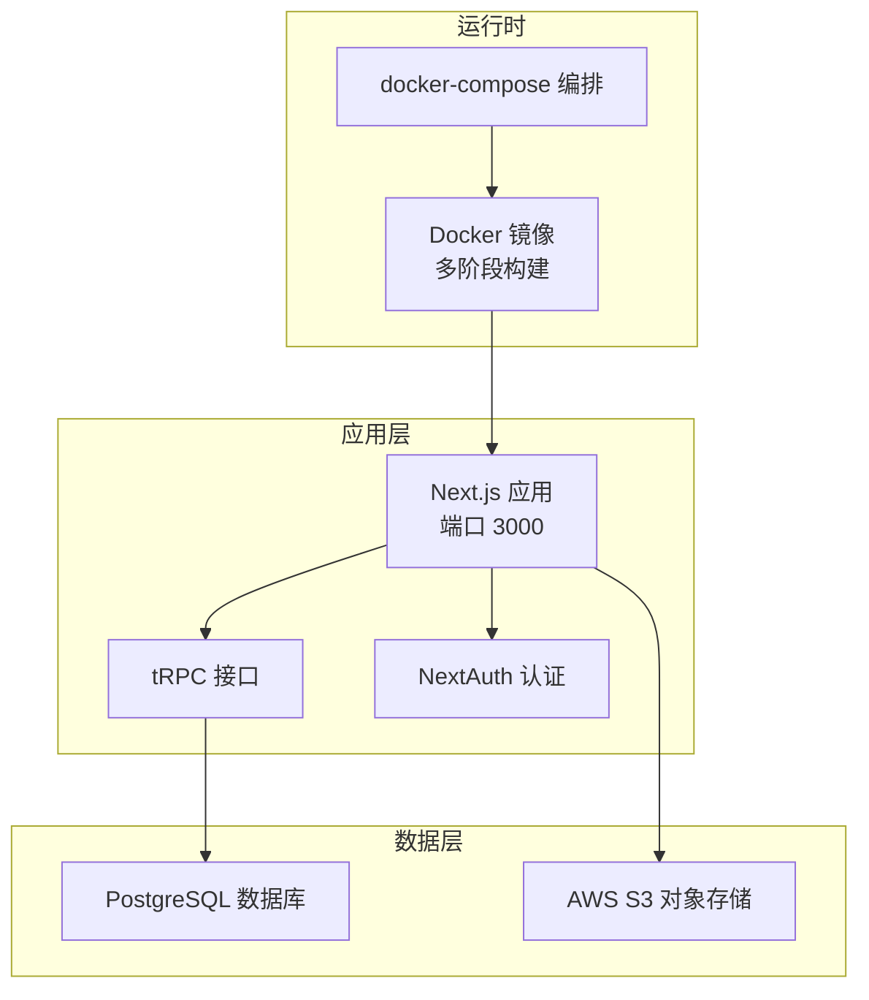
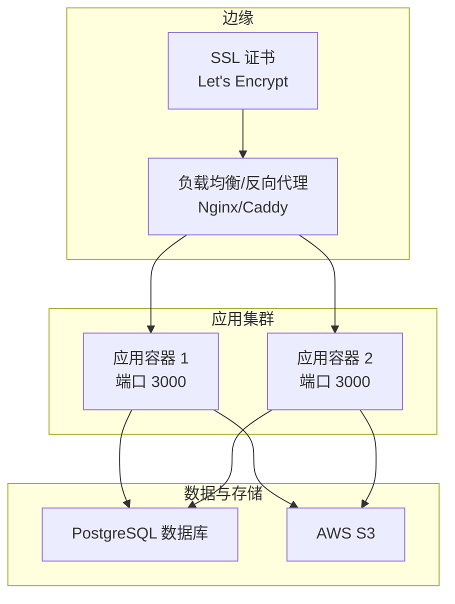
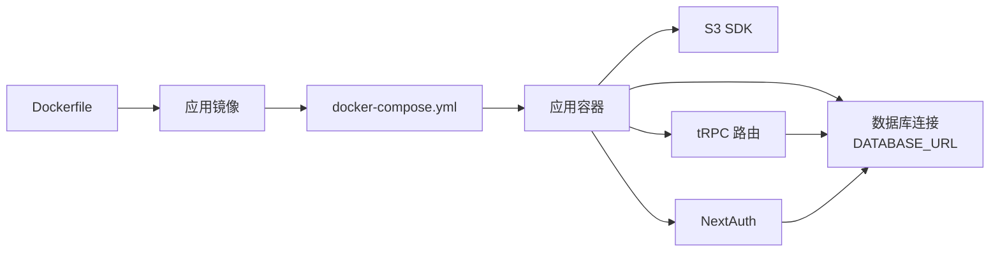

# 生产环境部署

<cite>
**本文引用的文件**
- [docker-compose.yml](file://docker-compose.yml)
- [Dockerfile](file://Dockerfile)
- [package.json](file://package.json)
- [start.sh](file://start.sh)
- [next.config.ts](file://next.config.ts)
- [drizzle.config.ts](file://drizzle.config.ts)
- [src/server/db/db.ts](file://src/server/db/db.ts)
- [src/server/auth/index.ts](file://src/server/auth/index.ts)
- [src/app/api/trpc/[...trpc]/route.ts](file://src/app/api/trpc/[...trpc]/route.ts)
- [src/app/api/open/[...trpc]/route.ts](file://src/app/api/open/[...trpc]/route.ts)
- [src/server/routes/api-keys.ts](file://src/server/routes/api-keys.ts)
- [src/server/routes/storages.ts](file://src/server/routes/storages.ts)
- [src/server/db/schema.ts](file://src/server/db/schema.ts)
- [README.Docker.md](file://README.Docker.md)
</cite>

## 目录

1. [简介](#简介)
2. [项目结构](#项目结构)
3. [核心组件](#核心组件)
4. [架构总览](#架构总览)
5. [详细组件分析](#详细组件分析)
6. [依赖关系分析](#依赖关系分析)
7. [性能考虑](#性能考虑)
8. [故障排查指南](#故障排查指南)
9. [结论](#结论)
10. [附录](#附录)

## 简介

本指南面向 Image SaaS 项目的生产环境部署，覆盖基础设施准备、容器编排与应用启动、配置项详解、性能优化、负载均衡与反向代理、SSL 证书、监控与日志、备份与灾难恢复、部署验证与健康检查等全链路内容。文档基于仓库现有配置与代码进行系统化梳理，帮助团队在生产环境中稳定、安全、可扩展地运行该应用。

## 项目结构

项目采用 Next.js 16 应用，配合 tRPC 服务端接口、Drizzle ORM 访问数据库、NextAuth 进行认证、AWS S3 作为对象存储后端。容器化采用多阶段构建，输出为 standalone 模式以减小镜像体积并提升启动效率。

图表来源

- [Dockerfile:1-76](file://Dockerfile#L1-L76)
- [docker-compose.yml:1-72](file://docker-compose.yml#L1-L72)
- [src/server/db/db.ts:1-9](file://src/server/db/db.ts#L1-L9)
- [src/server/auth/index.ts:1-163](file://src/server/auth/index.ts#L1-L163)

章节来源

- [Dockerfile:1-76](file://Dockerfile#L1-L76)
- [docker-compose.yml:1-72](file://docker-compose.yml#L1-L72)
- [next.config.ts:1-22](file://next.config.ts#L1-L22)
- [package.json:1-94](file://package.json#L1-L94)

## 核心组件

- 应用容器
  - 多阶段构建，使用 Node.js 20-alpine，启用 standalone 输出，非 root 用户运行，暴露端口 3000。
- 数据库
  - 通过 DATABASE_URL 连接外部数据库；Drizzle ORM 与 schema 定义清晰，支持用户、应用、文件、标签、存储配置等表。
- 认证与会话
  - NextAuth 集成 GitHub、Gitee、JiHuLab 等 OAuth 提供商；支持 SKIP_LOGIN 模式快速调试。
- API 层
  - tRPC 路由集中于 server/trpc-middlewares，开放 API 通过 open/[...trpc] 暴露并设置 CORS。
- 存储与对象
  - 支持 S3 存储配置，提供创建、更新存储能力；文件上传与预签名 URL 由 AWS SDK 提供。
- 反向代理与 SSL
  - 文档建议使用 Nginx/Caddy 作为反向代理，并通过 Certbot 配置 Let's Encrypt 证书。

章节来源

- [Dockerfile:1-76](file://Dockerfile#L1-L76)
- [src/server/db/db.ts:1-9](file://src/server/db/db.ts#L1-L9)
- [src/server/auth/index.ts:1-163](file://src/server/auth/index.ts#L1-L163)
- [src/app/api/trpc/[...trpc]/route.ts:1-13](file://src/app/api/trpc/[...trpc]/route.ts#L1-L13)
- [src/app/api/open/[...trpc]/route.ts:1-30](file://src/app/api/open/[...trpc]/route.ts#L1-L30)
- [src/server/routes/storages.ts:1-73](file://src/server/routes/storages.ts#L1-L73)
- [README.Docker.md:74-160](file://README.Docker.md#L74-L160)

## 架构总览

生产环境推荐以 docker-compose 编排应用与数据库，应用通过反向代理对外提供服务，数据库使用云托管或自管实例，对象存储对接 AWS S3。

图表来源

- [docker-compose.yml:1-72](file://docker-compose.yml#L1-L72)
- [README.Docker.md:74-160](file://README.Docker.md#L74-L160)

## 详细组件分析

### docker-compose.yml 配置详解

- 服务定义
  - app：基于根目录 Dockerfile 构建，映射宿主 3000:3000，使用环境变量驱动数据库、认证、OAuth、S3、OpenRouter 等配置。
- 网络与端口
  - 默认暴露 3000 端口；生产建议通过反向代理统一入口与 TLS 终止。
- 卷与持久化
  - 当前未定义卷；生产需为数据库与日志配置持久化卷或使用云存储。
- 环境变量传递
  - 数据库：DATABASE_URL
  - NextAuth：NEXTAUTH_URL、NEXTAUTH_SECRET
  - OAuth：GITHUB_ID/GITHUB_SECRET、GOOGLE_ID/GOOGLE_SECRET
  - S3：AWS_REGION/AWS_ACCESS_KEY_ID/AWS_SECRET_ACCESS_KEY/AWS_S3_BUCKET
  - OpenRouter：OPENROUTER_API_KEY
  - Node 环境：NODE_ENV=production
- 健康检查
  - 通过 HTTP GET /api/health 检测应用就绪状态，配置了间隔、超时、重试与启动宽限期。
- 重启策略
  - unless-stopped，保证异常退出后自动恢复。
- 可选数据库服务
  - 注释掉的 postgres 服务展示了如何在本地使用 Compose 启动数据库（不推荐生产）。

章节来源

- [docker-compose.yml:1-72](file://docker-compose.yml#L1-L72)

### Dockerfile 多阶段构建

- 基础镜像与工具链
  - 使用 node:20-alpine，启用 corepack 与 pnpm。
- 依赖安装阶段
  - 分别构建仅生产依赖与完整依赖镜像，便于后续构建阶段复用。
- 构建阶段
  - 设置 NEXT_TELEMETRY_DISABLED=1 与 NODE_ENV=production，执行 next build。
- 运行阶段
  - 设置 NODE_ENV=production、PORT=3000、HOSTNAME=0.0.0.0。
  - 创建非 root 用户 nextjs，复制 standalone 产物与静态资源，切换用户，暴露 3000 端口，CMD 启动 node server.js。
- 优化点
  - 使用 standalone 输出减少运行时依赖，降低攻击面与镜像体积。

章节来源

- [Dockerfile:1-76](file://Dockerfile#L1-L76)

### Next.js 配置与启动

- 配置要点
  - output: 'standalone'，与 Dockerfile 一致。
  - images.remotePatterns 支持任意 HTTPS 远程图片。
  - TypeScript 构建忽略错误（开发友好，生产建议关闭）。
- 启动脚本
  - start.sh 支持从 /web/.env 加载环境变量并以生产模式启动 next。
- package.json
  - 依赖包含 next、next-auth、drizzle-orm、@aws-sdk、sharp、tRPC 等，满足认证、ORM、存储、图像处理需求。

章节来源

- [next.config.ts:1-22](file://next.config.ts#L1-L22)
- [start.sh:1-8](file://start.sh#L1-L8)
- [package.json:1-94](file://package.json#L1-L94)

### 数据库与 ORM

- 连接与适配
  - 通过 DATABASE_URL 初始化 postgres 客户端，Drizzle 适配数据库。
- Schema 设计
  - 用户、会话、账户、验证码、认证器、应用、文件、标签、文件-标签关联、存储配置、API Key 等表，具备外键与索引设计。
- tRPC 集成
  - tRPC 中间件与路由文件通过 Drizzle 查询数据库，实现受保护过程与 API Key 校验。

章节来源

- [src/server/db/db.ts:1-9](file://src/server/db/db.ts#L1-L9)
- [src/server/db/schema.ts:1-270](file://src/server/db/schema.ts#L1-L270)
- [src/server/routes/api-keys.ts:1-37](file://src/server/routes/api-keys.ts#L1-L37)

### 认证与会话

- NextAuth 配置
  - DrizzleAdapter 驱动会话存储；支持 GitHub、Gitee、JiHuLab；SKIP_LOGIN 模式下可快速生成管理员会话。
- 会话回调
  - 自定义 session 与 signIn 回调，支持按需放行与扩展用户信息。
- 环境变量
  - NEXTAUTH_SECRET、各 OAuth 的 ID/Secret、可选 NEXTAUTH_URL。

章节来源

- [src/server/auth/index.ts:1-163](file://src/server/auth/index.ts#L1-L163)

### API 层与跨域

- tRPC 接口
  - /api/trpc 路由集中处理请求，统一上下文与中间件。
- 开放 API
  - /api/open 路由对跨域进行宽松配置，允许 api-key 请求头，适合第三方集成场景。

章节来源

- [src/app/api/trpc/[...trpc]/route.ts:1-13](file://src/app/api/trpc/[...trpc]/route.ts#L1-L13)
- [src/app/api/open/[...trpc]/route.ts:1-30](file://src/app/api/open/[...trpc]/route.ts#L1-L30)

### 存储与对象

- 存储配置
  - 支持为用户创建/更新 S3 存储配置，包含桶名、区域、密钥与可选端点。
- 文件管理
  - 通过 tRPC 路由实现文件列表、回收站、恢复与永久删除等操作。

章节来源

- [src/server/routes/storages.ts:1-73](file://src/server/routes/storages.ts#L1-L73)
- [src/server/db/schema.ts:154-173](file://src/server/db/schema.ts#L154-L173)

### 反向代理与 SSL

- 反向代理
  - 建议使用 Nginx 或 Caddy 将 80/443 转发至容器 3000 端口，透传 Host、X-Forwarded-\* 等头部。
- SSL 证书
  - 使用 Certbot 申请与续期 Let's Encrypt 证书，自动配置 HTTPS。

章节来源

- [README.Docker.md:74-160](file://README.Docker.md#L74-L160)

## 依赖关系分析

图表来源

- [Dockerfile:1-76](file://Dockerfile#L1-L76)
- [docker-compose.yml:1-72](file://docker-compose.yml#L1-L72)
- [src/server/db/db.ts:1-9](file://src/server/db/db.ts#L1-L9)
- [src/server/auth/index.ts:1-163](file://src/server/auth/index.ts#L1-L163)
- [src/app/api/trpc/[...trpc]/route.ts:1-13](file://src/app/api/trpc/[...trpc]/route.ts#L1-L13)

章节来源

- [Dockerfile:1-76](file://Dockerfile#L1-L76)
- [docker-compose.yml:1-72](file://docker-compose.yml#L1-L72)
- [src/server/db/db.ts:1-9](file://src/server/db/db.ts#L1-L9)

## 性能考虑

- 镜像与运行时
  - 使用 standalone 输出与非 root 用户运行，减少启动时间与权限风险。
- 并发与资源
  - 建议在 docker-compose 中为应用容器设置 CPU 与内存限制，结合反向代理实现水平扩展。
- 图像处理
  - 项目依赖 sharp，建议在容器内合理配置线程数与内存上限，避免 OOM。
- 缓存与 CDN
  - 静态资源与远程图片可利用 CDN 加速；S3 对象可开启缓存头。
- 数据库优化
  - 为高频查询字段建立索引，定期维护统计信息；使用连接池与只读副本（如适用）。

章节来源

- [Dockerfile:1-76](file://Dockerfile#L1-L76)
- [README.Docker.md:74-160](file://README.Docker.md#L74-L160)
- [src/server/db/schema.ts:135-136](file://src/server/db/schema.ts#L135-L136)

## 故障排查指南

- 容器启动失败
  - 检查环境变量是否正确注入（DATABASE*URL、NEXTAUTH*_、AWS\__、OPENROUTER\_\*）。
  - 查看容器日志定位初始化错误。
- 数据库连接异常
  - 确认 DATABASE_URL 可达性与凭据正确；若使用云数据库，检查网络 ACL 与白名单。
- 认证问题
  - 校验 NEXTAUTH_SECRET 一致性与 NEXTAUTH_URL 是否与反向代理域名一致。
  - OAuth 回调地址需与前端域名匹配。
- API 访问失败
  - 检查 /api/trpc 与 /api/open 路由是否可达；确认 CORS 配置与 api-key 有效性。
- 健康检查失败
  - 确认 /api/health 可访问且返回 200；检查应用启动顺序与依赖服务可用性。

章节来源

- [docker-compose.yml:37-46](file://docker-compose.yml#L37-L46)
- [src/app/api/trpc/[...trpc]/route.ts:1-13](file://src/app/api/trpc/[...trpc]/route.ts#L1-L13)
- [src/app/api/open/[...trpc]/route.ts:1-30](file://src/app/api/open/[...trpc]/route.ts#L1-L30)

## 结论

本指南基于仓库现有配置与代码，提供了 Image SaaS 生产环境的部署蓝图：以 docker-compose 编排应用与依赖，通过反向代理与 SSL 提升安全性与可用性，结合健康检查与资源限制保障稳定性，并给出性能优化、监控日志、备份与灾难恢复的实施建议。建议在上线前完成环境变量审计、数据库与 S3 权限校验、以及端到端的部署验证。

## 附录

### 部署流程清单

- 基础设施准备
  - 准备反向代理服务器（Nginx/Caddy），配置域名与证书。
  - 准备数据库与 S3 存储，确保网络连通与最小权限。
- 配置文件准备
  - 准备 .env 文件，填充 DATABASE*URL、NEXTAUTH*_、AWS\__、OPENROUTER\_\* 等变量。
- 构建与启动
  - 使用 docker-compose 构建并启动应用容器；确认健康检查通过。
- 验证与监控
  - 访问站点首页与 /api/health；配置日志与指标采集；设置告警阈值。
- 回滚与恢复
  - 保留上一版本镜像与配置快照；制定回滚与数据恢复流程。

章节来源

- [docker-compose.yml:1-72](file://docker-compose.yml#L1-L72)
- [README.Docker.md:74-160](file://README.Docker.md#L74-L160)
