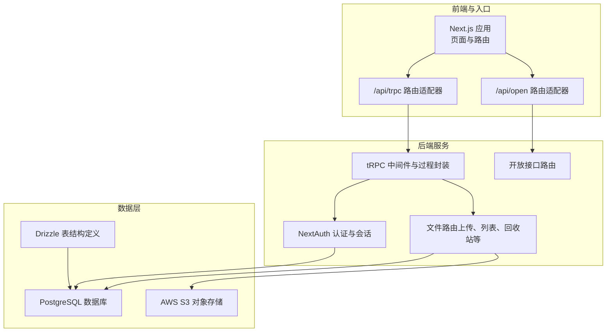
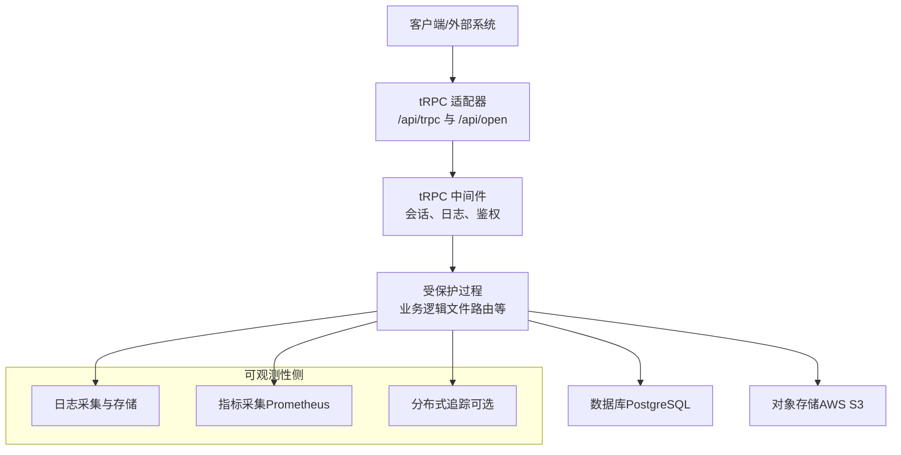
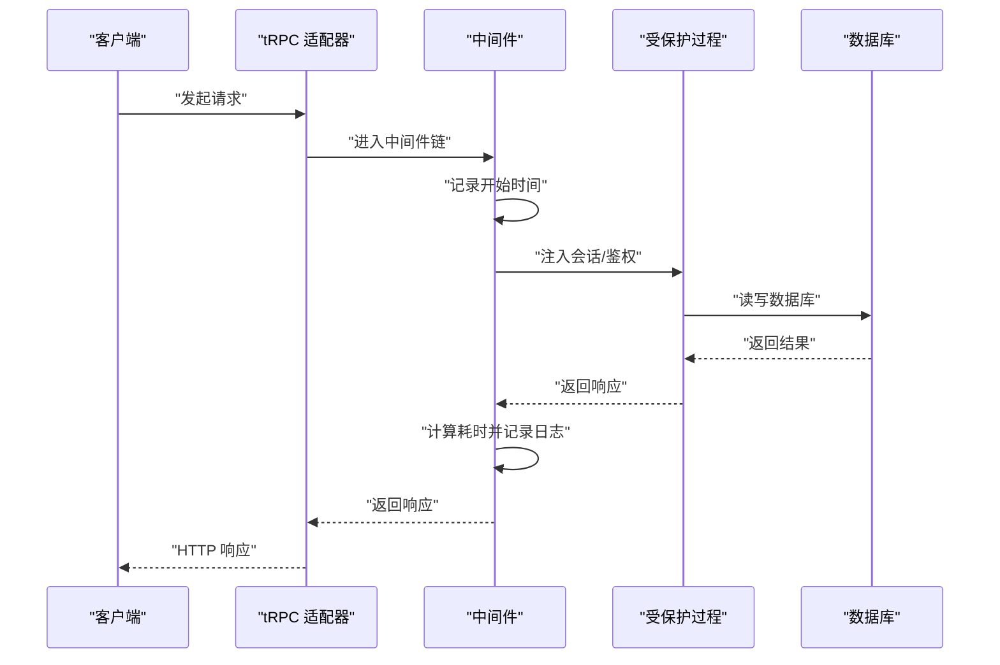
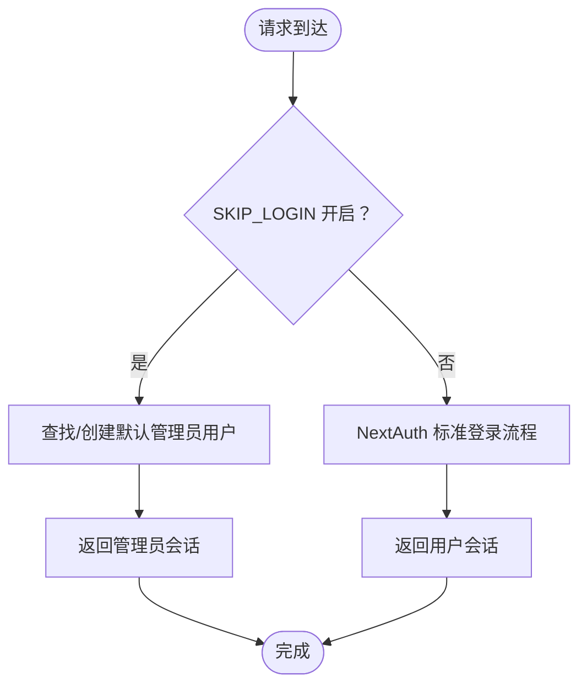
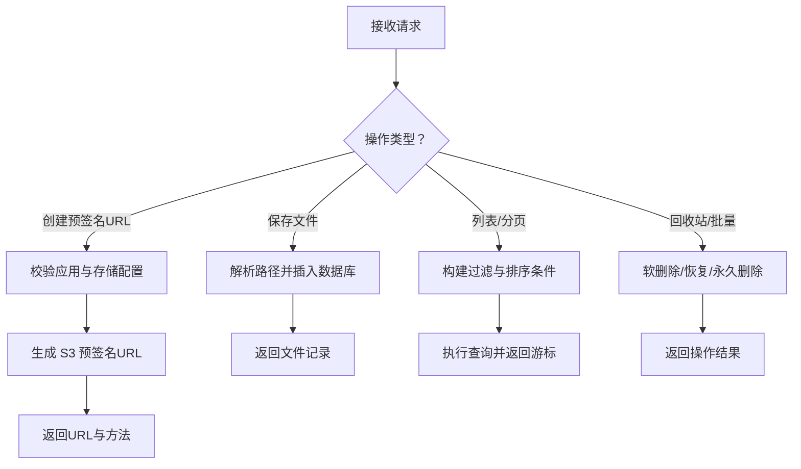
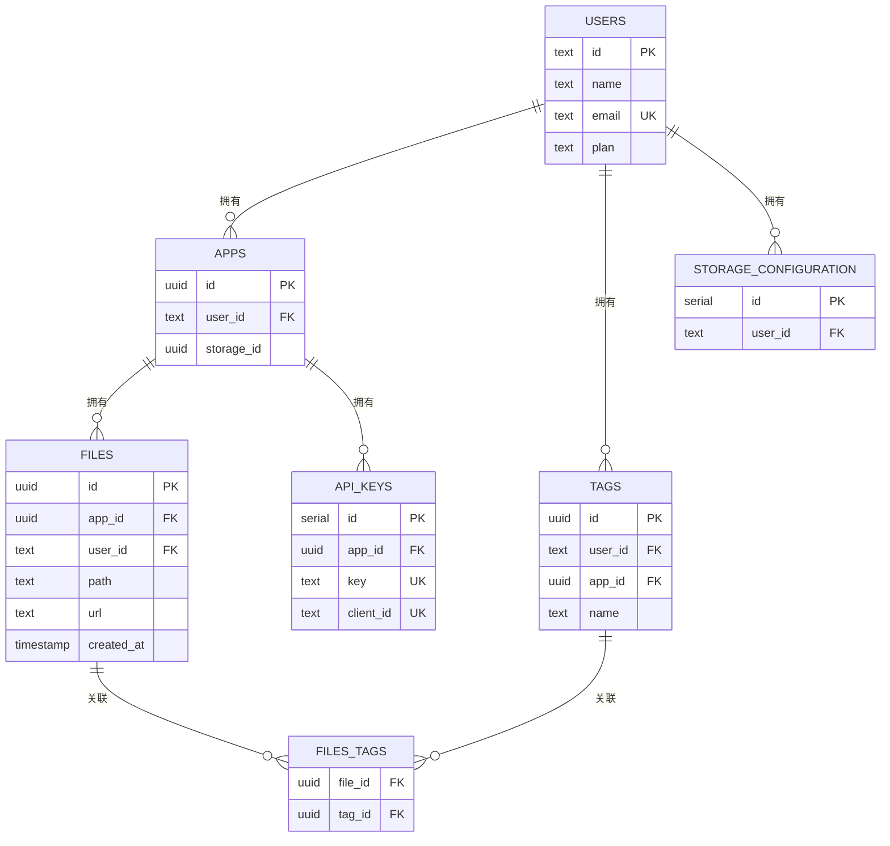
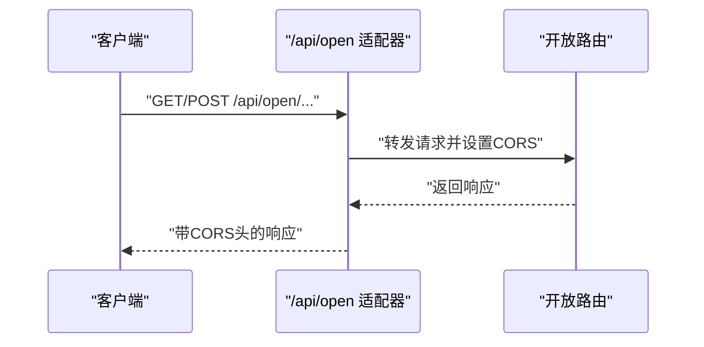
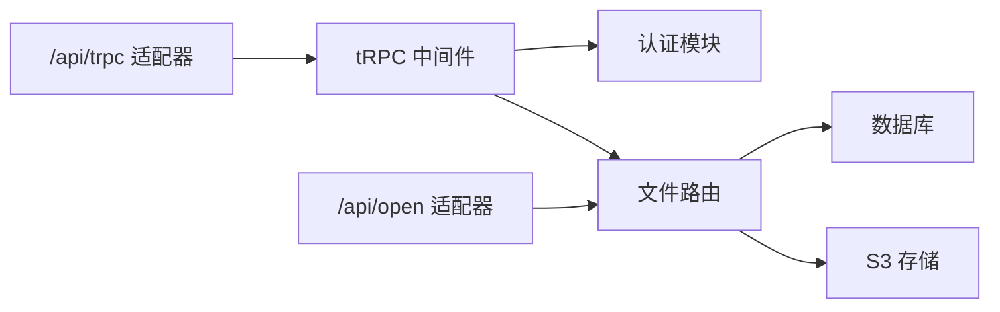

# 监控与日志

<cite>
**本文引用的文件**
- [package.json](file://package.json)
- [Dockerfile](file://Dockerfile)
- [docker-compose.yml](file://docker-compose.yml)
- [src/server/db/db.ts](file://src/server/db/db.ts)
- [src/server/db/schema.ts](file://src/server/db/schema.ts)
- [src/server/auth/index.ts](file://src/server/auth/index.ts)
- [src/server/trpc-middlewares/trpc.ts](file://src/server/trpc-middlewares/trpc.ts)
- [src/server/routes/file.ts](file://src/server/routes/file.ts)
- [src/app/api/trpc/[...trpc]/route.ts](file://src/app/api/trpc/[...trpc]/route.ts)
- [src/app/api/open/[...trpc]/route.ts](file://src/app/api/open/[...trpc]/route.ts)
- [src/server/open-router.ts](file://src/server/open-router.ts)
</cite>

## 目录
1. [简介](#简介)
2. [项目结构](#项目结构)
3. [核心组件](#核心组件)
4. [架构总览](#架构总览)
5. [详细组件分析](#详细组件分析)
6. [依赖关系分析](#依赖关系分析)
7. [性能考量](#性能考量)
8. [故障排查指南](#故障排查指南)
9. [结论](#结论)
10. [附录](#附录)

## 简介
本文件面向 Image SaaS 项目的监控与日志管理，目标是帮助运维与开发团队建立完善的可观测性体系，覆盖应用性能、业务指标与基础设施指标的采集与展示；明确日志配置（级别、格式、存储）；给出与 Prometheus、Grafana、ELK Stack 的集成建议；制定告警规则与通知机制；解释分布式追踪与性能分析思路；并提供日志分析与问题诊断的实用技巧及监控仪表板设计与自定义指标扩展方法。

## 项目结构
Image SaaS 采用 Next.js 16 应用，结合 tRPC 作为 API 层，Drizzle ORM 访问数据库，使用 NextAuth 进行认证，并通过 AWS S3 存储图片资源。容器化部署通过 Dockerfile 与 docker-compose 编排，具备健康检查能力。

图表来源
- [src/app/api/trpc/[...trpc]/route.ts](file://src/app/api/trpc/[...trpc]/route.ts#L1-L14)
- [src/app/api/open/[...trpc]/route.ts](file://src/app/api/open/[...trpc]/route.ts#L1-L30)
- [src/server/trpc-middlewares/trpc.ts:1-130](file://src/server/trpc-middlewares/trpc.ts#L1-L130)
- [src/server/auth/index.ts:1-163](file://src/server/auth/index.ts#L1-L163)
- [src/server/routes/file.ts:1-561](file://src/server/routes/file.ts#L1-L561)
- [src/server/db/db.ts:1-9](file://src/server/db/db.ts#L1-L9)
- [src/server/db/schema.ts:1-270](file://src/server/db/schema.ts#L1-L270)
- [src/server/open-router.ts:1-10](file://src/server/open-router.ts#L1-L10)

章节来源
- [package.json:1-94](file://package.json#L1-L94)
- [Dockerfile:1-76](file://Dockerfile#L1-L76)
- [docker-compose.yml:1-72](file://docker-compose.yml#L1-L72)

## 核心组件
- tRPC 中间件与过程封装：提供会话注入、API 访问控制、日志中间件等能力，是监控与日志埋点的关键位置。
- 认证模块：基于 NextAuth，支持多种 OAuth 提供商，负责用户身份校验与会话上下文。
- 文件路由：实现图片上传预签名 URL、保存记录、分页查询、回收站、批量操作等功能，涉及数据库与 S3。
- 数据库与表结构：定义用户、应用、文件、标签、存储配置、API Key 等模型，支撑业务指标统计。
- API 路由适配器：统一暴露 /api/trpc 与 /api/open 接口，便于外部系统调用与跨域配置。

章节来源
- [src/server/trpc-middlewares/trpc.ts:1-130](file://src/server/trpc-middlewares/trpc.ts#L1-L130)
- [src/server/auth/index.ts:1-163](file://src/server/auth/index.ts#L1-L163)
- [src/server/routes/file.ts:1-561](file://src/server/routes/file.ts#L1-L561)
- [src/server/db/schema.ts:1-270](file://src/server/db/schema.ts#L1-L270)
- [src/app/api/trpc/[...trpc]/route.ts:1-L14](file://src/app/api/trpc/[...trpc]/route.ts#L1-L14)
- [src/app/api/open/[...trpc]/route.ts:1-L30](file://src/app/api/open/[...trpc]/route.ts#L1-L30)

## 架构总览
下图展示了监控与日志在系统中的位置与交互：

图表来源
- [src/app/api/trpc/[...trpc]/route.ts](file://src/app/api/trpc/[...trpc]/route.ts#L1-L14)
- [src/app/api/open/[...trpc]/route.ts](file://src/app/api/open/[...trpc]/route.ts#L1-L30)
- [src/server/trpc-middlewares/trpc.ts:1-130](file://src/server/trpc-middlewares/trpc.ts#L1-L130)
- [src/server/routes/file.ts:1-561](file://src/server/routes/file.ts#L1-L561)
- [src/server/db/db.ts:1-9](file://src/server/db/db.ts#L1-L9)

## 详细组件分析

### tRPC 中间件与日志埋点
- 会话中间件：在请求进入时注入会话上下文，便于后续鉴权与审计。
- 日志中间件：记录每个过程的执行耗时，可用于性能分析与慢查询定位。
- 受保护过程：在会话基础上增加权限校验，缺失会话时抛出错误。
- 应用级鉴权：支持 API Key 与签名 Token 两种方式，校验失败抛出相应错误。

图表来源
- [src/server/trpc-middlewares/trpc.ts:11-45](file://src/server/trpc-middlewares/trpc.ts#L11-L45)
- [src/server/trpc-middlewares/trpc.ts:47-127](file://src/server/trpc-middlewares/trpc.ts#L47-L127)

章节来源
- [src/server/trpc-middlewares/trpc.ts:1-130](file://src/server/trpc-middlewares/trpc.ts#L1-L130)

### 认证与会话
- 支持 GitHub、Gitee、JiHuLab 等 OAuth 提供商。
- 提供 SKIP_LOGIN 模式下的管理员用户自动创建与会话返回，便于本地调试。
- 会话上下文用于 tRPC 过程的权限判断与审计。

图表来源
- [src/server/auth/index.ts:66-101](file://src/server/auth/index.ts#L66-L101)
- [src/server/auth/index.ts:141-160](file://src/server/auth/index.ts#L141-L160)

章节来源
- [src/server/auth/index.ts:1-163](file://src/server/auth/index.ts#L1-L163)

### 文件路由与业务指标
- 上传：生成 S3 预签名 URL，记录文件元信息至数据库。
- 列表与分页：支持游标分页、排序与多维搜索，涉及数据库查询与索引。
- 回收站与批量操作：软删除、恢复与永久删除，配合过期时间字段。
- 业务指标建议：
  - 上传成功率、平均耗时、失败原因分布。
  - 文件数量、按天/月趋势、存储容量使用。
  - 用户活跃度（登录次数、文件操作次数）、应用维度指标。

图表来源
- [src/server/routes/file.ts:26-90](file://src/server/routes/file.ts#L26-L90)
- [src/server/routes/file.ts:91-133](file://src/server/routes/file.ts#L91-L133)
- [src/server/routes/file.ts:120-234](file://src/server/routes/file.ts#L120-L234)
- [src/server/routes/file.ts:344-394](file://src/server/routes/file.ts#L344-L394)
- [src/server/routes/file.ts:501-557](file://src/server/routes/file.ts#L501-L557)

章节来源
- [src/server/routes/file.ts:1-561](file://src/server/routes/file.ts#L1-L561)

### 数据库与表结构
- 用户、应用、文件、标签、存储配置、API Key 等核心模型。
- 关系：用户与应用、应用与文件、文件与标签的多对多关联。
- 索引：针对游标查询与高频过滤字段建立索引，提升分页与搜索性能。

图表来源
- [src/server/db/schema.ts:18-270](file://src/server/db/schema.ts#L18-L270)

章节来源
- [src/server/db/schema.ts:1-270](file://src/server/db/schema.ts#L1-L270)
- [src/server/db/db.ts:1-9](file://src/server/db/db.ts#L1-L9)

### API 路由适配器与跨域
- /api/trpc：tRPC 服务端适配器，统一处理请求。
- /api/open：开放接口适配器，附加 CORS 头，支持 api-key 请求头。

图表来源
- [src/app/api/open/[...trpc]/route.ts:1-L30](file://src/app/api/open/[...trpc]/route.ts#L1-L30)
- [src/server/open-router.ts:1-10](file://src/server/open-router.ts#L1-L10)

章节来源
- [src/app/api/trpc/[...trpc]/route.ts:1-L14](file://src/app/api/trpc/[...trpc]/route.ts#L1-L14)
- [src/app/api/open/[...trpc]/route.ts:1-L30](file://src/app/api/open/[...trpc]/route.ts#L1-L30)
- [src/server/open-router.ts:1-10](file://src/server/open-router.ts#L1-L10)

## 依赖关系分析
- 组件耦合：tRPC 中间件与认证模块紧密耦合，共同决定请求上下文；文件路由依赖数据库与 S3；API 适配器仅作为入口。
- 外部依赖：PostgreSQL、AWS S3、NextAuth、tRPC、Next.js。
- 健康检查：compose 中对应用进行健康检查，确保服务可用。

图表来源
- [src/server/trpc-middlewares/trpc.ts:1-130](file://src/server/trpc-middlewares/trpc.ts#L1-L130)
- [src/server/auth/index.ts:1-163](file://src/server/auth/index.ts#L1-L163)
- [src/server/routes/file.ts:1-561](file://src/server/routes/file.ts#L1-L561)
- [src/app/api/trpc/[...trpc]/route.ts](file://src/app/api/trpc/[...trpc]/route.ts#L1-L14)
- [src/app/api/open/[...trpc]/route.ts](file://src/app/api/open/[...trpc]/route.ts#L1-L30)

章节来源
- [docker-compose.yml:38-43](file://docker-compose.yml#L38-L43)

## 性能考量
- tRPC 过程耗时：通过中间件记录每次请求耗时，便于识别慢过程与热点接口。
- 数据库查询：文件表与标签关联查询较多，需关注游标索引与 SQL 复杂度；建议对高频字段建立合适索引。
- S3 交互：预签名 URL 生成与上传路径解析为关键路径，注意网络抖动与超时重试。
- 分页与搜索：游标分页与多条件组合查询可能带来复杂 SQL，建议缓存热点查询结果或引入二级索引。

章节来源
- [src/server/trpc-middlewares/trpc.ts:21-26](file://src/server/trpc-middlewares/trpc.ts#L21-L26)
- [src/server/routes/file.ts:120-234](file://src/server/routes/file.ts#L120-L234)
- [src/server/db/schema.ts:135-136](file://src/server/db/schema.ts#L135-L136)

## 故障排查指南
- 认证失败：检查 SKIP_LOGIN 模式与 NextAuth 配置，确认会话是否正确注入。
- API Key/签名 Token 错误：核对 api-key 请求头与签名 Token 的 clientId、密钥一致性。
- 数据库连接：确认 DATABASE_URL 正确，连接池与超时参数合理。
- S3 上传：核对存储桶配置、区域与凭据，检查预签名 URL 有效期。
- 健康检查：compose 中的健康检查脚本可快速定位服务不可达问题。

章节来源
- [src/server/auth/index.ts:141-160](file://src/server/auth/index.ts#L141-L160)
- [src/server/trpc-middlewares/trpc.ts:47-127](file://src/server/trpc-middlewares/trpc.ts#L47-L127)
- [src/server/db/db.ts:5-6](file://src/server/db/db.ts#L5-L6)
- [docker-compose.yml:38-43](file://docker-compose.yml#L38-L43)

## 结论
本项目已具备良好的基础可观测性能力：tRPC 中间件提供日志与耗时记录，认证模块保障访问安全，数据库与表结构清晰支撑业务指标统计。建议在此基础上补充 Prometheus 指标导出、Grafana 仪表板、ELK 日志聚合与告警策略，形成完整的监控闭环。

## 附录

### 日志配置建议
- 日志级别：生产环境建议 INFO 或更高；关键路径可临时提升至 DEBUG。
- 输出格式：统一 JSON 格式，包含时间戳、级别、服务名、请求 ID、模块、消息与上下文字段。
- 存储策略：容器标准输出接入集中式日志系统（如 ELK），按天滚动与保留周期管理。

### 监控与告警集成方案
- Prometheus：导出应用指标（请求速率、错误率、P95/P99 耗时、数据库连接数、S3 请求计数与延迟）。
- Grafana：构建仪表板，展示关键业务指标（上传成功率、文件增长趋势、用户活跃度、存储容量）。
- ELK Stack：采集应用日志，建立日志查询与告警规则（如认证失败、数据库异常、S3 4xx/5xx）。

### 自定义指标与仪表板
- 自定义指标：在 tRPC 中间件中增加计数器与直方图，记录不同过程的成功/失败与耗时分布。
- 仪表板设计：按“基础设施—应用—业务”三层设计，覆盖 CPU/内存/磁盘、请求画像、业务增长与告警看板。

### 分布式追踪与性能分析
- 追踪：在关键链路（tRPC → 认证 → 数据库/S3）埋点，生成 Trace ID 并贯穿日志。
- 性能分析：结合慢查询日志、数据库 EXPLAIN、S3 SDK 指标与前端性能监控，定位瓶颈。

### 常见问题定位与解决
- 上传失败：检查预签名 URL 生成与 S3 权限；查看日志中的错误码与堆栈。
- 查询缓慢：分析游标分页 SQL 与索引使用情况，必要时引入物化视图或缓存。
- 认证异常：核对 NextAuth 配置与回调地址，确认会话过期策略。