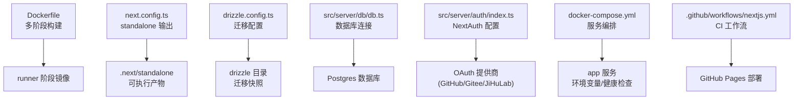
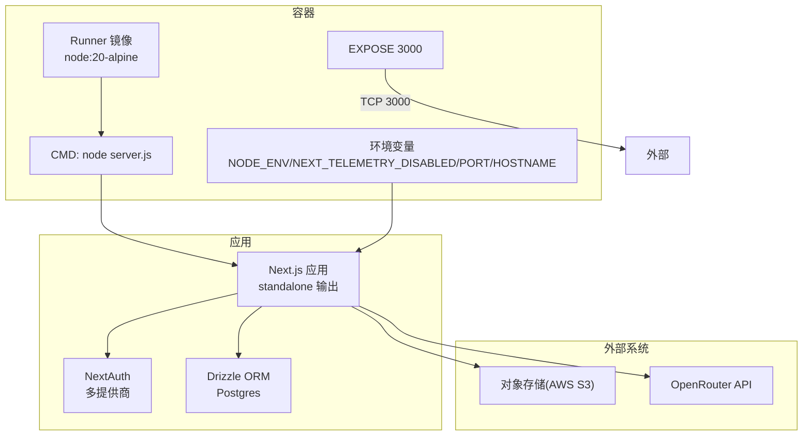
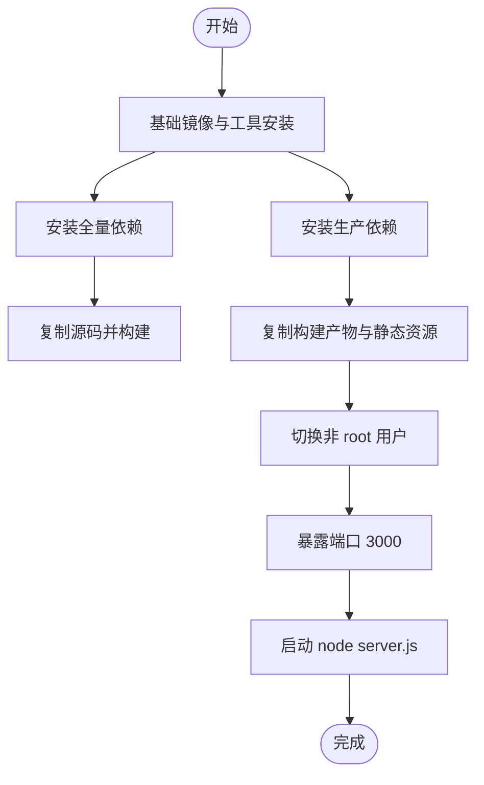
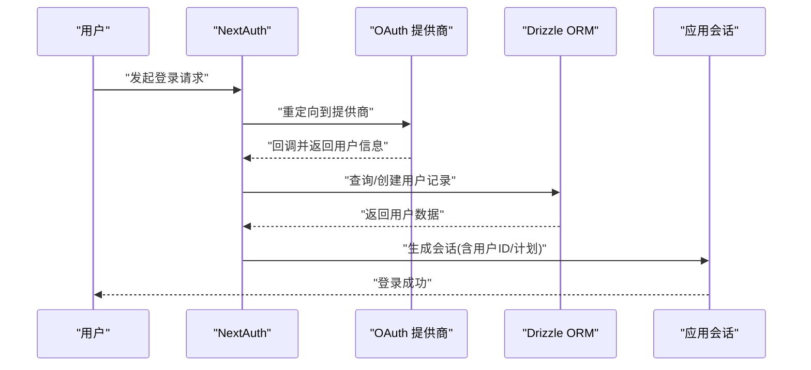
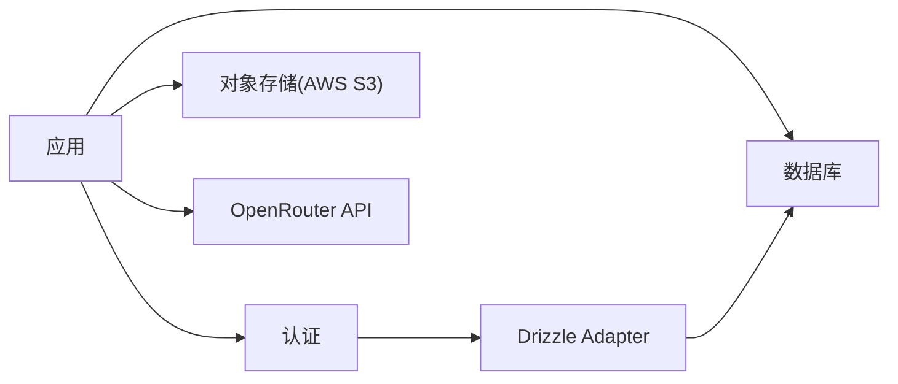

# 部署配置

<cite>
**本文引用的文件**
- [Dockerfile](file://Dockerfile)
- [docker-compose.yml](file://docker-compose.yml)
- [.github/workflows/nextjs.yml](file://.github/workflows/nextjs.yml)
- [package.json](file://package.json)
- [next.config.ts](file://next.config.ts)
- [drizzle.config.ts](file://drizzle.config.ts)
- [src/server/db/db.ts](file://src/server/db/db.ts)
- [src/server/auth/index.ts](file://src/server/auth/index.ts)
- [src/lib/auth.ts](file://src/lib/auth.ts)
- [start.sh](file://start.sh)
- [README.Docker.md](file://README.Docker.md)
- [README.md](file://README.md)
</cite>

## 目录

1. [简介](#简介)
2. [项目结构](#项目结构)
3. [核心组件](#核心组件)
4. [架构总览](#架构总览)
5. [详细组件分析](#详细组件分析)
6. [依赖关系分析](#依赖关系分析)
7. [性能考虑](#性能考虑)
8. [故障排查指南](#故障排查指南)
9. [结论](#结论)
10. [附录](#附录)

## 简介

本文件面向运维与开发团队，提供 Image SaaS 项目的完整部署配置指南。内容涵盖容器化构建与运行、环境变量与敏感信息管理、生产环境部署与性能调优、监控与日志、自动化部署与回滚策略、高可用与灾难恢复建议、以及安全加固与访问控制。文档基于仓库现有配置进行梳理与扩展，确保在不同环境中可复用与落地。

## 项目结构

项目采用 Next.js 16 应用，结合 Drizzle ORM 与 Postgres 数据库，使用 pnpm 工作区管理包依赖。部署相关的关键文件包括：

- Dockerfile：多阶段构建，输出独立可运行的 Next.js 应用
- docker-compose.yml：本地编排与健康检查示例
- next.config.ts：启用 standalone 输出模式与图片优化
- drizzle.config.ts：迁移与 schema 管理配置
- src/server/db/db.ts：数据库连接初始化
- src/server/auth/index.ts：NextAuth 认证适配与多提供商配置
- .github/workflows/nextjs.yml：GitHub Actions 部署工作流（Pages）
- start.sh：非容器场景启动脚本（兼容性用途）

图表来源

- [Dockerfile:1-76](file://Dockerfile#L1-L76)
- [next.config.ts:1-22](file://next.config.ts#L1-L22)
- [drizzle.config.ts:1-14](file://drizzle.config.ts#L1-L14)
- [src/server/db/db.ts:1-9](file://src/server/db/db.ts#L1-L9)
- [src/server/auth/index.ts:1-163](file://src/server/auth/index.ts#L1-L163)
- [docker-compose.yml:1-72](file://docker-compose.yml#L1-L72)
- [.github/workflows/nextjs.yml:1-70](file://.github/workflows/nextjs.yml#L1-L70)

章节来源

- [Dockerfile:1-76](file://Dockerfile#L1-L76)
- [next.config.ts:1-22](file://next.config.ts#L1-L22)
- [drizzle.config.ts:1-14](file://drizzle.config.ts#L1-L14)
- [src/server/db/db.ts:1-9](file://src/server/db/db.ts#L1-L9)
- [src/server/auth/index.ts:1-163](file://src/server/auth/index.ts#L1-L163)
- [docker-compose.yml:1-72](file://docker-compose.yml#L1-L72)
- [.github/workflows/nextjs.yml:1-70](file://.github/workflows/nextjs.yml#L1-L70)

## 核心组件

- 容器镜像与运行时
  - 多阶段构建，最终仅包含运行所需的最小产物，降低攻击面与镜像体积
  - 使用非 root 用户运行，提升安全性
  - 暴露端口与健康检查，便于编排与监控
- 应用配置
  - standalone 输出模式，减少容器层与启动时间
  - 图片优化配置，支持远程图片加载
- 数据库与迁移
  - Drizzle ORM + Postgres，通过 DATABASE_URL 连接
  - drizzle-kit 配置用于生成与应用迁移
- 认证与授权
  - NextAuth 集成 GitHub、Gitee、JiHuLab 多提供商
  - 支持 SKIP_LOGIN 管理员免登模式
- CI/CD
  - GitHub Actions 工作流用于构建与部署至 GitHub Pages

章节来源

- [Dockerfile:1-76](file://Dockerfile#L1-L76)
- [next.config.ts:1-22](file://next.config.ts#L1-L22)
- [drizzle.config.ts:1-14](file://drizzle.config.ts#L1-L14)
- [src/server/db/db.ts:1-9](file://src/server/db/db.ts#L1-L9)
- [src/server/auth/index.ts:1-163](file://src/server/auth/index.ts#L1-L163)
- [.github/workflows/nextjs.yml:1-70](file://.github/workflows/nextjs.yml#L1-L70)

## 架构总览

下图展示应用在容器中的运行路径、外部依赖与关键配置项：

图表来源

- [Dockerfile:46-76](file://Dockerfile#L46-L76)
- [src/server/db/db.ts:1-9](file://src/server/db/db.ts#L1-L9)
- [src/server/auth/index.ts:1-163](file://src/server/auth/index.ts#L1-L163)
- [docker-compose.yml:11-36](file://docker-compose.yml#L11-L36)

## 详细组件分析

### 容器化与镜像构建

- 多阶段构建策略
  - base：准备 Node 与 pnpm
  - deps / deps-full：安装生产与全量依赖
  - builder：复制依赖与源码，执行构建
  - runner：仅复制构建产物与静态资源，切换非 root 用户运行
- 关键环境变量
  - NODE_ENV=production
  - NEXT_TELEMETRY_DISABLED=1
  - PORT=3000
  - HOSTNAME=0.0.0.0
- 安全与合规
  - 非 root 用户运行
  - 最小化镜像层与暴露端口
- 启动命令
  - node server.js

图表来源

- [Dockerfile:1-76](file://Dockerfile#L1-L76)

章节来源

- [Dockerfile:1-76](file://Dockerfile#L1-L76)

### 应用配置与输出模式

- standalone 输出
  - 减少容器层与启动时间，利于快速部署与弹性扩缩容
- 图片优化
  - 允许远程图片加载，便于集成外部存储与 CDN
- TypeScript 构建
  - 忽略构建错误（开发场景），生产建议关闭以保证质量

章节来源

- [next.config.ts:1-22](file://next.config.ts#L1-L22)

### 数据库与迁移

- 连接方式
  - 通过 DATABASE_URL 初始化 Postgres 连接
  - Drizzle ORM 提供类型化查询
- 迁移配置
  - drizzle.config.ts 指定 schema 路径与输出目录
  - 使用 dotenv 加载环境变量

章节来源

- [src/server/db/db.ts:1-9](file://src/server/db/db.ts#L1-L9)
- [drizzle.config.ts:1-14](file://drizzle.config.ts#L1-L14)

### 认证与授权

- NextAuth 配置
  - DrizzleAdapter 集成用户表
  - 支持 GitHub、Gitee、JiHuLab 多提供商
  - 自定义回调：扩展 session 与登录校验
- 管理员免登模式
  - SKIP_LOGIN=true 时自动创建默认管理员并返回会话
- 会话与计划信息
  - 通过 session 回调注入用户 ID 与计划字段

图表来源

- [src/server/auth/index.ts:1-163](file://src/server/auth/index.ts#L1-L163)
- [src/server/db/db.ts:1-9](file://src/server/db/db.ts#L1-L9)

章节来源

- [src/server/auth/index.ts:1-163](file://src/server/auth/index.ts#L1-L163)
- [src/lib/auth.ts:1-3](file://src/lib/auth.ts#L1-L3)

### 编排与健康检查

- 服务编排
  - app 服务映射 3000:3000
  - 通过环境变量注入数据库、认证、对象存储与 OpenRouter 等配置
- 健康检查
  - 对 /api/health 发起 HTTP 请求，判断状态码
  - 间隔、超时、重试与启动等待时间可调
- 重启策略
  - unless-stopped，异常退出自动重启

章节来源

- [docker-compose.yml:1-72](file://docker-compose.yml#L1-L72)

### CI/CD 与自动化部署

- GitHub Actions 工作流
  - 在 ubuntu-latest 环境中安装 Node 与 pnpm
  - 执行安装依赖、构建 Next.js 并上传产物
  - 部署至 GitHub Pages 环境
- 建议
  - 将工作流扩展为多环境（dev/staging/prod）
  - 引入缓存与并行任务以缩短构建时间
  - 在生产环境增加测试与安全扫描步骤

章节来源

- [.github/workflows/nextjs.yml:1-70](file://.github/workflows/nextjs.yml#L1-L70)

### 启动脚本与非容器部署

- start.sh
  - 清理 Windows 换行符
  - 从 .env 注入环境变量
  - 以生产模式启动 Next.js 服务
- 适用场景
  - 传统虚拟机或裸金属部署
  - 与 systemd 或容器编排配合

章节来源

- [start.sh:1-8](file://start.sh#L1-L8)

## 依赖关系分析

- 组件耦合
  - 应用对数据库与认证模块存在直接依赖
  - 认证模块依赖 Drizzle Adapter 与数据库连接
  - 迁移配置依赖 dotenv 与 schema 路径
- 外部依赖
  - Postgres 数据库
  - AWS S3（可选，默认存储）
  - OpenRouter API（AI 标签识别）
  - OAuth 提供商（GitHub/Gitee/JiHuLab）

图表来源

- [src/server/db/db.ts:1-9](file://src/server/db/db.ts#L1-L9)
- [src/server/auth/index.ts:1-163](file://src/server/auth/index.ts#L1-L163)
- [drizzle.config.ts:1-14](file://drizzle.config.ts#L1-L14)

章节来源

- [src/server/db/db.ts:1-9](file://src/server/db/db.ts#L1-L9)
- [src/server/auth/index.ts:1-163](file://src/server/auth/index.ts#L1-L163)
- [drizzle.config.ts:1-14](file://drizzle.config.ts#L1-L14)

## 性能考虑

- 构建与运行优化
  - 使用 standalone 输出模式，减少容器层与启动延迟
  - 多阶段构建与只复制必要文件，缩小镜像体积
- 运行时参数
  - 设置 NODE_ENV=production 与 NEXT_TELEMETRY_DISABLED=1，避免额外开销
  - 使用非 root 用户与最小权限原则
- 数据库连接
  - 复用连接池，避免频繁重建连接
  - 在高并发场景下评估连接数上限
- 存储与网络
  - 对象存储与 CDN 结合，减少应用服务器带宽压力
  - 合理设置缓存头与压缩策略

## 故障排查指南

- 健康检查失败
  - 检查 /api/health 是否可达
  - 核对端口映射与容器内监听地址
- 数据库连接问题
  - 确认 DATABASE_URL 正确且可达
  - 检查网络策略与防火墙规则
- 认证失败
  - 核对 NEXTAUTH_SECRET、各提供商的 CLIENT_ID/CLIENT_SECRET
  - 检查 SKIP_LOGIN 模式与默认管理员创建逻辑
- 日志与可观测性
  - 容器标准输出与错误输出收集
  - 结合平台日志服务（如 CloudWatch、Loki、ELK）统一采集
- 回滚策略
  - 保留最近几个稳定版本镜像
  - 通过编排平台滚动回滚或标签切换

## 结论

本部署配置文档基于仓库现有文件进行了系统化梳理，覆盖了容器化构建、环境变量与敏感信息管理、生产部署与性能调优、监控与日志、自动化部署与回滚策略、高可用与灾难恢复建议，以及安全加固与访问控制。建议在生产环境中结合平台能力进一步完善 CI/CD 流水线、监控告警与安全审计，并按需扩展数据库与存储的高可用方案。

## 附录

### 环境变量清单与说明

- 数据库
  - DATABASE_URL：Postgres 连接字符串
- 认证与会话
  - NEXTAUTH_URL：NextAuth 回调地址
  - NEXTAUTH_SECRET：NextAuth 会话密钥
  - SKIP_LOGIN：启用管理员免登模式
- OAuth 提供商
  - GITHUB_ID / GITHUB_SECRET
  - GOOGLE_ID / GOOGLE_SECRET
  - GITEE_ID / GITEE_SECRET
  - JIHULAB_ID / JIHULAB_SECRET
- 对象存储（默认存储）
  - AWS_REGION / AWS_ACCESS_KEY_ID / AWS_SECRET_ACCESS_KEY / AWS_S3_BUCKET
- AI 服务
  - OPENROUTER_API_KEY：用于 AI 标签识别
- Node 环境
  - NODE_ENV=production
  - NEXT_TELEMETRY_DISABLED=1
  - PORT=3000
  - HOSTNAME=0.0.0.0

章节来源

- [docker-compose.yml:11-36](file://docker-compose.yml#L11-L36)
- [src/server/auth/index.ts:1-163](file://src/server/auth/index.ts#L1-L163)
- [Dockerfile:36-54](file://Dockerfile#L36-L54)

### 敏感信息管理

- 使用平台密钥管理服务（如 AWS Secrets Manager、Azure Key Vault、HashiCorp Vault）
- 避免将密钥写入仓库或镜像
- 通过环境变量注入，确保最小权限访问

### 配置文件组织建议

- 将敏感配置放入独立文件并通过编排平台挂载
- 使用 .dockerignore 与 .gitignore 控制文件暴露范围
- 迁移与 schema 分离，保持 drizzle 配置清晰

### 生产环境部署最佳实践

- 使用负载均衡与反向代理（Nginx/Traefik/Caddy）
- 配置 HTTPS 证书与强制跳转
- 实施蓝绿/金丝雀发布与自动回滚
- 健康检查与就绪探针双管齐下
- 定期备份数据库与对象存储数据

### 安全加固与访问控制

- 端口与防火墙
  - 仅开放 443/80（如需）与内部管理端口
  - 限制来源 IP 与内网访问
- 应用安全
  - 非 root 运行、只读文件系统、最小权限卷
  - 限制容器资源与 CPU/内存配额
- 认证与授权
  - 强制使用 HTTPS 与安全的 NEXTAUTH_SECRET
  - 审计登录与会话变更
  - 定期轮换密钥与证书

### 监控与日志

- 指标
  - CPU/内存/磁盘/网络使用率
  - 请求延迟、错误率、吞吐量
  - 数据库连接数与慢查询
- 日志
  - 标准输出采集与结构化日志
  - 错误堆栈与关键业务事件追踪
- 告警
  - 基于阈值与异常模式的告警策略
  - 多级通知与升级机制

### 自动化部署与回滚

- CI/CD
  - 构建 → 扫描 → 测试 → 部署 → 健康检查 → 回滚
  - 多环境流水线与分支保护策略
- 回滚
  - 版本化镜像与配置
  - 自动回滚与人工确认双重保障

### 高可用与灾难恢复

- 集群与副本
  - 多可用区部署与自动故障转移
  - 数据库主从/集群与只读副本
- 存储
  - 对象存储跨区域冗余与版本控制
- 灾备
  - 定期演练与数据一致性验证
  - 交叉区域备份与快速恢复流程
