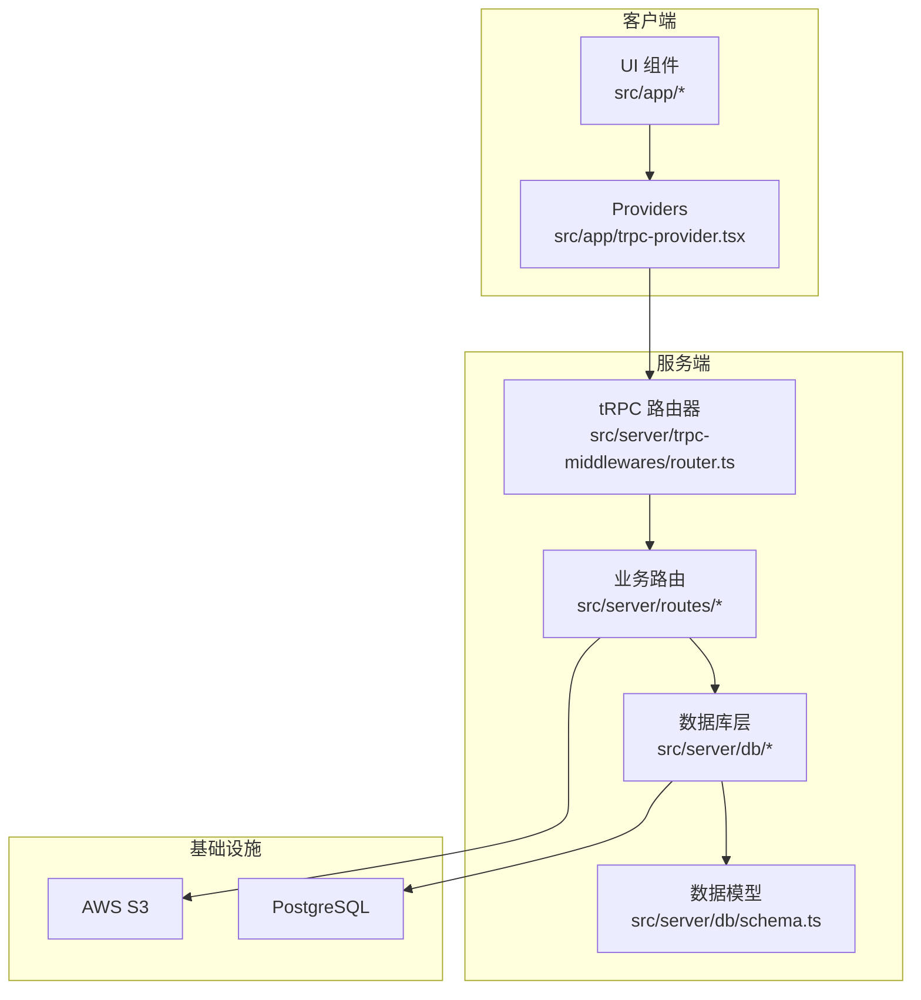
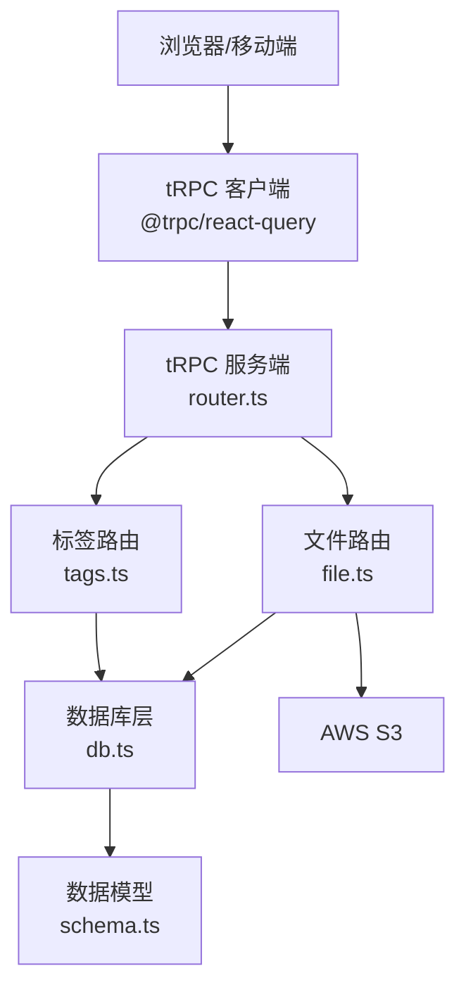
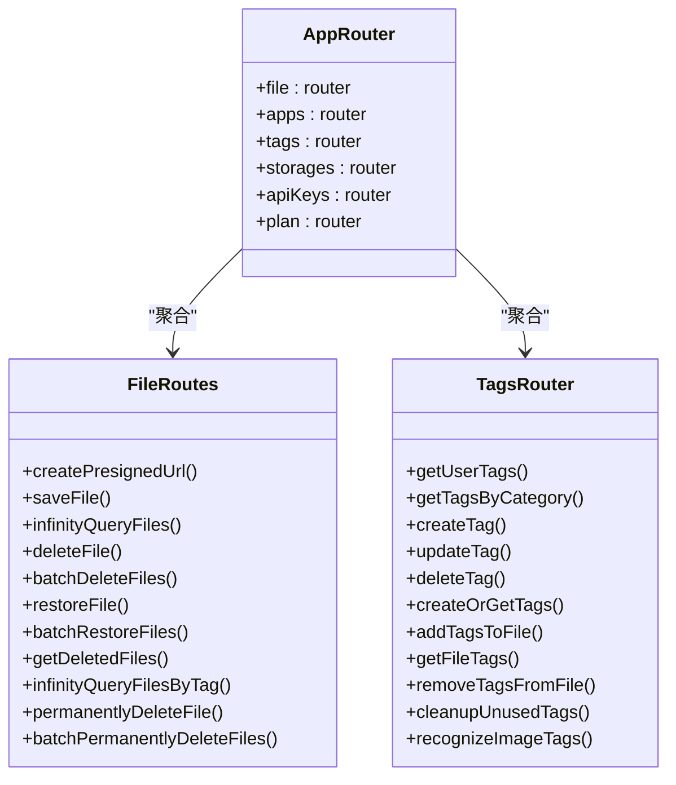
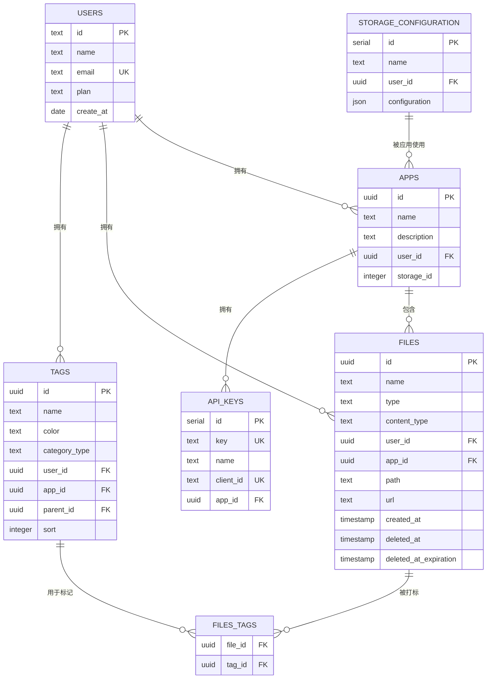
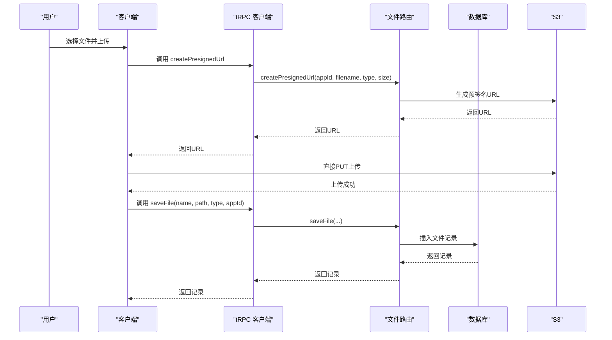
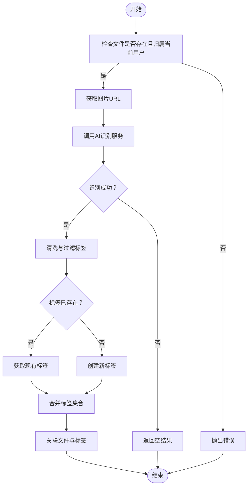
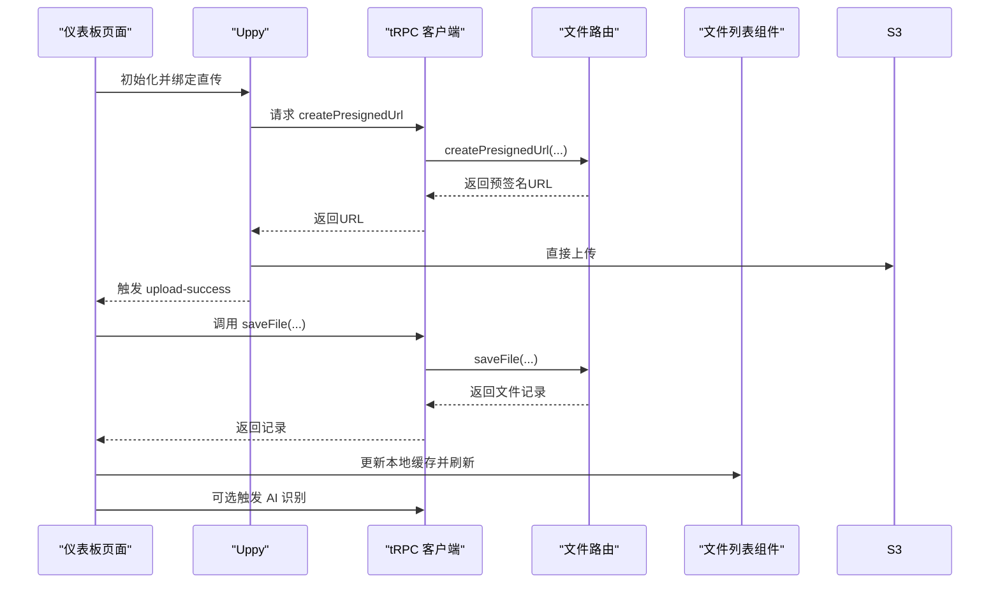
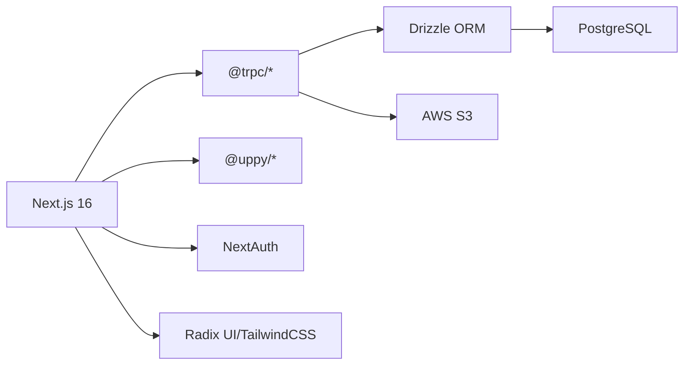

# 项目概述

<cite>
**本文档引用的文件**
- [README.md](file://README.md)
- [package.json](file://package.json)
- [next.config.ts](file://next.config.ts)
- [drizzle.config.ts](file://drizzle.config.ts)
- [src/app/layout.tsx](file://src/app/layout.tsx)
- [src/app/trpc-provider.tsx](file://src/app/trpc-provider.tsx)
- [src/lib/auth.ts](file://src/lib/auth.ts)
- [src/server/db/schema.ts](file://src/server/db/schema.ts)
- [src/server/db/db.ts](file://src/server/db/db.ts)
- [src/server/trpc-middlewares/router.ts](file://src/server/trpc-middlewares/router.ts)
- [src/server/routes/file.ts](file://src/server/routes/file.ts)
- [src/server/routes/tags.ts](file://src/server/routes/tags.ts)
- [src/app/dashboard/page.tsx](file://src/app/dashboard/page.tsx)
- [src/components/feature/FileList.tsx](file://src/components/feature/FileList.tsx)
- [scripts/init-default-tags.ts](file://scripts/init-default-tags.ts)
</cite>

## 目录
1. [引言](#引言)
2. [项目结构](#项目结构)
3. [核心组件](#核心组件)
4. [架构总览](#架构总览)
5. [详细组件分析](#详细组件分析)
6. [依赖关系分析](#依赖关系分析)
7. [性能考虑](#性能考虑)
8. [故障排除指南](#故障排除指南)
9. [结论](#结论)
10. [附录](#附录)

## 引言
本项目是一个基于 Next.js 16 的现代化全栈图像云存储 SaaS 应用，专注于图像文件的上传、管理与智能标签系统。系统采用 tRPC 进行前后端通信，Drizzle ORM 进行数据库建模与查询，结合 AWS S3 实现高可靠的对象存储，并通过智能标签与 AI 识别能力提升图像检索与管理效率。

项目旨在为用户提供简洁直观的上传体验、强大的无限滚动与搜索能力、灵活的标签体系以及安全的权限控制。同时，系统支持多应用隔离、API 密钥管理与回收站机制，满足个人与团队的多样化使用场景。

## 项目结构
项目采用 Next.js App Router 的目录结构，前端 UI 组件与路由位于 `src/app`，业务逻辑与 API 路由位于 `src/server`，数据库模型与迁移脚本位于 `src/server/db` 与 `drizzle` 目录，UI 组件库位于 `src/components/ui`，通用工具与 API 客户端位于 `src/utils`。

图表来源
- [src/app/trpc-provider.tsx:1-18](file://src/app/trpc-provider.tsx#L1-L18)
- [src/server/trpc-middlewares/router.ts:1-20](file://src/server/trpc-middlewares/router.ts#L1-L20)
- [src/server/db/schema.ts:1-270](file://src/server/db/schema.ts#L1-L270)

章节来源
- [README.md:1-37](file://README.md#L1-L37)
- [package.json:1-94](file://package.json#L1-L94)
- [next.config.ts:1-22](file://next.config.ts#L1-L22)

## 核心组件
- tRPC 服务端路由器：聚合文件、应用、标签、存储、API 密钥与用户计划等路由模块，统一暴露 GraphQL 风格的类型安全接口。
- Drizzle 数据模型：定义用户、应用、文件、标签、存储配置等表结构及关系，支持索引与复杂查询。
- AWS S3 集成：通过预签名 URL 实现直传，降低服务器带宽压力；支持自定义 Endpoint 与区域配置。
- 智能标签与 AI 识别：支持手动创建/编辑标签、批量关联文件、AI 识别图片类别并自动打标。
- 无限滚动与搜索：基于游标分页的列表加载，支持按文件名、标签名与日期范围搜索。
- 权限与会话：集成 NextAuth，支持多种认证方式与会话管理。

章节来源
- [src/server/trpc-middlewares/router.ts:1-20](file://src/server/trpc-middlewares/router.ts#L1-L20)
- [src/server/db/schema.ts:1-270](file://src/server/db/schema.ts#L1-L270)
- [src/server/routes/file.ts:1-561](file://src/server/routes/file.ts#L1-L561)
- [src/server/routes/tags.ts:1-735](file://src/server/routes/tags.ts#L1-L735)

## 架构总览
系统采用“客户端 tRPC + 服务端 tRPC 路由器 + Drizzle ORM + PostgreSQL + AWS S3”的分层架构。客户端通过 tRPC 客户端发起请求，服务端路由根据权限校验与输入参数执行业务逻辑，数据库层负责持久化与查询，对象存储负责大文件的高效传输。

图表来源
- [src/app/trpc-provider.tsx:1-18](file://src/app/trpc-provider.tsx#L1-L18)
- [src/server/trpc-middlewares/router.ts:1-20](file://src/server/trpc-middlewares/router.ts#L1-L20)
- [src/server/routes/file.ts:1-561](file://src/server/routes/file.ts#L1-L561)
- [src/server/routes/tags.ts:1-735](file://src/server/routes/tags.ts#L1-L735)
- [src/server/db/db.ts:1-9](file://src/server/db/db.ts#L1-L9)
- [src/server/db/schema.ts:1-270](file://src/server/db/schema.ts#L1-L270)

## 详细组件分析

### tRPC 路由器与中间件
- 路由聚合：在路由器中聚合文件、应用、标签、存储、API 密钥与用户计划等子路由，形成统一入口。
- 中间件：通过受保护过程（protectedProcedure）实现鉴权与上下文注入，确保每个请求都经过会话校验。

图表来源
- [src/server/trpc-middlewares/router.ts:1-20](file://src/server/trpc-middlewares/router.ts#L1-L20)
- [src/server/routes/file.ts:1-561](file://src/server/routes/file.ts#L1-L561)
- [src/server/routes/tags.ts:1-735](file://src/server/routes/tags.ts#L1-L735)

章节来源
- [src/server/trpc-middlewares/router.ts:1-20](file://src/server/trpc-middlewares/router.ts#L1-L20)

### 数据模型与关系
- 用户、应用、文件、标签、存储配置、API 密钥等核心实体通过 Drizzle ORM 建模，定义主键、外键、索引与关系。
- 支持文件与标签的多对多关联表，便于灵活打标与统计使用次数。
- 存储配置支持 S3 的桶、区域、凭据与可选 Endpoint，便于私有化部署。

图表来源
- [src/server/db/schema.ts:1-270](file://src/server/db/schema.ts#L1-L270)

章节来源
- [src/server/db/schema.ts:1-270](file://src/server/db/schema.ts#L1-L270)

### 文件上传与管理流程
- 预签名直传：客户端向服务端申请预签名 URL，随后直接上传至 S3，减少服务器中转。
- 保存元数据：上传完成后，客户端调用保存接口，服务端写入文件元数据并返回结果。
- 列表与搜索：支持按应用、用户、删除状态与时间范围筛选，支持按标签名与文件名联合搜索。
- 回收站与恢复：文件删除后进入回收站，支持单个与批量恢复。

图表来源
- [src/server/routes/file.ts:27-90](file://src/server/routes/file.ts#L27-L90)
- [src/server/routes/file.ts:91-118](file://src/server/routes/file.ts#L91-L118)

章节来源
- [src/server/routes/file.ts:1-561](file://src/server/routes/file.ts#L1-L561)

### 智能标签与 AI 识别
- 标签管理：支持创建、更新、删除标签，支持批量清理未使用标签。
- 文件打标：支持为文件创建或获取标签，并避免重复关联。
- AI 识别：通过 WebSocket 调用第三方 AI 服务（示例为讯飞星火），识别图片类别并自动创建标签，再与文件建立关联。

图表来源
- [src/server/routes/tags.ts:416-531](file://src/server/routes/tags.ts#L416-L531)
- [src/server/routes/tags.ts:534-735](file://src/server/routes/tags.ts#L534-L735)

章节来源
- [src/server/routes/tags.ts:1-735](file://src/server/routes/tags.ts#L1-L735)

### 前端交互与无限滚动
- Uppy 直传：在仪表板页面初始化 Uppy 并配置 AWS S3 直传，自动获取预签名 URL 并上传。
- 文件列表：使用 tRPC 的无限查询加载文件，按日期分组展示，支持展开/折叠与懒加载。
- 上传态反馈：显示正在上传的文件缩略图，上传完成后自动刷新列表并触发 AI 识别（针对图片）。

图表来源
- [src/app/dashboard/page.tsx:31-47](file://src/app/dashboard/page.tsx#L31-L47)
- [src/components/feature/FileList.tsx:163-202](file://src/components/feature/FileList.tsx#L163-L202)

章节来源
- [src/app/dashboard/page.tsx:1-90](file://src/app/dashboard/page.tsx#L1-L90)
- [src/components/feature/FileList.tsx:1-366](file://src/components/feature/FileList.tsx#L1-L366)

## 依赖关系分析
- 技术栈：Next.js 16、tRPC、Drizzle ORM、PostgreSQL、AWS S3、Uppy、Radix UI、TailwindCSS。
- 外部依赖：@aws-sdk/client-s3、@aws-sdk/s3-request-presigner、@uppy/*、@tanstack/react-query、next-auth、drizzle-orm/postgres-js。
- 开发工具：drizzle-kit、dotenv、typescript、jest、prettier、tailwindcss。

图表来源
- [package.json:14-66](file://package.json#L14-L66)

章节来源
- [package.json:1-94](file://package.json#L1-L94)

## 性能考虑
- 预签名直传：通过 S3 预签名 URL 实现客户端直传，显著降低服务器带宽与 CPU 占用。
- 无限滚动与游标分页：按需加载，减少一次性渲染的数据量，提升首屏性能。
- 数据库索引：为常用查询字段（如文件 id+createdAt、标签用户索引等）建立复合索引，优化排序与过滤。
- 查询优化：使用原生 SQL 与条件拼接，避免 N+1 查询，提高复杂搜索与统计场景的性能。
- 缓存与重用：tRPC 与 React Query 提供本地缓存与请求去重，减少网络往返。

## 故障排除指南
- 预签名 URL 失败：检查应用是否配置存储、用户权限是否匹配、S3 凭据与 Endpoint 是否正确。
- 文件保存失败：确认上传 URL 有效、文件类型与大小限制、数据库连接状态。
- 标签冲突：当更新标签名称时若与其他标签冲突会抛出冲突错误，需修改名称或删除重复项。
- AI 识别异常：检查 AI 服务凭证与网络连通性，WebSocket 超时或解析错误时会降级返回空结果。
- 数据库迁移：使用 drizzle-kit 生成与应用迁移脚本，确保 schema 与数据库一致。

章节来源
- [src/server/routes/file.ts:40-90](file://src/server/routes/file.ts#L40-L90)
- [src/server/routes/tags.ts:135-204](file://src/server/routes/tags.ts#L135-L204)
- [drizzle.config.ts:1-14](file://drizzle.config.ts#L1-L14)

## 结论
本项目以 Next.js 16 为核心，结合 tRPC、Drizzle ORM 与 AWS S3，构建了一个现代化、高性能、可扩展的图像 SaaS 平台。其智能标签与 AI 识别能力提升了图像管理的智能化水平，而直传与无限滚动等特性优化了用户体验。通过模块化的架构与完善的权限控制，系统能够满足从个人到团队的多样化需求，并为后续的功能扩展与私有化部署提供了良好基础。

## 附录
- 默认标签初始化：脚本为所有应用初始化“人物/地点/事务”三类默认标签，便于快速上手。
- 配置说明：数据库 URL、S3 凭据、AI 服务密钥等均通过环境变量注入，建议在生产环境中妥善保管。

章节来源
- [scripts/init-default-tags.ts:1-74](file://scripts/init-default-tags.ts#L1-L74)